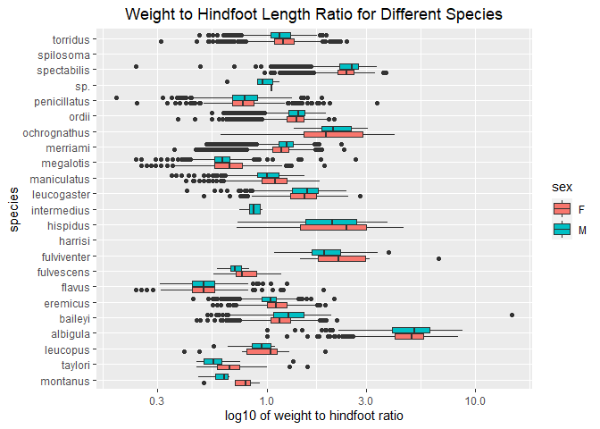

## Instructions
Answer the following questions and complete the exercises in RMarkdown. Please embed all of your code and push your final work to your repository. Your final lab report should be organized, clean, and run free from errors. Remember, you must remove the `#` for the included code chunks to run. Be sure to add your name to the author header above. For any included plots, make sure they are clearly labeled. You are free to use any plot type that you feel best communicates the results of your analysis.  

Make sure to use the formatting conventions of RMarkdown to make your report neat and clean!  

## Load the libraries

```r
library(tidyverse)
library(janitor)
library(here)
library(naniar)
```

## Desert Ecology
For this assignment, we are going to use a modified data set on [desert ecology](http://esapubs.org/archive/ecol/E090/118/). The data are from: S. K. Morgan Ernest, Thomas J. Valone, and James H. Brown. 2009. Long-term monitoring and experimental manipulation of a Chihuahuan Desert ecosystem near Portal, Arizona, USA. Ecology 90:1708.

```r
deserts <- read_csv(here("lab10", "data", "surveys_complete.csv"))
```

```
## Rows: 34786 Columns: 13
```

```
## -- Column specification --------------------------------------------------------
## Delimiter: ","
## chr (6): species_id, sex, genus, species, taxa, plot_type
## dbl (7): record_id, month, day, year, plot_id, hindfoot_length, weight
```

```
## 
## i Use `spec()` to retrieve the full column specification for this data.
## i Specify the column types or set `show_col_types = FALSE` to quiet this message.
```

1. Use the function(s) of your choice to get an idea of its structure, including how NA's are treated. Are the data tidy?  

```r
head(deserts)
```

```
## # A tibble: 6 x 13
##   record_id month   day  year plot_id species_id sex   hindfoot_length weight
##       <dbl> <dbl> <dbl> <dbl>   <dbl> <chr>      <chr>           <dbl>  <dbl>
## 1         1     7    16  1977       2 NL         M                  32     NA
## 2         2     7    16  1977       3 NL         M                  33     NA
## 3         3     7    16  1977       2 DM         F                  37     NA
## 4         4     7    16  1977       7 DM         M                  36     NA
## 5         5     7    16  1977       3 DM         M                  35     NA
## 6         6     7    16  1977       1 PF         M                  14     NA
## # ... with 4 more variables: genus <chr>, species <chr>, taxa <chr>,
## #   plot_type <chr>
```

```r
anyNA(deserts)
```

```
## [1] TRUE
```

```r
glimpse(deserts)
```

```
## Rows: 34,786
## Columns: 13
## $ record_id       <dbl> 1, 2, 3, 4, 5, 6, 7, 8, 9, 10, 11, 12, 13, 14, 15, 16,~
## $ month           <dbl> 7, 7, 7, 7, 7, 7, 7, 7, 7, 7, 7, 7, 7, 7, 7, 7, 7, 7, ~
## $ day             <dbl> 16, 16, 16, 16, 16, 16, 16, 16, 16, 16, 16, 16, 16, 16~
## $ year            <dbl> 1977, 1977, 1977, 1977, 1977, 1977, 1977, 1977, 1977, ~
## $ plot_id         <dbl> 2, 3, 2, 7, 3, 1, 2, 1, 1, 6, 5, 7, 3, 8, 6, 4, 3, 2, ~
## $ species_id      <chr> "NL", "NL", "DM", "DM", "DM", "PF", "PE", "DM", "DM", ~
## $ sex             <chr> "M", "M", "F", "M", "M", "M", "F", "M", "F", "F", "F",~
## $ hindfoot_length <dbl> 32, 33, 37, 36, 35, 14, NA, 37, 34, 20, 53, 38, 35, NA~
## $ weight          <dbl> NA, NA, NA, NA, NA, NA, NA, NA, NA, NA, NA, NA, NA, NA~
## $ genus           <chr> "Neotoma", "Neotoma", "Dipodomys", "Dipodomys", "Dipod~
## $ species         <chr> "albigula", "albigula", "merriami", "merriami", "merri~
## $ taxa            <chr> "Rodent", "Rodent", "Rodent", "Rodent", "Rodent", "Rod~
## $ plot_type       <chr> "Control", "Long-term Krat Exclosure", "Control", "Rod~
```

2. How many genera and species are represented in the data? What are the total number of observations? Which species is most/ least frequently sampled in the study?

```r
n_distinct(deserts$genus)
```

```
## [1] 26
```

```r
n_distinct(deserts$species)
```

```
## [1] 40
```

```r
deserts %>%
  group_by(species) %>%
  summarise(number = n()) %>%
  arrange(desc(number))
```

```
## # A tibble: 40 x 2
##    species      number
##    <chr>         <int>
##  1 merriami      10596
##  2 penicillatus   3123
##  3 ordii          3027
##  4 baileyi        2891
##  5 megalotis      2609
##  6 spectabilis    2504
##  7 torridus       2249
##  8 flavus         1597
##  9 eremicus       1299
## 10 albigula       1252
## # ... with 30 more rows
```

```r
nrow(deserts)
```

```
## [1] 34786
```

26 genera are represented, 40 species are represented, 34786 total observations, merriami is the most sampled species, and clarki, scutalatus, tereticaudus, tigris, uniparens, and viridis are tied at one sample for least sampled in the study.

3. What is the proportion of taxa included in this study? Show a table and plot that reflects this count.

```r
count(deserts,taxa)
```

```
## # A tibble: 4 x 2
##   taxa        n
##   <chr>   <int>
## 1 Bird      450
## 2 Rabbit     75
## 3 Reptile    14
## 4 Rodent  34247
```


```r
deserts %>%
  ggplot(aes(x = taxa)) +
  geom_bar() +
  scale_y_log10() +
  labs(title = 'Number of Samples in Each Taxa',
       y = 'taxa',
       x = 'number') +
  theme(plot.title = element_text(hjust = 0.5))
```

<!-- -->


4. For the taxa included in the study, use the fill option to show the proportion of individuals sampled by `plot_type.`

```r
deserts %>%
  ggplot(aes(x = taxa, fill = plot_type)) +
  geom_bar(position = 'dodge') +
  scale_y_log10() +
  labs(title = 'Sample Types Used',
       x = 'taxa',
       y = 'count (log10)',
       fill = 'plot type')
```

<!-- -->

5. What is the range of weight for each species included in the study? Remove any observations of weight that are NA so they do not show up in the plot.

```r
deserts %>%
  filter(weight != is.na(weight)) %>%
  ggplot(aes(x = species, y = weight)) +
  geom_boxplot(na.rm = T) +
  theme(axis.text.x = element_text(angle = 45)) +
  scale_y_log10() +
  labs(title = 'Weight of Different Species',
       x = 'Species',
       y = 'Weight') +
  theme(plot.title = element_text(hjust = 0.5))
```

<!-- -->

6. Add another layer to your answer from #4 using `geom_point` to get an idea of how many measurements were taken for each species.

```r
deserts %>%
  filter(weight != is.na(weight)) %>%
  ggplot(aes(x = species, y = weight)) +
  geom_boxplot(na.rm = T) +
  theme(axis.text.x = element_text(angle = 45)) +
  scale_y_log10() +
  geom_point(size = .75) +
  labs(title = 'Weight of Different Species',
       x = 'Species',
       y = 'Weight') +
  theme(plot.title = element_text(hjust = 0.5))
```

<!-- -->

7. [Dipodomys merriami](https://en.wikipedia.org/wiki/Merriam's_kangaroo_rat) is the most frequently sampled animal in the study. How have the number of observations of this species changed over the years included in the study?

```r
deserts %>%
  filter(species == 'merriami') %>%
  ggplot(aes(x = year)) +
  geom_bar() +
  labs(title = 'Observations Each Year of Dipodomys merriami',
       x = 'year',
       y = 'number of observations') +
  theme(plot.title = element_text(hjust = 0.5))
```

<!-- -->

8. What is the relationship between `weight` and `hindfoot` length? Consider whether or not over plotting is an issue.

```r
deserts %>%
  ggplot(aes(x = weight, y = hindfoot_length)) +
  geom_point(size = 0.5, alpha = .5) +
  labs(title = 'Relationship between weight and hindfoot length',
       x = 'weight',
       y = 'hindfoot length') +
  theme(plot.title = element_text(hjust = 0.5)) +
  geom_jitter()
```

```
## Warning: Removed 4048 rows containing missing values (geom_point).

## Warning: Removed 4048 rows containing missing values (geom_point).
```

<!-- -->


9. Which two species have, on average, the highest weight? Once you have identified them, make a new column that is a ratio of `weight` to `hindfoot_length`. Make a plot that shows the range of this new ratio and fill by sex.


```r
deserts %>%
  group_by(species) %>%
  summarise(mean_weight = mean(weight, na.rm = T)) %>%
  arrange(desc(mean_weight))
```

```
## # A tibble: 40 x 2
##    species      mean_weight
##    <chr>              <dbl>
##  1 albigula           159. 
##  2 spectabilis        120. 
##  3 spilosoma           93.5
##  4 hispidus            65.6
##  5 fulviventer         58.9
##  6 ochrognathus        55.4
##  7 ordii               48.9
##  8 merriami            43.2
##  9 baileyi             31.7
## 10 leucogaster         31.6
## # ... with 30 more rows
```

```r
deserts_ratio <- deserts %>%
  mutate(weight_to_hindfoot = weight/hindfoot_length)
```


```r
deserts_ratio %>%
  filter(sex != is.na(sex)) %>%
  ggplot(aes(x = reorder(species, weight_to_hindfoot), y = weight_to_hindfoot, fill = sex)) +
  geom_boxplot() +
  labs(title = 'Weight to Hindfoot Length Ratio for Different Species',
       x = 'species',
       y = 'log10 of weight to hindfoot ratio') +
  theme(plot.title = element_text(hjust = 0.5)) +
  scale_y_log10() +
  coord_flip()
```

```
## Warning: Removed 2362 rows containing non-finite values (stat_boxplot).
```

<!-- -->


10. Make one plot of your choice! Make sure to include at least two of the aesthetics options you have learned.


```r
deserts_month_character <- deserts
deserts_month_character$month <- as.character(deserts$month)
deserts %>%
  ggplot(aes(x = month, y = weight, fill = plot_type)) +
  geom_col(position = 'dodge') +
  scale_x_continuous(breaks = deserts$month) +
  labs(title = 'Use of Different Plot Types Each Month',
       x = 'month',
       y = 'count',
       fill = 'plot type') +
  theme(plot.title = element_text(hjust = 0.5, size = 10.2, face = 'bold'))
```

```
## Warning: Removed 2503 rows containing missing values (geom_col).
```

<!-- -->


## Push your final code to GitHub!
Please be sure that you check the `keep md` file in the knit preferences. 
