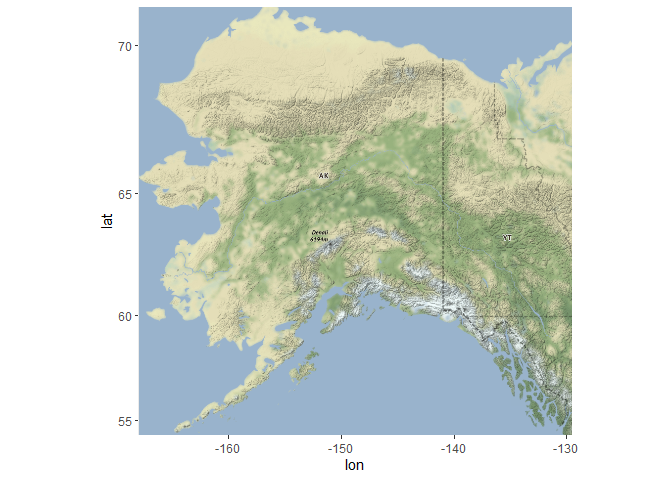
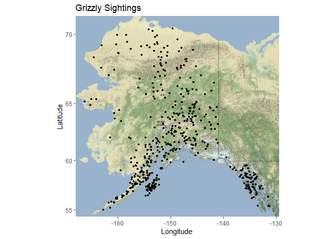
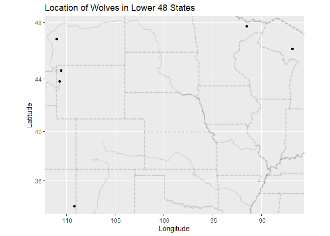
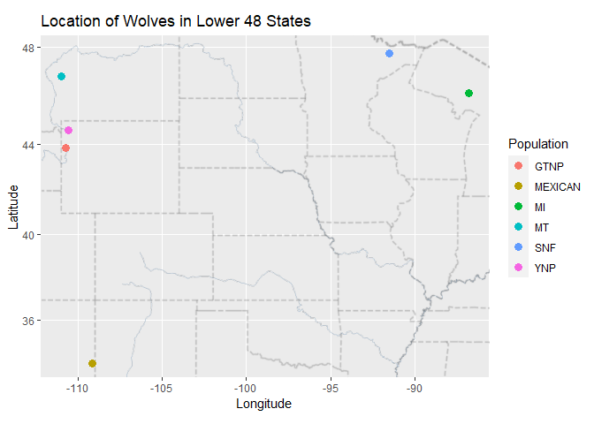

## Instructions
Answer the following questions and complete the exercises in RMarkdown. Please embed all of your code and push your final work to your repository. Your final lab report should be organized, clean, and run free from errors. Remember, you must remove the `#` for the included code chunks to run. Be sure to add your name to the author header above. For any included plots, make sure they are clearly labeled. You are free to use any plot type that you feel best communicates the results of your analysis.  

Make sure to use the formatting conventions of RMarkdown to make your report neat and clean!  

## Load the libraries

```r
library(tidyverse)
library(janitor)
library(here)
library(ggmap)
library(skimr)
library(naniar)
```


```r
library(albersusa)
```

## Load the Data
We will use two separate data sets for this homework.  

1. The first [data set](https://rcweb.dartmouth.edu/~f002d69/workshops/index_rspatial.html) represent sightings of grizzly bears (Ursos arctos) in Alaska.  
2. The second data set is from Brandell, Ellen E (2021), Serological dataset and R code for: Patterns and processes of pathogen exposure in gray wolves across North America, Dryad, [Dataset](https://doi.org/10.5061/dryad.5hqbzkh51).  

1. Load the `grizzly` data and evaluate its structure. As part of this step, produce a summary that provides the range of latitude and longitude so you can build an appropriate bounding box.


```r
grizzly <- read.csv('data/bear-sightings.csv')

skim(grizzly)
```


Table: Data summary

|                         |        |
|:------------------------|:-------|
|Name                     |grizzly |
|Number of rows           |494     |
|Number of columns        |3       |
|_______________________  |        |
|Column type frequency:   |        |
|numeric                  |3       |
|________________________ |        |
|Group variables          |None    |


**Variable type: numeric**

|skim_variable | n_missing| complete_rate|    mean|      sd|      p0|     p25|     p50|     p75|    p100|hist                                     |
|:-------------|---------:|-------------:|-------:|-------:|-------:|-------:|-------:|-------:|-------:|:----------------------------------------|
|bear.id       |         0|             1| 4934.51| 2877.87|    7.00| 2568.75| 4822.50| 7386.75| 9996.00|▇▇▇▆▇ |
|longitude     |         0|             1| -149.08|    7.65| -166.23| -154.25| -150.96| -145.59| -131.26|▁▇▇▂▃ |
|latitude      |         0|             1|   61.41|    3.83|   55.02|   58.13|   60.97|   64.13|   70.37|▇▇▇▃▃ |

```r
miss_var_summary(grizzly)
```

```
## # A tibble: 3 x 3
##   variable  n_miss pct_miss
##   <chr>      <int>    <dbl>
## 1 bear.id        0        0
## 2 longitude      0        0
## 3 latitude       0        0
```

```r
grizzly %>%
  summarise(min_lat = min(latitude),
            max_lat = max(latitude),
            min_long = min(longitude),
            max_long = max(longitude))
```

```
##    min_lat  max_lat  min_long  max_long
## 1 55.01637 70.36742 -166.2336 -131.2621
```


2. Use the range of the latitude and longitude to build an appropriate bounding box for your map.


```r
grizzly_lat <- c(55.02, 70.37)
grizzly_long <- c(-166.23, -131.26)

grizzly_bbox <- make_bbox(grizzly_long, grizzly_lat, f = 0.05)
```


3. Load a map from `stamen` in a terrain style projection and display the map.


```r
map1 <- get_map(grizzly_bbox, maptype = 'terrain', source = 'stamen')
```

```
## Map tiles by Stamen Design, under CC BY 3.0. Data by OpenStreetMap, under ODbL.
```

```r
ggmap(map1)
```

<!-- -->


4. Build a final map that overlays the recorded observations of grizzly bears in Alaska.


```r
ggmap(map1) +
  geom_point(data = grizzly, aes(longitude, latitude), size = 1) +
  labs(title = 'Grizzly Sightings',
       y = 'Latitude',
       x = 'Longitude')
```

<!-- -->


Let's switch to the wolves data. Brandell, Ellen E (2021), Serological dataset and R code for: Patterns and processes of pathogen exposure in gray wolves across North America, Dryad, [Dataset](https://doi.org/10.5061/dryad.5hqbzkh51).  

5. Load the data and evaluate its structure.  


```r
wolves <- read.csv('data/wolves_data/wolves_dataset.csv')
skim(wolves)
```


Table: Data summary

|                         |       |
|:------------------------|:------|
|Name                     |wolves |
|Number of rows           |1986   |
|Number of columns        |23     |
|_______________________  |       |
|Column type frequency:   |       |
|character                |4      |
|numeric                  |19     |
|________________________ |       |
|Group variables          |None   |


**Variable type: character**

|skim_variable | n_missing| complete_rate| min| max| empty| n_unique| whitespace|
|:-------------|---------:|-------------:|---:|---:|-----:|--------:|----------:|
|pop           |         0|          1.00|   2|   7|     0|       17|          0|
|age.cat       |       102|          0.95|   1|   1|     0|        3|          0|
|sex           |        19|          0.99|   1|   1|     0|        2|          0|
|color         |       616|          0.69|   1|   1|     0|        2|          0|


**Variable type: numeric**

|skim_variable      | n_missing| complete_rate|     mean|      sd|      p0|      p25|      p50|      p75|     p100|hist                                     |
|:------------------|---------:|-------------:|--------:|-------:|-------:|--------:|--------:|--------:|--------:|:----------------------------------------|
|year               |         0|          1.00|  2010.28|    5.91| 1992.00|  2006.00|  2011.00|  2016.00|  2019.00|▁▂▆▆▇ |
|lat                |         0|          1.00|    50.43|    9.16|   33.89|    44.60|    46.83|    57.89|    80.50|▁▇▂▂▁ |
|long               |         0|          1.00|  -116.86|   19.11| -157.84|  -123.73|  -110.99|  -110.55|   -82.42|▃▁▂▇▂ |
|habitat            |         0|          1.00| 12797.42| 7330.64|  254.08| 10375.16| 11211.30| 11860.81| 34676.55|▂▇▂▁▁ |
|human              |         0|          1.00|  2335.38| 1912.21|    0.02|    80.60|  2787.67|  3973.47|  6228.64|▇▁▅▅▁ |
|pop.density        |         0|          1.00|    14.91|    9.50|    3.74|     7.40|    11.63|    25.32|    33.96|▇▅▁▂▅ |
|pack.size          |         0|          1.00|     6.47|    1.67|    3.55|     5.62|     6.37|     8.25|     9.56|▅▇▅▆▃ |
|standard.habitat   |         0|          1.00|     0.01|    0.96|   -1.63|    -0.31|    -0.20|    -0.11|     2.88|▂▇▂▁▁ |
|standard.human     |         0|          1.00|     0.15|    0.92|   -0.98|    -0.94|     0.36|     0.94|     2.03|▇▁▅▅▁ |
|standard.pop       |         0|          1.00|     0.05|    1.01|   -1.13|    -0.75|    -0.30|     1.15|     2.07|▇▅▁▂▅ |
|standard.packsize  |         0|          1.00|    -0.04|    0.98|   -1.76|    -0.54|    -0.10|     1.00|     1.77|▅▇▅▆▃ |
|standard.latitude  |         0|          1.00|     0.00|    1.00|   -1.81|    -0.64|    -0.39|     0.81|     3.28|▁▇▂▂▁ |
|standard.longitude |         0|          1.00|     0.00|    1.00|   -2.14|    -0.36|     0.31|     0.33|     1.80|▃▁▂▇▂ |
|cav.binary         |       321|          0.84|     0.85|    0.35|    0.00|     1.00|     1.00|     1.00|     1.00|▂▁▁▁▇ |
|cdv.binary         |        21|          0.99|     0.22|    0.42|    0.00|     0.00|     0.00|     0.00|     1.00|▇▁▁▁▂ |
|cpv.binary         |         7|          1.00|     0.79|    0.40|    0.00|     1.00|     1.00|     1.00|     1.00|▂▁▁▁▇ |
|chv.binary         |       548|          0.72|     0.80|    0.40|    0.00|     1.00|     1.00|     1.00|     1.00|▂▁▁▁▇ |
|neo.binary         |       538|          0.73|     0.28|    0.45|    0.00|     0.00|     0.00|     1.00|     1.00|▇▁▁▁▃ |
|toxo.binary        |       827|          0.58|     0.48|    0.50|    0.00|     0.00|     0.00|     1.00|     1.00|▇▁▁▁▇ |

```r
miss_var_summary(wolves)
```

```
## # A tibble: 23 x 3
##    variable    n_miss pct_miss
##    <chr>        <int>    <dbl>
##  1 toxo.binary    827   41.6  
##  2 color          616   31.0  
##  3 chv.binary     548   27.6  
##  4 neo.binary     538   27.1  
##  5 cav.binary     321   16.2  
##  6 age.cat        102    5.14 
##  7 cdv.binary      21    1.06 
##  8 sex             19    0.957
##  9 cpv.binary       7    0.352
## 10 pop              0    0    
## # ... with 13 more rows
```

```r
head(wolves)
```

```
##      pop year age.cat sex color      lat      long habitat human pop.density
## 1 AK.PEN 2006       S   F     G 57.03983 -157.8427  254.08 10.42           8
## 2 AK.PEN 2006       S   M     G 57.03983 -157.8427  254.08 10.42           8
## 3 AK.PEN 2006       A   F     G 57.03983 -157.8427  254.08 10.42           8
## 4 AK.PEN 2006       S   M     B 57.03983 -157.8427  254.08 10.42           8
## 5 AK.PEN 2006       A   M     B 57.03983 -157.8427  254.08 10.42           8
## 6 AK.PEN 2006       A   M     G 57.03983 -157.8427  254.08 10.42           8
##   pack.size standard.habitat standard.human standard.pop standard.packsize
## 1      8.78          -1.6339        -0.9784      -0.6827            1.3157
## 2      8.78          -1.6339        -0.9784      -0.6827            1.3157
## 3      8.78          -1.6339        -0.9784      -0.6827            1.3157
## 4      8.78          -1.6339        -0.9784      -0.6827            1.3157
## 5      8.78          -1.6339        -0.9784      -0.6827            1.3157
## 6      8.78          -1.6339        -0.9784      -0.6827            1.3157
##   standard.latitude standard.longitude cav.binary cdv.binary cpv.binary
## 1            0.7214            -2.1441          1          0          0
## 2            0.7214            -2.1441          1          0          0
## 3            0.7214            -2.1441          1          0          1
## 4            0.7214            -2.1441          0          0          1
## 5            0.7214            -2.1441          1          0          0
## 6            0.7214            -2.1441          1          1          1
##   chv.binary neo.binary toxo.binary
## 1          1         NA          NA
## 2          1         NA          NA
## 3          1         NA          NA
## 4          1          0           1
## 5          1          0           0
## 6          1         NA          NA
```

```r
nrow(wolves)
```

```
## [1] 1986
```


6. How many distinct wolf populations are included in this study? Mae a new object that restricts the data to the wolf populations in the lower 48 US states.


```r
n_unique(wolves$pop)
```

```
## [1] 17
```

```r
wolves_lower48 <- wolves %>%
  filter(lat <= 50, long >= -124)

wolves_lower48 %>%
  summarise(min_long = min(long),
            max_long = max(long),
            min_lat = min(lat),
            max_lat = max(lat))
```

```
##    min_long  max_long  min_lat  max_lat
## 1 -110.9924 -86.81887 33.88778 47.74968
```


7. Use the range of the latitude and longitude to build an appropriate bounding box for your map.


```r
wolves_lower48_lat <- c(33.89, 47.75)
wolves_lower48_long <- c(-110.99, -86.82)

wolves_lower48_bbox <- make_bbox(wolves_lower48_long, wolves_lower48_lat, f = .05)
```


8.  Load a map from `stamen` in a `terrain-lines` projection and display the map.


```r
terrain_lines_map <- get_map(wolves_lower48_bbox, maptype = 'terrain-lines', source = 'stamen')
```

```
## Map tiles by Stamen Design, under CC BY 3.0. Data by OpenStreetMap, under ODbL.
```

```r
ggmap(terrain_lines_map)
```

<!-- -->


9. Build a final map that overlays the recorded observations of wolves in the lower 48 states.


```r
ggmap(terrain_lines_map) +
  geom_point(data = wolves_lower48, aes(x = long, y = lat)) +
  labs(title = 'Location of Wolves in Lower 48 States',
       x = 'Longitude',
       y = 'Latitude')
```

<!-- -->


10. Use the map from #9 above, but add some aesthetics. Try to `fill` and `color` by population.


```r
ggmap(terrain_lines_map) +
  geom_point(data = wolves_lower48, aes(x = long, y = lat, color = pop), size = 3) +
  labs(title = 'Location of Wolves in Lower 48 States',
       x = 'Longitude',
       y = 'Latitude',
       color = 'Population')
```

<!-- -->


## Push your final code to GitHub!
Please be sure that you check the `keep md` file in the knit preferences. 
