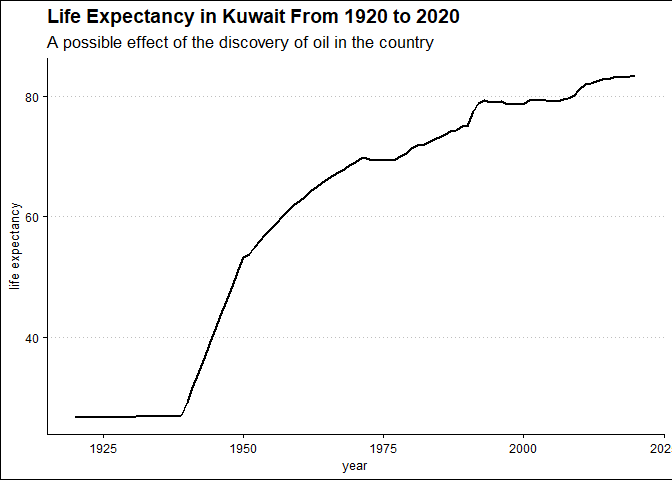
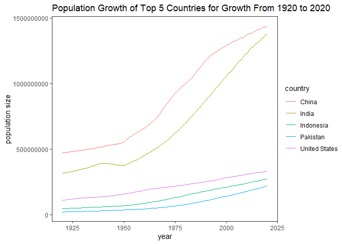
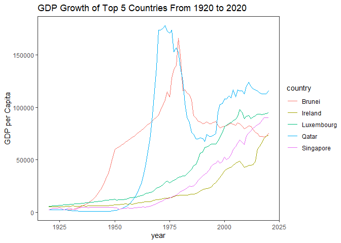
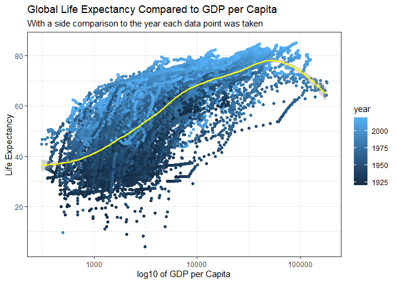

turning off scientific notation

```r
options(scipen = 999)
```

## Instructions
Answer the following questions and complete the exercises in RMarkdown. Please embed all of your code and push your final work to your repository. Your code should be organized, clean, and run free from errors. Be sure to **add your name** to the author header above. You may use any resources to answer these questions (including each other), but you may not post questions to Open Stacks or external help sites. There are 10 total questions.  

Make sure to use the formatting conventions of RMarkdown to make your report neat and clean! Your plots should use consistent aesthetics throughout.  

This exam is due by **12:00p on Tuesday, February 22**.  

Loading packages

```r
library(tidyverse)
```

```
## -- Attaching packages --------------------------------------- tidyverse 1.3.1 --
```

```
## v ggplot2 3.3.5     v purrr   0.3.4
## v tibble  3.1.6     v dplyr   1.0.7
## v tidyr   1.1.4     v stringr 1.4.0
## v readr   2.1.1     v forcats 0.5.1
```

```
## -- Conflicts ------------------------------------------ tidyverse_conflicts() --
## x dplyr::filter() masks stats::filter()
## x dplyr::lag()    masks stats::lag()
```

```r
library(naniar)
library(here)
```

```
## here() starts at C:/Users/royba/OneDrive - University of California, Davis/Backup/Documents/github/BIS15W2022_eroybal
```

```r
library(janitor)
```

```
## 
## Attaching package: 'janitor'
```

```
## The following objects are masked from 'package:stats':
## 
##     chisq.test, fisher.test
```

```r
library(skimr)
```

```
## 
## Attaching package: 'skimr'
```

```
## The following object is masked from 'package:naniar':
## 
##     n_complete
```

```r
library(paletteer)
```


## Gapminder
For this assignment, we are going to use data from  [gapminder](https://www.gapminder.org/). Gapminder includes information about economics, population, social issues, and life expectancy from countries all over the world. We will use three data sets, so please load all three as separate objects.    

1. population_total.csv  
2. income_per_person_gdppercapita_ppp_inflation_adjusted.csv  
3. life_expectancy_years.csv  

Loading Gapminder data

```r
population_total <- read.csv('data/population_total.csv')
income_gdp_inflation <- read.csv('data/income_per_person_gdppercapita_ppp_inflation_adjusted.csv')
life_expectancy <- read.csv('data/life_expectancy_years.csv')
```


1. (3 points) Once you have an idea of the structure of the data, please make each data set tidy (hint: think back to pivots) and store them as new objects. You will need both the original (wide) and tidy (long) data!  

inspecting and tidying population_total

```r
head(population_total)
```

```
##               country   X1800   X1801   X1802   X1803   X1804   X1805   X1806
## 1         Afghanistan 3280000 3280000 3280000 3280000 3280000 3280000 3280000
## 2             Albania  400000  402000  404000  405000  407000  409000  411000
## 3             Algeria 2500000 2510000 2520000 2530000 2540000 2550000 2560000
## 4             Andorra    2650    2650    2650    2650    2650    2650    2650
## 5              Angola 1570000 1570000 1570000 1570000 1570000 1570000 1570000
## 6 Antigua and Barbuda   37000   37000   37000   37000   37000   37000   37000
##     X1807   X1808   X1809   X1810   X1811   X1812   X1813   X1814   X1815
## 1 3280000 3280000 3280000 3280000 3280000 3280000 3280000 3280000 3280000
## 2  413000  414000  416000  418000  420000  422000  424000  426000  427000
## 3 2560000 2570000 2580000 2590000 2600000 2610000 2620000 2630000 2640000
## 4    2650    2650    2650    2650    2650    2650    2650    2650    2650
## 5 1570000 1570000 1570000 1570000 1570000 1570000 1570000 1570000 1570000
## 6   37000   37000   37000   37000   37000   37000   37000   37000   37000
##     X1816   X1817   X1818   X1819   X1820   X1821   X1822   X1823   X1824
## 1 3280000 3280000 3280000 3280000 3290000 3300000 3310000 3320000 3340000
## 2  429000  431000  433000  435000  437000  439000  441000  443000  445000
## 3 2650000 2660000 2670000 2680000 2690000 2690000 2700000 2700000 2710000
## 4    2650    2650    2650    2660    2670    2680    2690    2710    2730
## 5 1570000 1570000 1570000 1570000 1580000 1590000 1610000 1640000 1660000
## 6   37000   37000   37000   37000   37000   37000   37000   37000   37000
##     X1825   X1826   X1827   X1828   X1829   X1830   X1831   X1832   X1833
## 1 3350000 3370000 3380000 3400000 3410000 3430000 3450000 3460000 3480000
## 2  447000  449000  451000  453000  455000  457000  459000  461000  463000
## 3 2710000 2720000 2720000 2730000 2730000 2740000 2740000 2750000 2750000
## 4    2750    2770    2790    2810    2830    2850    2870    2890    2910
## 5 1690000 1710000 1740000 1760000 1790000 1810000 1840000 1870000 1900000
## 6   37000   37000   37000   37000   37000   37000   37000   37000   37000
##     X1834   X1835   X1836   X1837   X1838   X1839   X1840   X1841   X1842
## 1 3490000 3510000 3520000 3540000 3550000 3570000 3590000 3600000 3620000
## 2  465000  467000  470000  472000  474000  476000  478000  480000  482000
## 3 2760000 2760000 2770000 2770000 2780000 2780000 2790000 2790000 2800000
## 4    2930    2950    2970    2990    3010    3030    3060    3080    3100
## 5 1920000 1950000 1980000 2010000 2040000 2070000 2100000 2130000 2160000
## 6   37000   37000   37000   37000   37000   37000   37000   37000   37000
##     X1843   X1844   X1845   X1846   X1847   X1848   X1849   X1850   X1851
## 1 3630000 3650000 3670000 3680000 3700000 3720000 3730000 3750000 3770000
## 2  485000  487000  489000  491000  493000  496000  498000  501000  505000
## 3 2800000 2810000 2810000 2820000 2820000 2830000 2840000 2850000 2870000
## 4    3120    3140    3170    3190    3210    3230    3260    3280    3300
## 5 2190000 2230000 2260000 2290000 2330000 2360000 2390000 2420000 2450000
## 6   37000   37000   37000   37000   37000   37000   37000   37000   37000
##     X1852   X1853   X1854   X1855   X1856   X1857   X1858   X1859   X1860
## 1 3790000 3810000 3830000 3840000 3860000 3880000 3900000 3920000 3940000
## 2  510000  515000  520000  525000  530000  535000  540000  545000  551000
## 3 2900000 2920000 2950000 2980000 3010000 3040000 3070000 3100000 3130000
## 4    3320    3350    3370    3390    3420    3440    3460    3490    3510
## 5 2470000 2490000 2510000 2530000 2550000 2570000 2600000 2620000 2640000
## 6   37000   37000   37000   37000   37000   37000   36900   36900   36800
##     X1861   X1862   X1863   X1864   X1865   X1866   X1867   X1868   X1869
## 1 3960000 3980000 4000000 4020000 4040000 4060000 4080000 4100000 4120000
## 2  556000  561000  567000  572000  578000  584000  589000  595000  601000
## 3 3170000 3200000 3230000 3260000 3290000 3330000 3360000 3390000 3430000
## 4    3540    3560    3590    3610    3640    3660    3690    3710    3740
## 5 2660000 2680000 2710000 2730000 2750000 2780000 2800000 2820000 2840000
## 6   36700   36500   36300   36100   35900   35700   35500   35300   35100
##     X1870   X1871   X1872   X1873   X1874   X1875   X1876   X1877   X1878
## 1 4140000 4160000 4180000 4210000 4230000 4250000 4270000 4290000 4310000
## 2  606000  612000  618000  624000  630000  636000  642000  648000  655000
## 3 3460000 3500000 3530000 3570000 3600000 3640000 3670000 3710000 3750000
## 4    3760    3790    3820    3840    3870    3900    3920    3950    3980
## 5 2870000 2890000 2910000 2930000 2940000 2960000 2980000 3000000 3020000
## 6   35000   34900   34900   34900   34900   34800   34800   34800   34800
##     X1879   X1880   X1881   X1882   X1883   X1884   X1885   X1886   X1887
## 1 4330000 4350000 4380000 4400000 4420000 4440000 4460000 4490000 4510000
## 2  661000  667000  674000  680000  687000  693000  700000  707000  714000
## 3 3790000 3820000 3860000 3900000 3940000 3980000 4020000 4060000 4100000
## 4    4010    4030    4060    4090    4120    4150    4170    4200    4230
## 5 3040000 3060000 3080000 3100000 3120000 3140000 3160000 3180000 3200000
## 6   34900   34900   35000   35200   35400   35600   35800   36000   36200
##     X1888   X1889   X1890   X1891   X1892   X1893   X1894   X1895   X1896
## 1 4530000 4550000 4580000 4600000 4620000 4650000 4670000 4690000 4710000
## 2  720000  727000  735000  742000  749000  757000  764000  772000  780000
## 3 4140000 4180000 4220000 4260000 4300000 4340000 4390000 4430000 4470000
## 4    4260    4290    4320    4350    4380    4410    4440    4470    4500
## 5 3220000 3230000 3240000 3240000 3240000 3230000 3210000 3200000 3190000
## 6   36300   36500   36500   36400   36300   36100   35900   35700   35500
##     X1897   X1898   X1899   X1900   X1901   X1902   X1903   X1904   X1905
## 1 4740000 4760000 4790000 4830000 4880000 4940000 5000000 5060000 5130000
## 2  788000  795000  803000  811000  819000  826000  834000  842000  849000
## 3 4510000 4560000 4610000 4660000 4730000 4800000 4880000 4950000 5030000
## 4    4540    4570    4600    4630    4660    4690    4730    4760    4790
## 5 3180000 3170000 3150000 3140000 3120000 3100000 3080000 3060000 3040000
## 6   35300   35100   34900   34600   34400   34100   33800   33400   33100
##     X1906   X1907   X1908   X1909   X1910   X1911   X1912   X1913   X1914
## 1 5200000 5260000 5330000 5470000 5680000 5980000 6360000 6850000 7370000
## 2  857000  865000  873000  881000  888000  895000  901000  907000  913000
## 3 5120000 5200000 5280000 5360000 5420000 5470000 5510000 5530000 5560000
## 4    4830    4860    4890    4940    4990    5060    5150    5240    5330
## 5 3020000 3000000 2980000 2960000 2950000 2930000 2920000 2920000 2910000
## 6   32800   32500   32200   32000   31700   31500   31200   31000   30800
##     X1915   X1916   X1917   X1918    X1919    X1920    X1921    X1922   X1923
## 1 7920000 8520000 9170000 9880000 10300000 10600000 10500000 10300000 9710000
## 2  919000  926000  932000  938000   944000   949000   955000   960000  965000
## 3 5590000 5620000 5640000 5670000  5710000  5750000  5800000  5860000 5920000
## 4    5430    5530    5630    5740     5800     5820     5800     5740    5630
## 5 2900000 2890000 2880000 2870000  2870000  2880000  2900000  2940000 2980000
## 6   30600   30400   30200   30000    29900    29800    29800    29800   29900
##     X1924   X1925   X1926   X1927   X1928   X1929   X1930   X1931   X1932
## 1 9200000 8720000 8260000 7830000 7420000 7100000 6870000 6720000 6640000
## 2  970000  975000  980000  985000  990000  997000 1000000 1010000 1020000
## 3 5990000 6050000 6120000 6190000 6260000 6340000 6420000 6520000 6630000
## 4    5530    5430    5330    5240    5140    5080    5040    5040    5060
## 5 3030000 3070000 3120000 3160000 3210000 3260000 3310000 3350000 3400000
## 6   30000   30100   30200   30300   30400   30700   31100   31800   32600
##     X1933   X1934   X1935   X1936   X1937   X1938   X1939   X1940   X1941
## 1 6640000 6640000 6640000 6640000 6640000 6640000 6660000 6700000 6770000
## 2 1030000 1040000 1050000 1060000 1080000 1090000 1100000 1110000 1120000
## 3 6740000 6860000 6990000 7110000 7230000 7360000 7490000 7610000 7730000
## 4    5120    5170    5230    5280    5340    5390    5450    5510    5570
## 5 3450000 3500000 3550000 3600000 3650000 3700000 3750000 3810000 3870000
## 6   33600   34600   35700   36800   37900   39100   40100   41000   41700
##     X1942   X1943   X1944   X1945   X1946   X1947   X1948   X1949   X1950
## 1 6850000 6950000 7060000 7170000 7280000 7390000 7500000 7620000 7750000
## 2 1140000 1150000 1160000 1180000 1190000 1210000 1220000 1240000 1260000
## 3 7860000 7970000 8090000 8210000 8340000 8460000 8590000 8730000 8870000
## 4    5630    5690    5750    5810    5870    5930    5990    6080    6200
## 5 3940000 4010000 4080000 4160000 4230000 4310000 4390000 4470000 4550000
## 6   42200   42600   43000   43300   43700   44100   44500   45000   45500
##     X1951   X1952   X1953   X1954   X1955    X1956    X1957    X1958    X1959
## 1 7840000 7940000 8040000 8150000 8270000  8400000  8540000  8680000  8830000
## 2 1290000 1320000 1350000 1380000 1420000  1460000  1500000  1540000  1590000
## 3 9020000 9190000 9360000 9560000 9770000 10000000 10300000 10500000 10800000
## 4    6690    7250    7860    8530    9230     9980    10800    11600    12500
## 5 4620000 4710000 4820000 4940000 5040000  5140000  5230000  5310000  5380000
## 6   46500   47400   48100   48900   49600    50500    51400    52300    53200
##      X1960    X1961    X1962    X1963    X1964    X1965    X1966    X1967
## 1  9000000  9170000  9350000  9540000  9740000  9960000 10200000 10400000
## 2  1640000  1690000  1740000  1790000  1840000  1900000  1950000  2000000
## 3 11100000 11300000 11600000 11900000 12200000 12600000 12900000 13300000
## 4    13400    14400    15400    16400    17500    18500    19600    20800
## 5  5450000  5530000  5610000  5680000  5730000  5770000  5780000  5770000
## 6    54100    55000    55800    56700    57600    58700    59900    61200
##      X1968    X1969    X1970    X1971    X1972    X1973    X1974    X1975
## 1 10600000 10900000 11200000 11500000 11800000 12100000 12400000 12700000
## 2  2050000  2100000  2150000  2200000  2250000  2310000  2360000  2410000
## 3 13700000 14100000 14500000 14900000 15300000 15700000 16100000 16600000
## 4    21900    23100    24300    25600    26900    28200    29500    30700
## 5  5770000  5800000  5890000  6040000  6250000  6500000  6760000  7020000
## 6    62500    63600    64200    64400    64100    63600    63100    62700
##      X1976    X1977    X1978    X1979    X1980    X1981    X1982    X1983
## 1 12900000 13200000 13300000 13400000 13400000 13200000 12900000 12500000
## 2  2460000  2520000  2570000  2630000  2680000  2740000  2790000  2840000
## 3 17100000 17600000 18100000 18600000 19200000 19800000 20500000 21100000
## 4    31800    32800    33700    34800    36100    37500    39100    40900
## 5  7280000  7530000  7790000  8060000  8340000  8640000  8950000  9280000
## 6    62400    62200    62000    61900    61900    61800    61800    61800
##      X1984    X1985    X1986    X1987    X1988    X1989    X1990    X1991
## 1 12200000 11900000 11700000 11600000 11600000 11900000 12400000 13300000
## 2  2900000  2970000  3040000  3120000  3200000  3260000  3290000  3280000
## 3 21800000 22400000 23100000 23800000 24400000 25100000 25800000 26400000
## 4    42700    44600    46500    48500    50400    52500    54500    56700
## 5  9610000  9960000 10300000 10700000 11100000 11500000 11800000 12200000
## 6    61800    61800    61800    61700    61800    62000    62500    63400
##      X1992    X1993    X1994    X1995    X1996    X1997    X1998    X1999
## 1 14500000 15800000 17100000 18100000 18900000 19400000 19700000 20200000
## 2  3250000  3200000  3150000  3110000  3100000  3100000  3110000  3120000
## 3 27000000 27600000 28200000 28800000 29300000 29700000 30200000 30600000
## 4    58900    61000    62700    63900    64400    64300    64100    64400
## 5 12700000 13100000 13500000 13900000 14400000 14900000 15400000 15900000
## 6    64500    65800    67200    68700    70200    71700    73200    74700
##      X2000    X2001    X2002    X2003    X2004    X2005    X2006    X2007
## 1 20800000 21600000 22600000 23700000 24700000 25700000 26400000 27100000
## 2  3130000  3130000  3130000  3120000  3100000  3090000  3060000  3030000
## 3 31000000 31500000 31900000 32300000 32700000 33100000 33600000 34200000
## 4    65400    67300    70000    73200    76300    78900    81000    82700
## 5 16400000 16900000 17500000 18100000 18800000 19400000 20100000 20900000
## 6    76000    77200    78300    79300    80300    81500    82700    84000
##      X2008    X2009    X2010    X2011    X2012    X2013    X2014    X2015
## 1 27700000 28400000 29200000 30100000 31200000 32300000 33400000 34400000
## 2  3000000  2970000  2950000  2930000  2910000  2900000  2900000  2890000
## 3 34700000 35300000 36000000 36700000 37400000 38100000 38900000 39700000
## 4    83900    84500    84500    83700    82400    80800    79200    78000
## 5 21700000 22500000 23400000 24200000 25100000 26000000 26900000 27900000
## 6    85400    86700    88000    89300    90400    91500    92600    93600
##      X2016    X2017    X2018    X2019    X2020    X2021    X2022    X2023
## 1 35400000 36300000 37200000 38000000 38900000 39800000 40800000 41700000
## 2  2890000  2880000  2880000  2880000  2880000  2870000  2870000  2860000
## 3 40600000 41400000 42200000 43100000 43900000 44600000 45400000 46100000
## 4    77300    77000    77000    77100    77300    77400    77500    77600
## 5 28800000 29800000 30800000 31800000 32900000 33900000 35000000 36100000
## 6    94500    95400    96300    97100    97900    98700    99500   100000
##      X2024    X2025    X2026    X2027    X2028    X2029    X2030    X2031
## 1 42600000 43500000 44400000 45400000 46300000 47200000 48100000 49000000
## 2  2850000  2840000  2830000  2820000  2810000  2800000  2790000  2770000
## 3 46700000 47400000 48000000 48600000 49200000 49800000 50400000 50900000
## 4    77700    77800    77900    77900    77900    77900    77900    77900
## 5 37300000 38500000 39700000 40900000 42200000 43500000 44800000 46200000
## 6   101000   102000   102000   103000   104000   104000   105000   105000
##      X2032    X2033    X2034    X2035    X2036    X2037    X2038    X2039
## 1 49900000 50800000 51700000 52600000 53500000 54300000 55200000 56100000
## 2  2760000  2750000  2740000  2720000  2710000  2690000  2670000  2650000
## 3 51400000 52000000 52500000 53000000 53500000 54100000 54600000 55100000
## 4    78000    78000    78000    78000    78000    78000    77900    77900
## 5 47600000 49000000 50500000 52000000 53500000 55000000 56600000 58200000
## 6   106000   106000   107000   107000   108000   108000   108000   109000
##      X2040    X2041    X2042    X2043    X2044    X2045    X2046    X2047
## 1 56900000 57700000 58600000 59400000 60200000 61000000 61700000 62500000
## 2  2630000  2620000  2600000  2580000  2550000  2530000  2510000  2490000
## 3 55600000 56200000 56700000 57300000 57800000 58300000 58900000 59400000
## 4    77900    77800    77700    77600    77500    77300    77100    76900
## 5 59800000 61400000 63100000 64800000 66500000 68300000 70100000 71900000
## 6   109000   109000   110000   110000   110000   110000   110000   111000
##      X2048    X2049    X2050    X2051    X2052    X2053    X2054    X2055
## 1 63200000 64000000 64700000 65400000 66100000 66700000 67400000 68000000
## 2  2470000  2450000  2420000  2400000  2380000  2360000  2330000  2310000
## 3 59900000 60400000 60900000 61400000 61900000 62300000 62800000 63200000
## 4    76700    76400    76100    75800    75400    75100    74600    74200
## 5 73700000 75500000 77400000 79300000 81200000 83200000 85100000 87100000
## 6   111000   111000   111000   111000   111000   111000   111000   111000
##      X2056    X2057    X2058    X2059    X2060    X2061     X2062     X2063
## 1 68600000 69200000 69800000 70300000 70800000 71400000  71800000  72300000
## 2  2290000  2260000  2240000  2210000  2190000  2170000   2140000   2120000
## 3 63600000 64000000 64300000 64700000 65000000 65300000  65600000  65800000
## 4    73800    73300    72800    72300    71800    71300     70800     70200
## 5 89100000 91100000 93200000 95300000 97300000 99500000 102000000 104000000
## 6   111000   111000   111000   111000   111000   111000    110000    110000
##       X2064     X2065     X2066     X2067     X2068     X2069     X2070
## 1  72800000  73200000  73600000  74000000  74300000  74700000  75000000
## 2   2090000   2070000   2040000   2020000   1990000   1970000   1940000
## 3  66100000  66300000  66600000  66800000  67000000  67200000  67400000
## 4     69700     69200     68700     68300     67800     67400     66900
## 5 106000000 108000000 110000000 112000000 115000000 117000000 119000000
## 6    110000    110000    110000    110000    110000    109000    109000
##       X2071     X2072     X2073     X2074     X2075     X2076     X2077
## 1  75300000  75500000  75800000  76000000  76200000  76400000  76500000
## 2   1920000   1890000   1860000   1830000   1810000   1780000   1750000
## 3  67500000  67700000  67900000  68100000  68200000  68400000  68600000
## 4     66500     66200     65800     65500     65200     64900     64600
## 5 121000000 124000000 126000000 128000000 131000000 133000000 135000000
## 6    109000    109000    109000    109000    108000    108000    108000
##       X2078     X2079     X2080     X2081     X2082     X2083     X2084
## 1  76700000  76800000  76900000  76900000  77000000  77000000  77000000
## 2   1720000   1690000   1660000   1630000   1600000   1570000   1540000
## 3  68700000  68900000  69000000  69200000  69300000  69500000  69600000
## 4     64400     64200     64000     63900     63700     63600     63500
## 5 137000000 140000000 142000000 144000000 147000000 149000000 151000000
## 6    108000    108000    107000    107000    107000    107000    106000
##       X2085     X2086     X2087     X2088     X2089     X2090     X2091
## 1  77000000  77000000  76900000  76900000  76800000  76700000  76600000
## 2   1510000   1480000   1450000   1420000   1390000   1360000   1330000
## 3  69700000  69900000  70000000  70100000  70200000  70300000  70400000
## 4     63400     63300     63300     63200     63100     63100     63000
## 5 154000000 156000000 158000000 161000000 163000000 165000000 168000000
## 6    106000    106000    106000    105000    105000    105000    105000
##       X2092     X2093     X2094     X2095     X2096     X2097     X2098
## 1  76400000  76300000  76100000  76000000  75800000  75600000  75400000
## 2   1300000   1270000   1250000   1220000   1190000   1170000   1140000
## 3  70500000  70500000  70600000  70700000  70700000  70700000  70700000
## 4     62900     62900     62800     62700     62700     62600     62500
## 5 170000000 172000000 175000000 177000000 179000000 182000000 184000000
## 6    104000    104000    104000    104000    103000    103000    103000
##       X2099     X2100
## 1  75200000  74900000
## 2   1110000   1090000
## 3  70700000  70700000
## 4     62500     62400
## 5 186000000 188000000
## 6    102000    102000
```

```r
anyNA(population_total)
```

```
## [1] FALSE
```

```r
#cleaning names
population_total <- clean_names(population_total)

colnames(population_total)
```

```
##   [1] "country" "x1800"   "x1801"   "x1802"   "x1803"   "x1804"   "x1805"  
##   [8] "x1806"   "x1807"   "x1808"   "x1809"   "x1810"   "x1811"   "x1812"  
##  [15] "x1813"   "x1814"   "x1815"   "x1816"   "x1817"   "x1818"   "x1819"  
##  [22] "x1820"   "x1821"   "x1822"   "x1823"   "x1824"   "x1825"   "x1826"  
##  [29] "x1827"   "x1828"   "x1829"   "x1830"   "x1831"   "x1832"   "x1833"  
##  [36] "x1834"   "x1835"   "x1836"   "x1837"   "x1838"   "x1839"   "x1840"  
##  [43] "x1841"   "x1842"   "x1843"   "x1844"   "x1845"   "x1846"   "x1847"  
##  [50] "x1848"   "x1849"   "x1850"   "x1851"   "x1852"   "x1853"   "x1854"  
##  [57] "x1855"   "x1856"   "x1857"   "x1858"   "x1859"   "x1860"   "x1861"  
##  [64] "x1862"   "x1863"   "x1864"   "x1865"   "x1866"   "x1867"   "x1868"  
##  [71] "x1869"   "x1870"   "x1871"   "x1872"   "x1873"   "x1874"   "x1875"  
##  [78] "x1876"   "x1877"   "x1878"   "x1879"   "x1880"   "x1881"   "x1882"  
##  [85] "x1883"   "x1884"   "x1885"   "x1886"   "x1887"   "x1888"   "x1889"  
##  [92] "x1890"   "x1891"   "x1892"   "x1893"   "x1894"   "x1895"   "x1896"  
##  [99] "x1897"   "x1898"   "x1899"   "x1900"   "x1901"   "x1902"   "x1903"  
## [106] "x1904"   "x1905"   "x1906"   "x1907"   "x1908"   "x1909"   "x1910"  
## [113] "x1911"   "x1912"   "x1913"   "x1914"   "x1915"   "x1916"   "x1917"  
## [120] "x1918"   "x1919"   "x1920"   "x1921"   "x1922"   "x1923"   "x1924"  
## [127] "x1925"   "x1926"   "x1927"   "x1928"   "x1929"   "x1930"   "x1931"  
## [134] "x1932"   "x1933"   "x1934"   "x1935"   "x1936"   "x1937"   "x1938"  
## [141] "x1939"   "x1940"   "x1941"   "x1942"   "x1943"   "x1944"   "x1945"  
## [148] "x1946"   "x1947"   "x1948"   "x1949"   "x1950"   "x1951"   "x1952"  
## [155] "x1953"   "x1954"   "x1955"   "x1956"   "x1957"   "x1958"   "x1959"  
## [162] "x1960"   "x1961"   "x1962"   "x1963"   "x1964"   "x1965"   "x1966"  
## [169] "x1967"   "x1968"   "x1969"   "x1970"   "x1971"   "x1972"   "x1973"  
## [176] "x1974"   "x1975"   "x1976"   "x1977"   "x1978"   "x1979"   "x1980"  
## [183] "x1981"   "x1982"   "x1983"   "x1984"   "x1985"   "x1986"   "x1987"  
## [190] "x1988"   "x1989"   "x1990"   "x1991"   "x1992"   "x1993"   "x1994"  
## [197] "x1995"   "x1996"   "x1997"   "x1998"   "x1999"   "x2000"   "x2001"  
## [204] "x2002"   "x2003"   "x2004"   "x2005"   "x2006"   "x2007"   "x2008"  
## [211] "x2009"   "x2010"   "x2011"   "x2012"   "x2013"   "x2014"   "x2015"  
## [218] "x2016"   "x2017"   "x2018"   "x2019"   "x2020"   "x2021"   "x2022"  
## [225] "x2023"   "x2024"   "x2025"   "x2026"   "x2027"   "x2028"   "x2029"  
## [232] "x2030"   "x2031"   "x2032"   "x2033"   "x2034"   "x2035"   "x2036"  
## [239] "x2037"   "x2038"   "x2039"   "x2040"   "x2041"   "x2042"   "x2043"  
## [246] "x2044"   "x2045"   "x2046"   "x2047"   "x2048"   "x2049"   "x2050"  
## [253] "x2051"   "x2052"   "x2053"   "x2054"   "x2055"   "x2056"   "x2057"  
## [260] "x2058"   "x2059"   "x2060"   "x2061"   "x2062"   "x2063"   "x2064"  
## [267] "x2065"   "x2066"   "x2067"   "x2068"   "x2069"   "x2070"   "x2071"  
## [274] "x2072"   "x2073"   "x2074"   "x2075"   "x2076"   "x2077"   "x2078"  
## [281] "x2079"   "x2080"   "x2081"   "x2082"   "x2083"   "x2084"   "x2085"  
## [288] "x2086"   "x2087"   "x2088"   "x2089"   "x2090"   "x2091"   "x2092"  
## [295] "x2093"   "x2094"   "x2095"   "x2096"   "x2097"   "x2098"   "x2099"  
## [302] "x2100"
```

```r
#pivoting dataframe
population_total_long <- population_total %>%
  pivot_longer(-country,
               names_to = 'year',
               values_to = 'population_size')
  
#removing x from year
population_total_long$year <- population_total_long$year %>%
  str_replace('x','')

#converting year to integer
population_total_long$year <- as.integer(population_total_long$year)
head(population_total_long)
```

```
## # A tibble: 6 x 3
##   country      year population_size
##   <chr>       <int>           <int>
## 1 Afghanistan  1800         3280000
## 2 Afghanistan  1801         3280000
## 3 Afghanistan  1802         3280000
## 4 Afghanistan  1803         3280000
## 5 Afghanistan  1804         3280000
## 6 Afghanistan  1805         3280000
```

```r
nrow(population_total_long)
```

```
## [1] 58695
```

```r
summary(population_total_long)
```

```
##    country               year      population_size     
##  Length:58695       Min.   :1800   Min.   :       645  
##  Class :character   1st Qu.:1875   1st Qu.:    422000  
##  Mode  :character   Median :1950   Median :   2610000  
##                     Mean   :1950   Mean   :  23285253  
##                     3rd Qu.:2025   3rd Qu.:  10800000  
##                     Max.   :2100   Max.   :1650000000
```

```r
skim(population_total_long)
```


Table: Data summary

|                         |                      |
|:------------------------|:---------------------|
|Name                     |population_total_long |
|Number of rows           |58695                 |
|Number of columns        |3                     |
|_______________________  |                      |
|Column type frequency:   |                      |
|character                |1                     |
|numeric                  |2                     |
|________________________ |                      |
|Group variables          |None                  |


**Variable type: character**

|skim_variable | n_missing| complete_rate| min| max| empty| n_unique| whitespace|
|:-------------|---------:|-------------:|---:|---:|-----:|--------:|----------:|
|country       |         0|             1|   3|  30|     0|      195|          0|


**Variable type: numeric**

|skim_variable   | n_missing| complete_rate|     mean|           sd|   p0|    p25|     p50|      p75|       p100|hist                                     |
|:---------------|---------:|-------------:|--------:|------------:|----:|------:|-------:|--------:|----------:|:----------------------------------------|
|year            |         0|             1|     1950|        86.89| 1800|   1875|    1950|     2025|       2100|▇▇▇▇▇ |
|population_size |         0|             1| 23285253| 100717285.09|  645| 422000| 2610000| 10800000| 1650000000|▇▁▁▁▁ |

inspecting and tidying income_gdp_inflation

```r
head(income_gdp_inflation)
```

```
##               country X1800 X1801 X1802 X1803 X1804 X1805 X1806 X1807 X1808
## 1         Afghanistan   603   603   603   603   603   603   603   603   603
## 2             Albania   667   667   667   667   667   668   668   668   668
## 3             Algeria   715   716   717   718   719   720   721   722   723
## 4             Andorra  1200  1200  1200  1200  1210  1210  1210  1210  1220
## 5              Angola   618   620   623   626   628   631   634   637   640
## 6 Antigua and Barbuda   757   757   757   757   757   757   757   758   758
##   X1809 X1810 X1811 X1812 X1813 X1814 X1815 X1816 X1817 X1818 X1819 X1820 X1821
## 1   603   604   604   604   604   604   604   604   604   604   604   604   607
## 2   668   668   668   668   668   668   669   669   669   669   669   669   671
## 3   724   725   726   727   728   729   730   731   732   733   734   735   743
## 4  1220  1220  1220  1220  1230  1230  1230  1230  1240  1240  1240  1240  1260
## 5   642   645   648   651   654   657   660   662   665   668   671   674   677
## 6   758   758   758   758   758   758   758   759   759   759   759   759   764
##   X1822 X1823 X1824 X1825 X1826 X1827 X1828 X1829 X1830 X1831 X1832 X1833 X1834
## 1   609   611   613   615   617   619   621   623   625   627   630   632   634
## 2   672   674   675   677   678   680   681   683   684   686   688   689   691
## 3   751   759   767   775   784   792   801   810   819   828   837   846   855
## 4  1270  1290  1300  1320  1330  1350  1370  1380  1400  1410  1430  1450  1470
## 5   680   683   686   689   692   695   698   701   704   708   711   714   717
## 6   769   775   780   785   790   796   801   806   812   817   823   828   834
##   X1835 X1836 X1837 X1838 X1839 X1840 X1841 X1842 X1843 X1844 X1845 X1846 X1847
## 1   636   638   640   643   645   647   649   651   654   656   658   660   663
## 2   692   694   695   697   699   700   702   703   705   707   708   710   711
## 3   864   874   883   893   903   912   922   932   943   953   963   974   984
## 4  1480  1500  1520  1540  1550  1570  1590  1610  1630  1650  1670  1690  1710
## 5   720   723   726   730   733   736   739   743   746   749   752   756   759
## 6   840   845   851   857   863   868   874   880   886   892   898   904   910
##   X1848 X1849 X1850 X1851 X1852 X1853 X1854 X1855 X1856 X1857 X1858 X1859 X1860
## 1   665   667   669   672   674   676   678   681   683   685   688   690   692
## 2   713   715   716   718   720   721   723   724   726   728   729   731   733
## 3   995  1010  1020  1030  1040  1050  1060  1070  1090  1100  1110  1120  1130
## 4  1730  1750  1770  1790  1810  1830  1860  1880  1900  1920  1950  1970  1990
## 5   762   766   769   773   776   779   783   786   790   793   797   800   804
## 6   917   923   929   935   942   948   954   961   967   974   980   987   994
##   X1861 X1862 X1863 X1864 X1865 X1866 X1867 X1868 X1869 X1870 X1871 X1872 X1873
## 1   695   697   699   702   704   707   709   711   714   716   719   721   724
## 2   738   745   751   757   763   770   776   782   788   795   807   819   831
## 3  1150  1160  1170  1180  1200  1210  1220  1240  1250  1260  1280  1290  1310
## 4  2020  2040  2060  2090  2110  2140  2160  2190  2220  2240  2270  2300  2320
## 5   807   811   814   818   822   825   829   832   836   840   844   847   851
## 6  1000  1010  1010  1020  1030  1040  1040  1050  1060  1060  1070  1080  1090
##   X1874 X1875 X1876 X1877 X1878 X1879 X1880 X1881 X1882 X1883 X1884 X1885 X1886
## 1   726   729   731   734   736   739   741   758   774   791   807   824   840
## 2   843   855   868   881   894   907   920   934   947   961   976   990  1010
## 3  1320  1330  1350  1360  1380  1390  1410  1420  1440  1450  1470  1490  1500
## 4  2350  2380  2410  2440  2460  2490  2520  2550  2580  2610  2650  2680  2710
## 5   855   858   862   866   870   874   878   881   885   889   893   897   901
## 6  1090  1100  1110  1110  1120  1130  1140  1150  1150  1160  1170  1180  1180
##   X1887 X1888 X1889 X1890 X1891 X1892 X1893 X1894 X1895 X1896 X1897 X1898 X1899
## 1   858   874   892   909   926   944   961   979   997  1010  1030  1050  1070
## 2  1020  1030  1050  1070  1080  1100  1110  1130  1140  1160  1170  1190  1200
## 3  1520  1540  1550  1570  1590  1600  1620  1640  1660  1680  1690  1710  1730
## 4  2740  2770  2810  2840  2870  2910  2940  2980  3010  3050  3080  3120  3160
## 5   905   909   913   917   921   925   929   933   937   941   946   950   954
## 6  1190  1200  1210  1220  1220  1230  1240  1250  1260  1270  1280  1280  1290
##   X1900 X1901 X1902 X1903 X1904 X1905 X1906 X1907 X1908 X1909 X1910 X1911 X1912
## 1  1090  1110  1120  1140  1160  1180  1200  1220  1240  1260  1280  1300  1320
## 2  1220  1240  1250  1270  1290  1300  1320  1340  1350  1370  1390  1410  1430
## 3  1750  1770  1790  1810  1830  1850  1870  1890  1910  1930  1950  2000  2050
## 4  3200  3230  3270  3310  3350  3390  3430  3470  3510  3550  3600  3640  3680
## 5   958   962   967   971   975   979   984   988   992   997  1000  1010  1010
## 6  1300  1310  1320  1330  1340  1350  1360  1360  1370  1380  1390  1400  1410
##   X1913 X1914 X1915 X1916 X1917 X1918 X1919 X1920 X1921 X1922 X1923 X1924 X1925
## 1  1340  1360  1380  1400  1430  1450  1470  1490  1520  1550  1570  1600  1630
## 2  1450  1460  1470  1480  1490  1510  1520  1530  1550  1560  1570  1580  1600
## 3  2100  2130  2170  2210  2240  2280  2320  2360  2420  2480  2540  2600  2660
## 4  3730  3790  3850  3920  3980  4050  4120  4190  4260  4330  4410  4480  4560
## 5  1010  1050  1080  1110  1140  1170  1210  1250  1290  1330  1370  1410  1460
## 6  1420  1460  1490  1530  1570  1600  1640  1680  1730  1770  1810  1860  1900
##   X1926 X1927 X1928 X1929 X1930 X1931 X1932 X1933 X1934 X1935 X1936 X1937 X1938
## 1  1650  1680  1710  1740  1770  1790  1820  1850  1880  1910  1940  1970  2000
## 2  1610  1620  1640  1650  1660  1660  1670  1680  1680  1690  1690  1700  1710
## 3  2720  2780  2830  2890  2950  3030  3110  3190  3280  3360  3440  3530  3610
## 4  4640  4720  4800  4880  4970  5050  5140  5230  5320  5410  5500  5600  5690
## 5  1500  1550  1600  1650  1700  1760  1810  1870  1930  1990  2060  2120  2190
## 6  1950  2000  2040  2090  2150  2200  2250  2310  2360  2420  2480  2540  2600
##   X1939 X1940 X1941 X1942 X1943 X1944 X1945 X1946 X1947 X1948 X1949 X1950 X1951
## 1  2030  2060  2090  2130  2160  2190  2220  2260  2290  2320  2360  2390  2420
## 2  1710  1720  1730  1730  1740  1750  1750  1760  1760  1770  1780  1780  1860
## 3  3690  3780  3870  3950  4040  4120  4210  4300  4380  4470  4560  4640  4650
## 4  5790  5890  5990  6100  6200  6310  6410  6520  6640  6750  6870  6980  7550
## 5  2260  2330  2400  2480  2560  2640  2720  2810  2900  2990  3080  3180  3260
## 6  2670  2730  2800  2870  2940  3010  3080  3160  3230  3310  3390  3470  3560
##   X1952 X1953 X1954 X1955 X1956 X1957 X1958 X1959 X1960 X1961 X1962 X1963 X1964
## 1  2460  2570  2580  2580  2640  2590  2680  2710  2740  2700  2680  2670  2650
## 2  1860  1940  2000  2100  2130  2260  2360  2460  2590  2610  2690  2790  2880
## 3  4810  4860  5170  5260  5730  6320  6500  7620  8080  7780  4910  6030  6460
## 4  8160  8830  9540 10300 11200 12100 13000 14100 15200 16500 17800 19200 20800
## 5  3340  3420  3290  3510  3400  3670  3810  3770  3860  4310  4130  4280  4700
## 6  3650  3730  3830  3920  4010  4110  4210  4310  4420  4570  4730  4890  5060
##   X1965 X1966 X1967 X1968 X1969 X1970 X1971 X1972 X1973 X1974 X1975 X1976 X1977
## 1  2640  2600  2600  2620  2590  2570  2500  2030  2030  2080  2150  2210  2040
## 2  2990  3100  3220  3330  3440  3570  3710  3860  4050  4070  4080  4100  4120
## 3  6850  6210  6700  7200  7570  8070  7170  8410  8430  8670  8990  9290  9810
## 4 22500 24300 26300 28400 30700 33200 33000 34000 34900 35300 34100 34000 34000
## 5  4970  5190  5410  5250  5320  5570  5790  5690  6010  6060  5620  5010  4960
## 6  5230  5410  5590  5780  5970  6170  6550  6960  7490  7680  7210  6530  6970
##   X1978 X1979 X1980 X1981 X1982 X1983 X1984 X1985 X1986 X1987 X1988 X1989 X1990
## 1  2130  2030  2020  2260  2500  2650  2620  2550  2620  2360  2140  1940  1860
## 2  4140  4160  4190  4210  4230  4260  4280  4300  4330  4360  4390  4420  4460
## 3 10700 11300 11200 11100 11400 11600 11800 12100 11600 11200 10700 10700 10300
## 4 33500 32500 32100 30800 29900 29100 28400 27800 27600 27900 28200 28400 28400
## 5  5070  5080  5110  4930  4610  4340  4260  4210  3760  4130  4650  4670  4760
## 6  7200  7980  8560  9060  9200  9980 10900 11900 13200 14600 15900 16900 17500
##   X1991 X1992 X1993 X1994 X1995 X1996 X1997 X1998 X1999 X2000 X2001 X2002 X2003
## 1  1650  1520  1010   721  1030   942   865   800   735   687   646  1020  1060
## 2  3230  3020  3320  3620  4130  4530  4060  4450  5060  5440  5950  6240  6610
## 3  9930  9870  9450  9170  9340  9560  9510  9840 10000 10300 10400 10900 11500
## 4 28000 27200 26000 25900 26100 27200 29700 30800 31900 31700 31800 31900 34500
## 5  4650  4240  3120  3060  3410  3750  3890  3950  3900  3890  3920  4320  4300
## 6 17600 17500 18100 18900 17700 18400 19000 19500 19800 20800 19500 19400 20300
##   X2004 X2005 X2006 X2007 X2008 X2009 X2010 X2011 X2012 X2013 X2014 X2015 X2016
## 1  1030  1100  1120  1250  1270  1500  1670  1630  1770  1810  1800  1770  1760
## 2  7000  7430  7910  8450  9160  9530  9930 10200 10400 10500 10700 11000 11400
## 3 11800 12400 12400 12600 12700 12700 12900 13000 13200 13300 13500 13800 13900
## 4 36300 39800 42700 43400 41400 41700 39000 42000 41900 43700 44900 46600 48200
## 5  4610  5110  5500  6040  6470  6290  6360  6350  6650  6730  6810  6650  6260
## 6 21200 22200 24700 26500 26100 22600 20700 20000 20400 20100 20800 21400 22400
##   X2017 X2018 X2019 X2020 X2021 X2022 X2023 X2024 X2025 X2026 X2027 X2028 X2029
## 1  1760  1740  1760  1800  1850  1900  1970  2050  2140  2220  2290  2360  2430
## 2 11800 12300 12700 13200 13800 14400 15000 15600 16200 16800 17400 18000 18500
## 3 13900 13900 14000 14000 14000 14000 13900 13800 13700 13700 13700 13800 13900
## 4 49800 51500 53200 55000 56900 58700 60400 62100 63900 65600 67300 68900 70500
## 5  6050  5730  5540  5440  5440  5460  5520  5560  5600  5660  5720  5800  5890
## 6 22900 23800 24500 25000 25400 25600 25800 26100 26300 26600 27000 27300 27800
##   X2030 X2031 X2032 X2033 X2034 X2035 X2036 X2037 X2038 X2039 X2040
## 1  2490  2550  2600  2660  2710  2770  2820  2880  2940  3000  3060
## 2 18900 19400 19800 20200 20600 21000 21500 21900 22300 22800 23300
## 3 14100 14300 14600 14900 15200 15500 15800 16100 16500 16800 17100
## 4 72100 73600 75100 76700 78300 79900 81500 83100 84800 86500 88300
## 5  6000  6110  6230  6350  6480  6610  6750  6880  7020  7170  7310
## 6 28300 28800 29400 30000 30600 31200 31800 32500 33100 33800 34500
```

```r
anyNA(income_gdp_inflation)
```

```
## [1] FALSE
```

```r
skim(income_gdp_inflation)
```


Table: Data summary

|                         |                     |
|:------------------------|:--------------------|
|Name                     |income_gdp_inflation |
|Number of rows           |193                  |
|Number of columns        |242                  |
|_______________________  |                     |
|Column type frequency:   |                     |
|character                |1                    |
|numeric                  |241                  |
|________________________ |                     |
|Group variables          |None                 |


**Variable type: character**

|skim_variable | n_missing| complete_rate| min| max| empty| n_unique| whitespace|
|:-------------|---------:|-------------:|---:|---:|-----:|--------:|----------:|
|country       |         0|             1|   3|  30|     0|      193|          0|


**Variable type: numeric**

|skim_variable | n_missing| complete_rate|     mean|       sd|  p0|  p25|   p50|   p75|   p100|hist                                     |
|:-------------|---------:|-------------:|--------:|--------:|---:|----:|-----:|-----:|------:|:----------------------------------------|
|X1800         |         0|             1|   978.52|   579.63| 250|  592|   817|  1160|   3840|▇▃▁▁▁ |
|X1801         |         0|             1|   978.95|   579.92| 250|  592|   822|  1170|   3840|▇▃▁▁▁ |
|X1802         |         0|             1|   980.73|   582.57| 249|  592|   826|  1170|   3840|▇▃▁▁▁ |
|X1803         |         0|             1|   980.92|   582.03| 249|  592|   831|  1170|   3840|▇▃▁▁▁ |
|X1804         |         0|             1|   981.91|   583.96| 249|  592|   836|  1170|   3840|▇▃▁▁▁ |
|X1805         |         0|             1|   982.50|   584.04| 249|  593|   836|  1170|   3840|▇▃▁▁▁ |
|X1806         |         0|             1|   982.83|   584.10| 248|  593|   836|  1170|   3840|▇▃▁▁▁ |
|X1807         |         0|             1|   985.42|   590.51| 248|  593|   836|  1170|   3840|▇▃▁▁▁ |
|X1808         |         0|             1|   980.94|   578.20| 248|  593|   836|  1160|   3840|▇▃▁▁▁ |
|X1809         |         0|             1|   982.39|   581.88| 248|  593|   836|  1170|   3840|▇▃▁▁▁ |
|X1810         |         0|             1|   983.67|   584.03| 248|  593|   836|  1170|   3840|▇▃▁▁▁ |
|X1811         |         0|             1|   981.65|   579.85| 247|  593|   836|  1170|   3840|▇▃▁▁▁ |
|X1812         |         0|             1|   981.44|   578.88| 247|  594|   830|  1170|   3840|▇▃▁▁▁ |
|X1813         |         0|             1|   987.12|   589.26| 247|  594|   833|  1170|   3840|▇▃▁▁▁ |
|X1814         |         0|             1|   989.24|   591.35| 246|  594|   837|  1170|   3840|▇▃▁▁▁ |
|X1815         |         0|             1|   989.47|   593.77| 246|  594|   840|  1170|   3840|▇▃▁▁▁ |
|X1816         |         0|             1|   988.91|   586.16| 246|  594|   840|  1170|   3850|▇▃▁▁▁ |
|X1817         |         0|             1|   990.70|   589.03| 246|  594|   840|  1170|   3850|▇▃▁▁▁ |
|X1818         |         0|             1|   994.69|   596.17| 245|  594|   840|  1170|   3850|▇▃▁▁▁ |
|X1819         |         0|             1|   993.68|   590.58| 245|  594|   840|  1180|   3850|▇▃▁▁▁ |
|X1820         |         0|             1|   997.64|   600.35| 245|  594|   841|  1180|   3850|▇▃▁▁▁ |
|X1821         |         0|             1|  1004.98|   606.39| 245|  595|   844|  1190|   3850|▇▃▁▁▁ |
|X1822         |         0|             1|  1009.92|   610.05| 245|  596|   841|  1200|   3860|▇▃▁▁▁ |
|X1823         |         0|             1|  1016.58|   617.63| 245|  597|   838|  1210|   3870|▇▃▁▁▁ |
|X1824         |         0|             1|  1023.91|   626.54| 245|  598|   836|  1210|   3870|▇▃▁▁▁ |
|X1825         |         0|             1|  1029.58|   627.54| 245|  600|   834|  1210|   3880|▇▃▁▁▁ |
|X1826         |         0|             1|  1035.02|   630.55| 245|  604|   832|  1220|   3890|▇▃▁▁▁ |
|X1827         |         0|             1|  1041.96|   640.36| 245|  606|   841|  1220|   3890|▇▃▁▁▁ |
|X1828         |         0|             1|  1048.53|   646.00| 245|  610|   844|  1230|   3900|▇▃▁▁▁ |
|X1829         |         0|             1|  1054.03|   649.40| 245|  617|   851|  1250|   3910|▇▃▁▁▁ |
|X1830         |         0|             1|  1059.63|   650.16| 245|  621|   859|  1250|   3920|▇▃▁▁▁ |
|X1831         |         0|             1|  1065.67|   659.05| 245|  621|   867|  1260|   3920|▇▃▁▁▁ |
|X1832         |         0|             1|  1075.45|   674.28| 245|  621|   875|  1260|   3930|▇▃▁▁▁ |
|X1833         |         0|             1|  1081.68|   679.48| 246|  621|   876|  1270|   3940|▇▃▁▁▁ |
|X1834         |         0|             1|  1088.93|   686.40| 246|  621|   876|  1280|   3940|▇▃▁▁▁ |
|X1835         |         0|             1|  1100.39|   703.01| 246|  621|   876|  1290|   3950|▇▃▁▁▁ |
|X1836         |         0|             1|  1103.42|   703.62| 246|  621|   876|  1290|   3960|▇▃▁▁▁ |
|X1837         |         0|             1|  1109.21|   706.15| 246|  624|   884|  1300|   4010|▇▃▁▁▁ |
|X1838         |         0|             1|  1114.99|   713.97| 246|  627|   893|  1310|   4050|▇▃▁▁▁ |
|X1839         |         0|             1|  1116.96|   713.05| 246|  630|   892|  1330|   4130|▇▃▁▁▁ |
|X1840         |         0|             1|  1126.48|   726.72| 246|  633|   900|  1340|   4220|▇▃▁▁▁ |
|X1841         |         0|             1|  1131.22|   726.54| 246|  636|   912|  1350|   4310|▇▃▁▁▁ |
|X1842         |         0|             1|  1134.90|   726.03| 246|  639|   914|  1360|   4410|▇▃▁▁▁ |
|X1843         |         0|             1|  1139.73|   728.36| 246|  642|   910|  1360|   4500|▇▃▁▁▁ |
|X1844         |         0|             1|  1151.09|   746.58| 246|  645|   917|  1370|   4600|▇▃▁▁▁ |
|X1845         |         0|             1|  1157.81|   754.28| 246|  648|   920|  1380|   4690|▇▃▁▁▁ |
|X1846         |         0|             1|  1164.04|   760.10| 246|  652|   922|  1390|   4790|▇▃▁▁▁ |
|X1847         |         0|             1|  1173.32|   772.01| 246|  656|   928|  1400|   4890|▇▃▁▁▁ |
|X1848         |         0|             1|  1183.01|   786.77| 246|  658|   929|  1440|   5000|▇▃▁▁▁ |
|X1849         |         0|             1|  1190.79|   796.47| 246|  661|   931|  1440|   5100|▇▃▁▁▁ |
|X1850         |         0|             1|  1202.40|   805.98| 246|  664|   933|  1450|   5210|▇▃▁▁▁ |
|X1851         |         0|             1|  1219.93|   831.03| 246|  669|   939|  1460|   5350|▇▃▁▁▁ |
|X1852         |         0|             1|  1236.38|   866.54| 246|  672|   946|  1470|   5540|▇▂▁▁▁ |
|X1853         |         0|             1|  1246.25|   873.20| 246|  675|   952|  1480|   5470|▇▂▁▁▁ |
|X1854         |         0|             1|  1248.78|   856.83| 246|  678|   958|  1480|   4810|▇▃▁▁▁ |
|X1855         |         0|             1|  1262.16|   873.01| 246|  680|   964|  1490|   5030|▇▃▁▁▁ |
|X1856         |         0|             1|  1270.12|   902.14| 246|  683|   970|  1500|   5550|▇▃▁▁▁ |
|X1857         |         0|             1|  1283.88|   906.12| 246|  685|   977|  1520|   5330|▇▃▁▁▁ |
|X1858         |         0|             1|  1296.73|   950.06| 247|  688|   983|  1520|   7280|▇▂▁▁▁ |
|X1859         |         0|             1|  1306.50|   956.44| 247|  690|   989|  1550|   6610|▇▂▁▁▁ |
|X1860         |         0|             1|  1313.55|   941.47| 247|  692|  1000|  1540|   5460|▇▃▁▁▁ |
|X1861         |         0|             1|  1319.36|   948.08| 247|  695|  1000|  1550|   5860|▇▃▁▁▁ |
|X1862         |         0|             1|  1326.22|   965.17| 247|  697|  1010|  1550|   6320|▇▂▁▁▁ |
|X1863         |         0|             1|  1337.94|   976.50| 247|  707|  1020|  1560|   6030|▇▂▁▁▁ |
|X1864         |         0|             1|  1348.58|   983.63| 247|  710|  1020|  1580|   5510|▇▃▁▁▁ |
|X1865         |         0|             1|  1356.96|  1001.75| 247|  704|  1030|  1580|   6150|▇▂▁▁▁ |
|X1866         |         0|             1|  1365.80|  1009.42| 247|  707|  1040|  1590|   6000|▇▃▁▁▁ |
|X1867         |         0|             1|  1369.99|  1001.54| 247|  709|  1040|  1630|   5650|▇▃▁▁▁ |
|X1868         |         0|             1|  1388.28|  1045.48| 247|  718|  1040|  1640|   6390|▇▂▁▁▁ |
|X1869         |         0|             1|  1406.13|  1077.37| 247|  714|  1050|  1670|   7030|▇▂▁▁▁ |
|X1870         |         0|             1|  1418.80|  1090.50| 247|  710|  1060|  1690|   6710|▇▂▁▁▁ |
|X1871         |         0|             1|  1429.69|  1101.89| 249|  719|  1070|  1690|   6840|▇▂▁▁▁ |
|X1872         |         0|             1|  1454.12|  1132.29| 251|  721|  1080|  1700|   6460|▇▂▁▁▁ |
|X1873         |         0|             1|  1473.55|  1166.72| 253|  724|  1080|  1740|   6950|▇▂▁▁▁ |
|X1874         |         0|             1|  1488.19|  1198.75| 255|  726|  1090|  1750|   7410|▇▂▁▁▁ |
|X1875         |         0|             1|  1502.08|  1236.91| 258|  729|  1100|  1750|   8380|▇▂▁▁▁ |
|X1876         |         0|             1|  1508.08|  1221.02| 260|  732|  1100|  1770|   7940|▇▂▁▁▁ |
|X1877         |         0|             1|  1515.76|  1218.70| 262|  741|  1110|  1780|   7330|▇▂▁▁▁ |
|X1878         |         0|             1|  1530.18|  1253.07| 264|  741|  1100|  1800|   7770|▇▂▁▁▁ |
|X1879         |         0|             1|  1532.76|  1228.82| 266|  740|  1120|  1830|   7690|▇▂▁▁▁ |
|X1880         |         0|             1|  1560.22|  1275.52| 269|  742|  1130|  1850|   8000|▇▂▁▁▁ |
|X1881         |         0|             1|  1572.63|  1300.96| 271|  750|  1130|  1850|   8350|▇▂▁▁▁ |
|X1882         |         0|             1|  1587.27|  1290.43| 273|  750|  1140|  1870|   8000|▇▂▁▁▁ |
|X1883         |         0|             1|  1605.75|  1329.99| 276|  752|  1130|  1880|   8260|▇▂▁▁▁ |
|X1884         |         0|             1|  1622.66|  1362.62| 278|  756|  1150|  1880|   9370|▇▂▁▁▁ |
|X1885         |         0|             1|  1637.99|  1402.71| 280|  759|  1160|  1890|  10400|▇▁▁▁▁ |
|X1886         |         0|             1|  1649.69|  1420.34| 283|  760|  1140|  1910|  10800|▇▁▁▁▁ |
|X1887         |         0|             1|  1680.01|  1436.75| 285|  767|  1190|  1990|  10600|▇▂▁▁▁ |
|X1888         |         0|             1|  1697.58|  1466.40| 288|  771|  1190|  2000|  11000|▇▁▁▁▁ |
|X1889         |         0|             1|  1704.32|  1482.18| 290|  775|  1160|  1990|  10600|▇▂▁▁▁ |
|X1890         |         0|             1|  1716.47|  1491.72| 292|  778|  1140|  2010|  11300|▇▂▁▁▁ |
|X1891         |         0|             1|  1713.93|  1481.16| 295|  782|  1140|  2050|  10600|▇▂▁▁▁ |
|X1892         |         0|             1|  1735.77|  1489.61| 297|  796|  1180|  2070|  11200|▇▂▁▁▁ |
|X1893         |         0|             1|  1754.78|  1485.16| 300|  815|  1180|  2110|  11300|▇▂▁▁▁ |
|X1894         |         0|             1|  1786.36|  1502.02| 302|  828|  1220|  2140|  11100|▇▂▁▁▁ |
|X1895         |         0|             1|  1800.05|  1534.86| 305|  825|  1240|  2140|  11500|▇▂▁▁▁ |
|X1896         |         0|             1|  1830.47|  1587.21| 308|  836|  1200|  2190|  12100|▇▁▁▁▁ |
|X1897         |         0|             1|  1834.91|  1585.91| 310|  838|  1200|  2240|  12400|▇▂▁▁▁ |
|X1898         |         0|             1|  1868.75|  1635.01| 313|  841|  1220|  2270|  12800|▇▁▁▁▁ |
|X1899         |         0|             1|  1889.96|  1675.01| 315|  843|  1240|  2250|  13100|▇▁▁▁▁ |
|X1900         |         0|             1|  1897.88|  1703.25| 318|  845|  1250|  2250|  13800|▇▁▁▁▁ |
|X1901         |         0|             1|  1914.71|  1687.85| 321|  851|  1260|  2310|  13100|▇▁▁▁▁ |
|X1902         |         0|             1|  1945.91|  1721.74| 324|  871|  1280|  2330|  13500|▇▁▁▁▁ |
|X1903         |         0|             1|  1964.09|  1746.85| 326|  876|  1290|  2360|  13300|▇▁▁▁▁ |
|X1904         |         0|             1|  1993.62|  1790.29| 329|  883|  1340|  2400|  14200|▇▁▁▁▁ |
|X1905         |         0|             1|  2006.58|  1841.97| 332|  872|  1320|  2450|  14700|▇▁▁▁▁ |
|X1906         |         0|             1|  2044.10|  1921.41| 335|  873|  1350|  2460|  15400|▇▁▁▁▁ |
|X1907         |         0|             1|  2058.97|  1941.64| 337|  875|  1340|  2520|  15300|▇▁▁▁▁ |
|X1908         |         0|             1|  2068.26|  1914.16| 340|  887|  1350|  2580|  15300|▇▁▁▁▁ |
|X1909         |         0|             1|  2104.50|  1962.12| 343|  919|  1370|  2600|  15600|▇▁▁▁▁ |
|X1910         |         0|             1|  2144.21|  2023.12| 346|  924|  1390|  2660|  16100|▇▁▁▁▁ |
|X1911         |         0|             1|  2158.42|  2054.50| 349|  905|  1410|  2600|  16200|▇▁▁▁▁ |
|X1912         |         0|             1|  2193.97|  2099.25| 352|  917|  1430|  2630|  16800|▇▁▁▁▁ |
|X1913         |         0|             1|  2213.90|  2112.20| 355|  932|  1450|  2640|  16500|▇▁▁▁▁ |
|X1914         |         0|             1|  2174.28|  2001.49| 356|  943|  1460|  2680|  15500|▇▁▁▁▁ |
|X1915         |         0|             1|  2177.18|  1994.85| 356|  949|  1460|  2670|  15500|▇▁▁▁▁ |
|X1916         |         0|             1|  2197.84|  2078.35| 356|  969|  1450|  2640|  16500|▇▁▁▁▁ |
|X1917         |         0|             1|  2166.91|  2003.86| 356|  964|  1450|  2650|  15900|▇▁▁▁▁ |
|X1918         |         0|             1|  2112.10|  1933.95| 356|  914|  1450|  2580|  14500|▇▁▁▁▁ |
|X1919         |         0|             1|  2145.57|  1971.31| 356|  917|  1470|  2690|  14400|▇▁▁▁▁ |
|X1920         |         0|             1|  2179.25|  2034.08| 356|  905|  1490|  2590|  15300|▇▁▁▁▁ |
|X1921         |         0|             1|  2182.46|  1932.36| 360|  924|  1540|  2750|  12900|▇▂▁▁▁ |
|X1922         |         0|             1|  2273.75|  2075.95| 364|  962|  1560|  2760|  15100|▇▁▁▁▁ |
|X1923         |         0|             1|  2332.35|  2156.73| 367|  985|  1570|  2800|  15700|▇▁▁▁▁ |
|X1924         |         0|             1|  2409.57|  2243.59| 371| 1010|  1600|  2850|  16900|▇▁▁▁▁ |
|X1925         |         0|             1|  2483.84|  2298.06| 374| 1030|  1650|  2910|  17200|▇▁▁▁▁ |
|X1926         |         0|             1|  2528.06|  2328.18| 378| 1060|  1730|  2910|  17500|▇▁▁▁▁ |
|X1927         |         0|             1|  2576.60|  2414.57| 379| 1070|  1780|  2940|  18600|▇▁▁▁▁ |
|X1928         |         0|             1|  2664.50|  2514.27| 380| 1090|  1830|  3050|  19500|▇▁▁▁▁ |
|X1929         |         0|             1|  2725.66|  2576.82| 380| 1100|  1880|  3190|  20100|▇▁▁▁▁ |
|X1930         |         0|             1|  2701.92|  2522.61| 380| 1110|  1830|  3090|  19800|▇▁▁▁▁ |
|X1931         |         0|             1|  2631.39|  2410.66| 381| 1120|  1800|  3050|  19700|▇▁▁▁▁ |
|X1932         |         0|             1|  2575.12|  2315.42| 381| 1120|  1820|  3050|  18300|▇▁▁▁▁ |
|X1933         |         0|             1|  2638.79|  2367.18| 382| 1140|  1860|  3190|  18800|▇▂▁▁▁ |
|X1934         |         0|             1|  2716.60|  2432.42| 382| 1160|  1910|  3300|  18900|▇▂▁▁▁ |
|X1935         |         0|             1|  2795.09|  2477.98| 382| 1170|  1910|  3340|  18000|▇▂▁▁▁ |
|X1936         |         0|             1|  2884.78|  2570.20| 379| 1200|  2050|  3520|  17700|▇▂▁▁▁ |
|X1937         |         0|             1|  2991.58|  2721.94| 377| 1220|  2090|  3650|  19500|▇▂▁▁▁ |
|X1938         |         0|             1|  3036.56|  2743.63| 375| 1250|  2090|  3740|  18600|▇▂▁▁▁ |
|X1939         |         0|             1|  3131.41|  2858.92| 372| 1250|  2110|  3920|  18900|▇▂▁▁▁ |
|X1940         |         0|             1|  3122.61|  2846.90| 370| 1240|  2090|  3890|  19000|▇▂▁▁▁ |
|X1941         |         0|             1|  3168.74|  2949.96| 367| 1250|  2100|  3860|  18800|▇▂▁▁▁ |
|X1942         |         0|             1|  3204.13|  3062.71| 364| 1270|  2130|  3860|  17900|▇▂▁▁▁ |
|X1943         |         0|             1|  3245.96|  3196.59| 362| 1250|  2180|  3760|  19600|▇▂▁▁▁ |
|X1944         |         0|             1|  3268.10|  3336.66| 360| 1220|  2150|  3700|  23000|▇▁▁▁▁ |
|X1945         |         0|             1|  3247.86|  3410.97| 357| 1210|  2140|  3640|  26900|▇▁▁▁▁ |
|X1946         |         0|             1|  3370.23|  3703.15| 355| 1230|  2260|  3770|  31600|▇▁▁▁▁ |
|X1947         |         0|             1|  3512.14|  4026.12| 353| 1250|  2290|  3850|  37100|▇▁▁▁▁ |
|X1948         |         0|             1|  3694.90|  4377.58| 350| 1290|  2420|  4160|  43500|▇▁▁▁▁ |
|X1949         |         0|             1|  3844.25|  4800.77| 348| 1320|  2510|  4440|  51000|▇▁▁▁▁ |
|X1950         |         0|             1|  4019.69|  5378.64| 345| 1350|  2580|  4500|  59800|▇▁▁▁▁ |
|X1951         |         0|             1|  4146.84|  5538.92| 351| 1380|  2600|  4650|  61200|▇▁▁▁▁ |
|X1952         |         0|             1|  4249.28|  5663.14| 358| 1400|  2710|  4700|  62500|▇▁▁▁▁ |
|X1953         |         0|             1|  4413.73|  5865.30| 365| 1430|  2760|  4770|  64000|▇▁▁▁▁ |
|X1954         |         0|             1|  4581.60|  6070.79| 367| 1440|  2820|  5020|  65400|▇▁▁▁▁ |
|X1955         |         0|             1|  4796.72|  6269.15| 383| 1460|  2930|  5350|  66900|▇▁▁▁▁ |
|X1956         |         0|             1|  4974.87|  6460.45| 378| 1480|  2960|  5660|  68400|▇▁▁▁▁ |
|X1957         |         0|             1|  5138.31|  6637.00| 379| 1510|  3050|  5890|  69900|▇▁▁▁▁ |
|X1958         |         0|             1|  5263.08|  6779.35| 389| 1510|  3140|  6110|  71500|▇▁▁▁▁ |
|X1959         |         0|             1|  5448.42|  7030.96| 402| 1550|  3190|  6160|  73100|▇▁▁▁▁ |
|X1960         |         0|             1|  5710.42|  7312.32| 404| 1560|  3160|  6610|  74700|▇▁▁▁▁ |
|X1961         |         0|             1|  5960.58|  7624.84| 409| 1590|  3380|  7130|  76300|▇▁▁▁▁ |
|X1962         |         0|             1|  6190.35|  7953.39| 430| 1600|  3420|  7410|  78000|▇▁▁▁▁ |
|X1963         |         0|             1|  6444.72|  8336.34| 408| 1660|  3590|  7950|  79800|▇▁▁▁▁ |
|X1964         |         0|             1|  6861.42|  8870.64| 418| 1750|  3670|  8280|  81500|▇▁▁▁▁ |
|X1965         |         0|             1|  7227.01|  9509.05| 421| 1830|  3760|  8840|  83300|▇▁▁▁▁ |
|X1966         |         0|             1|  7607.79| 10285.82| 427| 1880|  3890|  9410|  85100|▇▁▁▁▁ |
|X1967         |         0|             1|  8012.42| 11286.46| 447| 1970|  3830|  9690|  87200|▇▁▁▁▁ |
|X1968         |         0|             1|  8547.35| 12670.23| 488| 1930|  4200| 10300| 110000|▇▁▁▁▁ |
|X1969         |         0|             1|  9117.88| 14400.94| 536| 2030|  4170| 11200| 138000|▇▁▁▁▁ |
|X1970         |         0|             1|  9628.67| 16532.69| 555| 2110|  4400| 11800| 174000|▇▁▁▁▁ |
|X1971         |         0|             1|  9937.51| 16954.44| 580| 2180|  4470| 12300| 174000|▇▁▁▁▁ |
|X1972         |         0|             1| 10256.21| 17327.83| 565| 2180|  4470| 13000| 176000|▇▁▁▁▁ |
|X1973         |         0|             1| 10773.03| 17944.39| 604| 2290|  4910| 13300| 178000|▇▁▁▁▁ |
|X1974         |         0|             1| 11934.97| 22022.18| 545| 2340|  5240| 13600| 173000|▇▁▁▁▁ |
|X1975         |         0|             1| 11851.55| 21673.41| 457| 2310|  5180| 13400| 171000|▇▁▁▁▁ |
|X1976         |         0|             1| 12196.67| 22185.50| 423| 2420|  5010| 14000| 174000|▇▁▁▁▁ |
|X1977         |         0|             1| 12278.72| 21514.67| 414| 2330|  5210| 14800| 163000|▇▁▁▁▁ |
|X1978         |         0|             1| 12370.85| 21014.06| 407| 2490|  5530| 15500| 157000|▇▁▁▁▁ |
|X1979         |         0|             1| 12812.73| 22508.00| 401| 2360|  5650| 15900| 166000|▇▁▁▁▁ |
|X1980         |         0|             1| 12639.90| 21714.71| 405| 2330|  5270| 15000| 179000|▇▁▁▁▁ |
|X1981         |         0|             1| 12240.83| 19837.01| 406| 2370|  5370| 15100| 177000|▇▁▁▁▁ |
|X1982         |         0|             1| 11943.54| 18162.72| 389| 2410|  5420| 15100| 155000|▇▁▁▁▁ |
|X1983         |         0|             1| 11781.77| 17141.74| 357| 2440|  5610| 15000| 142000|▇▁▁▁▁ |
|X1984         |         0|             1| 11921.56| 16868.67| 346| 2400|  5740| 15100| 137000|▇▁▁▁▁ |
|X1985         |         0|             1| 11862.37| 16106.56| 312| 2360|  5830| 14700| 127000|▇▁▁▁▁ |
|X1986         |         0|             1| 11758.62| 14710.59| 316| 2500|  5860| 15200|  98000|▇▂▁▁▁ |
|X1987         |         0|             1| 11820.86| 14610.44| 335| 2360|  6030| 15400|  99100|▇▂▁▁▁ |
|X1988         |         0|             1| 11924.34| 14214.39| 367| 2390|  6320| 15900|  86800|▇▂▁▁▁ |
|X1989         |         0|             1| 12162.91| 14738.91| 385| 2340|  6060| 16500|  90100|▇▂▁▁▁ |
|X1990         |         0|             1| 12237.82| 15351.65| 386| 2390|  6380| 15600| 112000|▇▂▁▁▁ |
|X1991         |         0|             1| 12001.85| 15170.37| 395| 2370|  6070| 15100| 107000|▇▁▁▁▁ |
|X1992         |         0|             1| 12004.23| 15473.98| 361| 2320|  6170| 14700| 104000|▇▂▁▁▁ |
|X1993         |         0|             1| 12033.82| 15699.48| 377| 2270|  6290| 14100|  99800|▇▂▁▁▁ |
|X1994         |         0|             1| 12256.99| 16168.15| 385| 2220|  6130| 14600| 101000|▇▂▁▁▁ |
|X1995         |         0|             1| 12535.06| 16535.17| 380| 2320|  6200| 14600| 102000|▇▂▁▁▁ |
|X1996         |         0|             1| 12834.08| 16756.89| 413| 2400|  6460| 15200| 103000|▇▂▁▁▁ |
|X1997         |         0|             1| 13295.85| 17439.46| 505| 2460|  6680| 15800| 106000|▇▂▁▁▁ |
|X1998         |         0|             1| 13561.60| 17660.08| 550| 2640|  6920| 15900| 103000|▇▁▁▁▁ |
|X1999         |         0|             1| 13781.39| 17893.49| 579| 2660|  7130| 15600| 104000|▇▂▁▁▁ |
|X2000         |         0|             1| 14236.26| 18512.35| 573| 2710|  7220| 16300| 108000|▇▂▁▁▁ |
|X2001         |         0|             1| 14394.10| 18531.11| 545| 2710|  7460| 17700| 108000|▇▂▁▁▁ |
|X2002         |         0|             1| 14576.62| 18652.66| 545| 2710|  7620| 17700| 111000|▇▂▁▁▁ |
|X2003         |         0|             1| 14900.22| 18979.51| 558| 2740|  7700| 18600| 109000|▇▂▁▁▁ |
|X2004         |         0|             1| 15488.60| 19615.59| 577| 2910|  7930| 19300| 117000|▇▂▁▁▁ |
|X2005         |         0|             1| 15897.97| 19623.82| 594| 2880|  8180| 20100| 110000|▇▂▁▁▁ |
|X2006         |         0|             1| 16504.23| 20136.40| 605| 2950|  8780| 21700| 117000|▇▂▁▁▁ |
|X2007         |         0|             1| 17069.59| 20422.44| 615| 3160|  8990| 23500| 116000|▇▂▁▁▁ |
|X2008         |         0|             1| 17180.93| 20065.73| 615| 3200|  9460| 24000| 116000|▇▂▁▁▁ |
|X2009         |         0|             1| 16444.79| 18764.23| 615| 3250|  9530| 22200| 113000|▇▂▁▁▁ |
|X2010         |         0|             1| 16703.46| 18934.98| 614| 3340|  9930| 22400| 120000|▇▂▁▁▁ |
|X2011         |         0|             1| 16940.30| 19167.62| 614| 3420| 10000| 22900| 124000|▇▂▁▁▁ |
|X2012         |         0|             1| 17092.69| 18986.12| 616| 3570| 10200| 24000| 120000|▇▂▁▁▁ |
|X2013         |         0|             1| 17227.09| 18887.93| 619| 3630| 10500| 23600| 118000|▇▂▁▁▁ |
|X2014         |         0|             1| 17427.78| 18949.79| 621| 3560| 10900| 24400| 117000|▇▂▁▁▁ |
|X2015         |         0|             1| 17686.05| 19182.93| 623| 3390| 11100| 25100| 116000|▇▂▁▁▁ |
|X2016         |         0|             1| 17894.62| 19262.86| 625| 3470| 11400| 25600| 114000|▇▂▁▁▁ |
|X2017         |         0|             1| 18173.01| 19393.33| 627| 3650| 11700| 26400| 113000|▇▂▁▁▁ |
|X2018         |         0|             1| 18462.87| 19615.53| 629| 3740| 12100| 27100| 113000|▇▂▁▁▁ |
|X2019         |         0|             1| 18647.47| 19718.35| 631| 3910| 12000| 27800| 113000|▇▂▁▁▁ |
|X2020         |         0|             1| 18950.35| 19982.70| 628| 4030| 12300| 28300| 116000|▇▂▁▁▁ |
|X2021         |         0|             1| 19277.56| 20253.17| 613| 4170| 12700| 29000| 119000|▇▂▁▁▁ |
|X2022         |         0|             1| 19594.58| 20522.10| 598| 4440| 13000| 29800| 122000|▇▂▁▁▁ |
|X2023         |         0|             1| 19926.28| 20756.26| 583| 4450| 13400| 30200| 124000|▇▂▁▁▁ |
|X2024         |         0|             1| 20273.45| 21030.07| 569| 4480| 13400| 30500| 127000|▇▃▁▁▁ |
|X2025         |         0|             1| 20641.26| 21345.56| 557| 4700| 13700| 30900| 131000|▇▂▁▁▁ |
|X2026         |         0|             1| 21012.46| 21654.10| 548| 4890| 13800| 31500| 134000|▇▂▁▁▁ |
|X2027         |         0|             1| 21403.84| 21993.40| 542| 4910| 14000| 32300| 137000|▇▂▁▁▁ |
|X2028         |         0|             1| 21816.06| 22375.97| 541| 4960| 14300| 33000| 140000|▇▂▁▁▁ |
|X2029         |         0|             1| 22239.95| 22768.92| 543| 5020| 14700| 33200| 143000|▇▂▁▁▁ |
|X2030         |         0|             1| 22680.93| 23201.58| 549| 5090| 15000| 33600| 146000|▇▂▁▁▁ |
|X2031         |         0|             1| 23142.38| 23670.67| 557| 5180| 15400| 34200| 149000|▇▂▁▁▁ |
|X2032         |         0|             1| 23613.12| 24162.38| 566| 5280| 15700| 34800| 153000|▇▂▁▁▁ |
|X2033         |         0|             1| 24083.46| 24635.07| 577| 5380| 16000| 35500| 156000|▇▂▁▁▁ |
|X2034         |         0|             1| 24577.43| 25136.44| 588| 5490| 16400| 36200| 159000|▇▂▁▁▁ |
|X2035         |         0|             1| 25077.68| 25646.48| 600| 5600| 16700| 37000| 162000|▇▂▁▁▁ |
|X2036         |         0|             1| 25576.48| 26138.36| 612| 5710| 17000| 37700| 165000|▇▂▁▁▁ |
|X2037         |         0|             1| 26107.56| 26707.57| 625| 5830| 17400| 38500| 169000|▇▂▁▁▁ |
|X2038         |         0|             1| 26635.95| 27233.42| 637| 5950| 17700| 39300| 172000|▇▂▁▁▁ |
|X2039         |         0|             1| 27180.51| 27813.43| 650| 6070| 18100| 40100| 176000|▇▂▁▁▁ |
|X2040         |         0|             1| 27730.73| 28356.57| 664| 6190| 18500| 40900| 179000|▇▂▁▁▁ |

```r
#cleaning column names
income_gdp_inflation <- clean_names(income_gdp_inflation)
colnames(income_gdp_inflation)
```

```
##   [1] "country" "x1800"   "x1801"   "x1802"   "x1803"   "x1804"   "x1805"  
##   [8] "x1806"   "x1807"   "x1808"   "x1809"   "x1810"   "x1811"   "x1812"  
##  [15] "x1813"   "x1814"   "x1815"   "x1816"   "x1817"   "x1818"   "x1819"  
##  [22] "x1820"   "x1821"   "x1822"   "x1823"   "x1824"   "x1825"   "x1826"  
##  [29] "x1827"   "x1828"   "x1829"   "x1830"   "x1831"   "x1832"   "x1833"  
##  [36] "x1834"   "x1835"   "x1836"   "x1837"   "x1838"   "x1839"   "x1840"  
##  [43] "x1841"   "x1842"   "x1843"   "x1844"   "x1845"   "x1846"   "x1847"  
##  [50] "x1848"   "x1849"   "x1850"   "x1851"   "x1852"   "x1853"   "x1854"  
##  [57] "x1855"   "x1856"   "x1857"   "x1858"   "x1859"   "x1860"   "x1861"  
##  [64] "x1862"   "x1863"   "x1864"   "x1865"   "x1866"   "x1867"   "x1868"  
##  [71] "x1869"   "x1870"   "x1871"   "x1872"   "x1873"   "x1874"   "x1875"  
##  [78] "x1876"   "x1877"   "x1878"   "x1879"   "x1880"   "x1881"   "x1882"  
##  [85] "x1883"   "x1884"   "x1885"   "x1886"   "x1887"   "x1888"   "x1889"  
##  [92] "x1890"   "x1891"   "x1892"   "x1893"   "x1894"   "x1895"   "x1896"  
##  [99] "x1897"   "x1898"   "x1899"   "x1900"   "x1901"   "x1902"   "x1903"  
## [106] "x1904"   "x1905"   "x1906"   "x1907"   "x1908"   "x1909"   "x1910"  
## [113] "x1911"   "x1912"   "x1913"   "x1914"   "x1915"   "x1916"   "x1917"  
## [120] "x1918"   "x1919"   "x1920"   "x1921"   "x1922"   "x1923"   "x1924"  
## [127] "x1925"   "x1926"   "x1927"   "x1928"   "x1929"   "x1930"   "x1931"  
## [134] "x1932"   "x1933"   "x1934"   "x1935"   "x1936"   "x1937"   "x1938"  
## [141] "x1939"   "x1940"   "x1941"   "x1942"   "x1943"   "x1944"   "x1945"  
## [148] "x1946"   "x1947"   "x1948"   "x1949"   "x1950"   "x1951"   "x1952"  
## [155] "x1953"   "x1954"   "x1955"   "x1956"   "x1957"   "x1958"   "x1959"  
## [162] "x1960"   "x1961"   "x1962"   "x1963"   "x1964"   "x1965"   "x1966"  
## [169] "x1967"   "x1968"   "x1969"   "x1970"   "x1971"   "x1972"   "x1973"  
## [176] "x1974"   "x1975"   "x1976"   "x1977"   "x1978"   "x1979"   "x1980"  
## [183] "x1981"   "x1982"   "x1983"   "x1984"   "x1985"   "x1986"   "x1987"  
## [190] "x1988"   "x1989"   "x1990"   "x1991"   "x1992"   "x1993"   "x1994"  
## [197] "x1995"   "x1996"   "x1997"   "x1998"   "x1999"   "x2000"   "x2001"  
## [204] "x2002"   "x2003"   "x2004"   "x2005"   "x2006"   "x2007"   "x2008"  
## [211] "x2009"   "x2010"   "x2011"   "x2012"   "x2013"   "x2014"   "x2015"  
## [218] "x2016"   "x2017"   "x2018"   "x2019"   "x2020"   "x2021"   "x2022"  
## [225] "x2023"   "x2024"   "x2025"   "x2026"   "x2027"   "x2028"   "x2029"  
## [232] "x2030"   "x2031"   "x2032"   "x2033"   "x2034"   "x2035"   "x2036"  
## [239] "x2037"   "x2038"   "x2039"   "x2040"
```

```r
#pivoting longer
income_long <- income_gdp_inflation %>%
  pivot_longer(-country,
               names_to = 'year',
               values_to = 'income')

head(income_long)
```

```
## # A tibble: 6 x 3
##   country     year  income
##   <chr>       <chr>  <int>
## 1 Afghanistan x1800    603
## 2 Afghanistan x1801    603
## 3 Afghanistan x1802    603
## 4 Afghanistan x1803    603
## 5 Afghanistan x1804    603
## 6 Afghanistan x1805    603
```

```r
#removing x and converting year to integer
income_long$year <- income_long$year %>%
  str_replace('x','') %>%
  as.integer()

head(income_long)
```

```
## # A tibble: 6 x 3
##   country      year income
##   <chr>       <int>  <int>
## 1 Afghanistan  1800    603
## 2 Afghanistan  1801    603
## 3 Afghanistan  1802    603
## 4 Afghanistan  1803    603
## 5 Afghanistan  1804    603
## 6 Afghanistan  1805    603
```

```r
skim(income_long)
```


Table: Data summary

|                         |            |
|:------------------------|:-----------|
|Name                     |income_long |
|Number of rows           |46513       |
|Number of columns        |3           |
|_______________________  |            |
|Column type frequency:   |            |
|character                |1           |
|numeric                  |2           |
|________________________ |            |
|Group variables          |None        |


**Variable type: character**

|skim_variable | n_missing| complete_rate| min| max| empty| n_unique| whitespace|
|:-------------|---------:|-------------:|---:|---:|-----:|--------:|----------:|
|country       |         0|             1|   3|  30|     0|      193|          0|


**Variable type: numeric**

|skim_variable | n_missing| complete_rate|    mean|       sd|   p0|  p25|  p50|  p75|   p100|hist                                     |
|:-------------|---------:|-------------:|-------:|--------:|----:|----:|----:|----:|------:|:----------------------------------------|
|year          |         0|             1| 1920.00|    69.57| 1800| 1860| 1920| 1980|   2040|▇▇▇▇▇ |
|income        |         0|             1| 6428.63| 13353.03|  245|  899| 1750| 4830| 179000|▇▁▁▁▁ |

inspecting and tidying life_expectancy

```r
head(life_expectancy)
```

```
##               country X1800 X1801 X1802 X1803 X1804 X1805 X1806 X1807 X1808
## 1         Afghanistan  28.2  28.2  28.2  28.2  28.2  28.2  28.1  28.1  28.1
## 2             Albania  35.4  35.4  35.4  35.4  35.4  35.4  35.4  35.4  35.4
## 3             Algeria  28.8  28.8  28.8  28.8  28.8  28.8  28.8  28.8  28.8
## 4             Andorra    NA    NA    NA    NA    NA    NA    NA    NA    NA
## 5              Angola  27.0  27.0  27.0  27.0  27.0  27.0  27.0  27.0  27.0
## 6 Antigua and Barbuda  33.5  33.5  33.5  33.5  33.5  33.5  33.5  33.5  33.5
##   X1809 X1810 X1811 X1812 X1813 X1814 X1815 X1816 X1817 X1818 X1819 X1820 X1821
## 1  28.1  28.1  28.1  28.1  28.1  28.1  28.1  28.1  28.0  28.0  28.0  28.0  28.0
## 2  35.4  35.4  35.4  35.4  35.4  35.4  35.4  35.4  35.4  35.4  35.4  35.4  35.4
## 3  28.8  28.8  28.8  28.8  28.8  28.8  28.8  28.8  28.8  28.8  28.8  28.8  28.8
## 4    NA    NA    NA    NA    NA    NA    NA    NA    NA    NA    NA    NA    NA
## 5  27.0  27.0  27.0  27.0  27.0  27.0  27.0  27.0  27.0  27.0  27.0  27.0  27.0
## 6  33.5  33.5  33.5  33.5  33.5  33.5  33.5  33.5  33.5  33.5  33.5  33.5  33.5
##   X1822 X1823 X1824 X1825 X1826 X1827 X1828 X1829 X1830 X1831 X1832 X1833 X1834
## 1  28.0  28.0  28.0  27.9  27.9  27.9  27.9  27.9  27.9  27.9  27.9  27.9  27.9
## 2  35.4  35.4  35.4  35.4  35.4  35.4  35.4  35.4  35.4  35.4  35.4  35.4  35.4
## 3  28.8  28.8  28.8  28.8  28.8  28.8  28.8  28.8  28.8  28.8  28.8  28.8  28.8
## 4    NA    NA    NA    NA    NA    NA    NA    NA    NA    NA    NA    NA    NA
## 5  27.0  27.0  27.0  27.0  27.0  27.0  27.0  27.0  27.0  27.0  27.0  27.0  27.0
## 6  33.5  33.5  33.5  33.5  33.5  33.5  33.5  33.5  33.5  33.5  33.5  33.5  33.5
##   X1835 X1836 X1837 X1838 X1839 X1840 X1841 X1842 X1843 X1844 X1845 X1846 X1847
## 1  27.9  27.8  27.8  27.8  27.8  27.8  27.8  27.8  27.8  27.8  27.8  27.7  27.7
## 2  35.4  35.4  35.4  35.4  35.4  35.4  35.4  35.4  35.4  35.4  35.4  35.4  35.4
## 3  28.8  28.8  28.8  28.8  28.8  28.8  28.8  28.8  28.8  28.8  28.8  28.8  28.8
## 4    NA    NA    NA    NA    NA    NA    NA    NA    NA    NA    NA    NA    NA
## 5  27.0  27.0  27.0  27.0  27.0  27.0  27.0  27.0  27.0  27.0  27.0  27.0  27.0
## 6  33.5  33.5  33.5  33.5  33.5  33.5  33.5  33.5  33.5  33.5  33.5  33.5  33.5
##   X1848 X1849 X1850 X1851 X1852 X1853 X1854 X1855 X1856 X1857 X1858 X1859 X1860
## 1  27.7  27.7  27.7  27.7  27.7  27.7  27.7  27.6  27.6  27.6  27.6  27.6  27.6
## 2  35.4  35.4  35.4  35.4  35.4  35.4  35.4  35.4  35.4  35.4  35.4  35.4  35.4
## 3  28.8  20.0  15.0  22.0  28.8  28.8  28.8  28.8  28.8  28.8  28.8  28.8  28.8
## 4    NA    NA    NA    NA    NA    NA    NA    NA    NA    NA    NA    NA    NA
## 5  27.0  27.0  27.0  27.0  27.0  27.0  27.0  27.0  27.0  27.0  27.0  27.0  27.0
## 6  33.5  33.5  33.5  33.5  33.5  33.5  33.5  33.5  33.5  33.5  33.5  33.5  33.5
##   X1861 X1862 X1863 X1864 X1865 X1866 X1867 X1868 X1869 X1870 X1871 X1872 X1873
## 1  27.6  27.6  27.6  27.6  27.5  27.5  27.5  27.5  27.5  27.5  27.6  27.6  27.7
## 2  35.4  35.4  35.4  35.4  35.4  35.4  35.4  35.4  35.4  35.4  35.4  35.4  35.4
## 3  28.8  28.8  28.8  28.8  28.8  28.8  21.0  11.0  15.0  22.0  28.9  28.9  29.0
## 4    NA    NA    NA    NA    NA    NA    NA    NA    NA    NA    NA    NA    NA
## 5  27.0  27.0  27.0  27.0  27.0  27.0  27.0  27.0  27.0  27.0  27.1  27.1  27.2
## 6  33.5  33.5  33.5  33.5  33.5  33.5  33.5  33.5  33.5  33.5  33.5  33.5  33.6
##   X1874 X1875 X1876 X1877 X1878 X1879 X1880 X1881 X1882 X1883 X1884 X1885 X1886
## 1  27.8  27.8  27.9  27.9  28.0  28.1  28.1  28.2  28.3  28.3  28.4  28.5  28.5
## 2  35.4  35.4  35.4  35.4  35.4  35.4  35.4  35.4  35.4  35.4  35.4  35.4  35.4
## 3  29.0  29.0  29.1  29.1  29.2  29.2  29.3  29.3  29.4  29.4  29.4  29.5  29.5
## 4    NA    NA    NA    NA    NA    NA    NA    NA    NA    NA    NA    NA    NA
## 5  27.3  27.3  27.4  27.5  27.5  27.6  27.7  27.7  27.8  27.9  27.9  28.0  28.1
## 6  33.6  33.6  33.6  33.6  33.6  33.6  33.6  33.6  33.6  33.6  33.6  33.6  33.6
##   X1887 X1888 X1889 X1890 X1891 X1892 X1893 X1894 X1895 X1896 X1897 X1898 X1899
## 1  28.6  28.6  28.7  28.8  28.8  28.9  29.0  29.0  29.1  29.1  29.2  29.3  29.3
## 2  35.4  35.4  35.4  35.4  35.4  35.4  35.4  35.4  35.4  35.4  35.4  35.4  35.4
## 3  29.6  29.6  29.7  29.7  29.8  29.8  29.8  29.9  29.9  30.0  30.0  30.1  30.1
## 4    NA    NA    NA    NA    NA    NA    NA    NA    NA    NA    NA    NA    NA
## 5  28.1  28.2  28.3  28.4  28.4  28.5  28.6  28.6  28.7  28.8  28.8  28.9  29.0
## 6  33.7  33.7  33.7  33.7  33.7  33.7  33.7  33.7  33.7  33.7  33.7  33.7  33.8
##   X1900 X1901 X1902 X1903 X1904 X1905 X1906 X1907 X1908 X1909 X1910 X1911 X1912
## 1  29.4  29.5  29.5  29.6  29.7  29.7  29.8  29.9  29.9  30.0  30.0  30.1  30.2
## 2  35.4  35.4  35.4  35.4  35.4  35.4  35.4  35.4  35.4  35.4  35.4  35.4  35.4
## 3  30.2  30.3  30.4  31.4  25.4  28.1  29.6  29.5  29.5  31.0  32.7  32.4  33.8
## 4    NA    NA    NA    NA    NA    NA    NA    NA    NA    NA    NA    NA    NA
## 5  29.0  29.1  29.2  29.3  29.3  29.4  29.4  29.5  29.6  29.7  29.7  29.8  29.9
## 6  33.8  33.8  33.8  33.8  33.8  33.8  33.8  33.8  33.8  33.8  33.8  33.8  33.8
##   X1913 X1914 X1915 X1916 X1917 X1918 X1919 X1920 X1921 X1922 X1923 X1924 X1925
## 1  30.2  30.3  30.3  30.4  30.5  7.97  30.6  30.6  30.7  30.8  30.8  30.9  31.0
## 2  35.4  35.4  35.4  35.4  35.4 19.40  35.4  35.4  35.4  35.4  35.4  35.4  35.4
## 3  31.6  31.1  30.6  30.3  30.3 23.70  30.4  29.6  29.6  29.4  32.0  33.5  34.3
## 4    NA    NA    NA    NA    NA    NA    NA    NA    NA    NA    NA    NA    NA
## 5  29.9  30.0  30.1  30.1  30.2 11.70  30.4  30.4  30.5  30.6  30.6  30.7  30.8
## 6  33.9  33.9  33.9  33.9  33.9 22.00  33.9  33.9  33.9  34.8  35.6  36.4  37.3
##   X1926 X1927 X1928 X1929 X1930 X1931 X1932 X1933 X1934 X1935 X1936 X1937 X1938
## 1  31.0  31.1  31.1  31.2  31.3  31.3  31.4  31.4  31.5  31.6  31.6  31.7  31.8
## 2  35.4  35.4  35.4  35.4  36.3  37.2  38.1  39.0  39.9  40.7  41.6  42.5  43.4
## 3  33.6  28.8  32.4  32.7  34.0  31.9  33.3  34.6  34.0  35.9  37.1  35.2  34.6
## 4    NA    NA    NA    NA    NA    NA    NA    NA    NA    NA    NA    NA    NA
## 5  30.8  30.9  31.0  31.0  31.1  31.2  31.2  31.3  31.4  31.4  31.5  31.6  31.6
## 6  38.1  39.0  39.8  40.7  41.5  42.4  43.2  44.1  44.9  45.8  46.6  47.5  48.3
##   X1939 X1940 X1941 X1942 X1943 X1944 X1945 X1946 X1947 X1948 X1949 X1950 X1951
## 1  31.8  31.9  31.9  32.0  32.1  32.1  32.2  32.2  32.3  32.4  32.4  32.5  32.9
## 2  43.0  42.0  41.5  40.0  37.0  34.0  47.0  50.0  51.5  52.4  53.3  54.1  54.4
## 3  36.9  37.3  35.6  34.9  30.2  35.7  33.5  35.7  39.1  42.3  44.8  47.3  47.5
## 4    NA    NA    NA    NA    NA    NA    NA    NA    NA    NA    NA    NA    NA
## 5  31.7  31.8  32.1  32.5  32.8  33.1  33.5  33.8  34.1  34.5  34.8  35.2  35.5
## 6  49.2  50.0  50.9  51.7  52.6  53.4  54.3  55.1  56.0  56.8  57.7  58.5  58.8
##   X1952 X1953 X1954 X1955 X1956 X1957 X1958 X1959 X1960 X1961 X1962 X1963 X1964
## 1  33.6  34.3  35.0  35.7  36.4  37.1  37.9  38.6  39.3  40.0  40.8  41.5  42.3
## 2  54.8  55.4  56.1  57.0  57.9  58.9  60.0  61.1  62.2  63.3  64.2  64.9  65.4
## 3  48.0  48.6  49.1  49.6  50.2  50.8  51.3  51.9  52.5  53.1  53.7  54.3  54.9
## 4    NA    NA    NA    NA    NA    NA    NA    NA    NA    NA    NA    NA    NA
## 5  36.0  36.6  37.1  37.7  38.3  38.8  39.4  40.0  40.6  41.1  41.7  42.3  42.9
## 6  59.3  59.8  60.4  60.9  61.4  61.9  62.4  62.9  63.3  63.8  64.2  64.7  65.1
##   X1965 X1966 X1967 X1968 X1969 X1970 X1971 X1972 X1973 X1974 X1975 X1976 X1977
## 1  43.0  43.7  44.5  45.2  45.9  46.6  46.8  46.8  46.9  47.0  47.1  47.3  47.5
## 2  65.8  66.1  66.3  66.4  66.6  66.9  67.5  68.1  68.7  69.3  69.8  70.3  70.8
## 3  55.4  56.0  56.5  57.0  57.6  58.1  58.4  58.8  59.2  59.7  60.1  60.6  61.2
## 4    NA    NA    NA    NA    NA  75.5  75.8  76.1  76.4  76.7  77.0  77.2  77.5
## 5  43.5  44.1  44.7  45.3  45.9  46.5  46.7  46.9  47.1  47.3  47.2  47.2  47.3
## 6  65.5  65.8  66.2  66.6  67.0  67.3  67.7  68.1  68.5  68.8  68.9  69.1  69.5
##   X1978 X1979 X1980 X1981 X1982 X1983 X1984 X1985 X1986 X1987 X1988 X1989 X1990
## 1  45.9  44.4  44.1  44.9  44.6  42.8  40.5  42.4  43.4  45.5  47.9  51.7  52.6
## 2  71.2  71.5  71.7  71.8  72.0  72.1  72.3  72.4  72.6  72.6  72.8  73.1  73.3
## 3  61.8  62.5  62.8  64.0  65.1  66.4  67.6  68.7  69.5  70.2  70.8  71.3  71.7
## 4  77.8  78.1  78.2  78.3  78.3  78.3  78.5  78.6  78.7  78.8  78.8  78.9  79.0
## 5  47.4  47.5  47.6  47.7  47.7  47.7  47.8  47.9  47.9  47.7  47.5  47.8  47.9
## 6  69.8  70.5  71.1  71.6  72.1  72.6  72.8  73.0  73.3  73.7  73.8  74.0  74.3
##   X1991 X1992 X1993 X1994 X1995 X1996 X1997 X1998 X1999 X2000 X2001 X2002 X2003
## 1  52.4  52.9  53.1  52.7  53.3  53.8  53.7  52.8  54.4  54.6  54.8  55.6  56.4
## 2  73.0  73.4  73.9  74.5  74.6  74.4  72.5  74.5  74.6  74.9  75.2  75.3  75.4
## 3  72.2  72.5  72.7  72.8  72.9  73.3  73.2  73.5  73.9  74.0  74.2  74.5  74.6
## 4  79.1  79.1  79.3  79.5  79.7  80.0  80.3  80.6  80.9  81.2  81.4  81.6  81.7
## 5  48.5  48.6  47.3  48.7  49.5  50.1  50.2  49.3  50.7  51.7  52.4  53.5  54.2
## 6  74.5  74.4  74.3  74.3  74.1  74.2  74.4  74.5  74.6  74.7  74.9  75.2  75.4
##   X2004 X2005 X2006 X2007 X2008 X2009 X2010 X2011 X2012 X2013 X2014 X2015 X2016
## 1  56.9  57.4  57.6  58.0  58.8  59.3  59.9  60.4  60.8  61.3  61.2  61.2  61.2
## 2  75.6  76.0  76.4  76.9  77.0  77.5  77.6  77.7  77.8  77.9  77.9  78.0  78.1
## 3  75.0  75.3  75.5  75.7  75.9  76.1  76.3  76.5  76.8  76.9  77.0  77.1  77.4
## 4  81.7  81.8  82.0  82.1  82.2  82.2  82.3  82.4  82.4  82.5  82.5  82.6  82.7
## 5  54.8  55.7  56.4  57.5  58.4  59.1  59.9  60.6  61.3  61.9  62.8  63.3  63.8
## 6  75.6  75.8  76.0  76.3  76.4  76.6  76.6  76.7  76.7  76.8  76.8  76.9  77.0
##   X2017 X2018 X2019 X2020 X2021 X2022 X2023 X2024 X2025 X2026 X2027 X2028 X2029
## 1  63.4  63.7  64.1  64.4  64.7  65.1  65.4  65.7  65.9  66.2  66.5  66.7  67.0
## 2  78.2  78.3  78.5  78.6  78.7  78.8  78.9  79.1  79.2  79.3  79.5  79.7  79.8
## 3  77.7  77.9  78.1  78.3  78.5  78.7  78.8  79.0  79.2  79.4  79.6  79.7  79.9
## 4  82.7    NA    NA    NA    NA    NA    NA    NA    NA    NA    NA    NA    NA
## 5  64.2  64.6  65.0  65.4  65.7  66.0  66.4  66.7  67.0  67.3  67.6  67.9  68.2
## 6  77.0  77.2  77.3  77.4  77.5  77.7  77.8  77.9  78.1  78.2  78.3  78.5  78.6
##   X2030 X2031 X2032 X2033 X2034 X2035 X2036 X2037 X2038 X2039 X2040 X2041 X2042
## 1  67.2  67.4  67.7  67.9  68.1  68.3  68.5  68.7  68.9  69.0  69.2  69.4  69.6
## 2  80.0  80.2  80.3  80.5  80.6  80.8  80.9  81.0  81.2  81.3  81.4  81.6  81.7
## 3  80.1  80.3  80.4  80.6  80.8  80.9  81.1  81.2  81.4  81.6  81.7  81.9  82.0
## 4    NA    NA    NA    NA    NA    NA    NA    NA    NA    NA    NA    NA    NA
## 5  68.5  68.8  69.1  69.3  69.6  69.9  70.1  70.4  70.6  70.8  71.1  71.3  71.5
## 6  78.7  78.8  79.0  79.1  79.2  79.4  79.5  79.6  79.7  79.9  80.0  80.1  80.3
##   X2043 X2044 X2045 X2046 X2047 X2048 X2049 X2050 X2051 X2052 X2053 X2054 X2055
## 1  69.7  69.9  70.1  70.2  70.4  70.5  70.7  70.8  71.0  71.1  71.3  71.4  71.6
## 2  81.8  82.0  82.1  82.3  82.4  82.5  82.7  82.8  83.0  83.1  83.2  83.4  83.5
## 3  82.2  82.3  82.5  82.7  82.8  83.0  83.1  83.3  83.4  83.6  83.7  83.8  84.0
## 4    NA    NA    NA    NA    NA    NA    NA    NA    NA    NA    NA    NA    NA
## 5  71.7  71.9  72.1  72.3  72.5  72.7  72.8  73.0  73.2  73.3  73.5  73.7  73.8
## 6  80.4  80.5  80.6  80.8  80.9  81.0  81.1  81.3  81.4  81.5  81.7  81.8  81.9
##   X2056 X2057 X2058 X2059 X2060 X2061 X2062 X2063 X2064 X2065 X2066 X2067 X2068
## 1  71.7  71.8  72.0  72.1  72.3  72.4  72.5  72.7  72.8  72.9  73.1  73.2  73.3
## 2  83.6  83.7  83.9  84.0  84.1  84.2  84.3  84.5  84.6  84.7  84.8  84.9  85.0
## 3  84.1  84.3  84.4  84.6  84.7  84.8  85.0  85.1  85.2  85.3  85.5  85.6  85.7
## 4    NA    NA    NA    NA    NA    NA    NA    NA    NA    NA    NA    NA    NA
## 5  74.0  74.2  74.3  74.5  74.6  74.8  74.9  75.0  75.2  75.3  75.5  75.6  75.7
## 6  82.0  82.2  82.3  82.4  82.5  82.7  82.8  82.9  83.0  83.2  83.3  83.4  83.5
##   X2069 X2070 X2071 X2072 X2073 X2074 X2075 X2076 X2077 X2078 X2079 X2080 X2081
## 1  73.5  73.6  73.7  73.9  74.0  74.2  74.3  74.4  74.6  74.7  74.8  75.0  75.1
## 2  85.1  85.2  85.3  85.4  85.5  85.7  85.8  85.8  86.0  86.0  86.2  86.3  86.4
## 3  85.8  86.0  86.1  86.2  86.3  86.4  86.5  86.7  86.8  86.9  87.0  87.1  87.2
## 4    NA    NA    NA    NA    NA    NA    NA    NA    NA    NA    NA    NA    NA
## 5  75.9  76.0  76.2  76.3  76.4  76.5  76.7  76.8  77.0  77.1  77.2  77.3  77.5
## 6  83.7  83.8  83.9  84.0  84.1  84.3  84.4  84.5  84.6  84.7  84.8  84.9  85.0
##   X2082 X2083 X2084 X2085 X2086 X2087 X2088 X2089 X2090 X2091 X2092 X2093 X2094
## 1  75.2  75.4  75.5  75.6  75.8  75.9  76.0  76.2  76.3  76.5  76.6  76.7  76.9
## 2  86.5  86.6  86.7  86.8  86.9  87.0  87.1  87.2  87.3  87.4  87.5  87.6  87.7
## 3  87.3  87.4  87.5  87.6  87.7  87.8  87.9  88.0  88.2  88.3  88.4  88.5  88.6
## 4    NA    NA    NA    NA    NA    NA    NA    NA    NA    NA    NA    NA    NA
## 5  77.6  77.7  77.8  78.0  78.1  78.2  78.4  78.5  78.6  78.7  78.9  79.0  79.1
## 6  85.2  85.3  85.4  85.5  85.6  85.7  85.8  85.9  86.0  86.1  86.2  86.3  86.4
##   X2095 X2096 X2097 X2098 X2099 X2100
## 1  77.0  77.1  77.3  77.4  77.5  77.7
## 2  87.8  87.9  88.0  88.1  88.2  88.3
## 3  88.7  88.8  88.9  89.0  89.1  89.2
## 4    NA    NA    NA    NA    NA    NA
## 5  79.3  79.4  79.5  79.7  79.8  79.9
## 6  86.5  86.6  86.7  86.8  86.9  87.0
```

```r
anyNA(life_expectancy)
```

```
## [1] TRUE
```

```r
miss_var_summary(life_expectancy)
```

```
## # A tibble: 302 x 3
##    variable n_miss pct_miss
##    <chr>     <int>    <dbl>
##  1 X1800         3     1.60
##  2 X1801         3     1.60
##  3 X1802         3     1.60
##  4 X1803         3     1.60
##  5 X1804         3     1.60
##  6 X1805         3     1.60
##  7 X1806         3     1.60
##  8 X1807         3     1.60
##  9 X1808         3     1.60
## 10 X1809         3     1.60
## # ... with 292 more rows
```

```r
skim(life_expectancy)
```


Table: Data summary

|                         |                |
|:------------------------|:---------------|
|Name                     |life_expectancy |
|Number of rows           |187             |
|Number of columns        |302             |
|_______________________  |                |
|Column type frequency:   |                |
|character                |1               |
|numeric                  |301             |
|________________________ |                |
|Group variables          |None            |


**Variable type: character**

|skim_variable | n_missing| complete_rate| min| max| empty| n_unique| whitespace|
|:-------------|---------:|-------------:|---:|---:|-----:|--------:|----------:|
|country       |         0|             1|   3|  30|     0|      187|          0|


**Variable type: numeric**

|skim_variable | n_missing| complete_rate|  mean|    sd|    p0|   p25|   p50|   p75| p100|hist                                     |
|:-------------|---------:|-------------:|-----:|-----:|-----:|-----:|-----:|-----:|----:|:----------------------------------------|
|X1800         |         3|          0.98| 31.50|  3.81| 23.40| 29.08| 31.75| 33.82| 42.9|▃▇▇▅▁ |
|X1801         |         3|          0.98| 31.46|  3.81| 23.40| 28.98| 31.65| 33.90| 40.3|▃▃▇▅▂ |
|X1802         |         3|          0.98| 31.48|  3.94| 23.40| 28.90| 31.55| 33.82| 44.4|▃▇▇▂▁ |
|X1803         |         3|          0.98| 31.38|  3.96| 19.60| 28.90| 31.50| 33.62| 44.8|▁▅▇▃▁ |
|X1804         |         3|          0.98| 31.46|  3.93| 23.40| 28.98| 31.55| 33.73| 42.8|▃▆▇▃▁ |
|X1805         |         3|          0.98| 31.59|  4.01| 23.40| 29.08| 31.65| 33.82| 44.3|▃▇▇▂▁ |
|X1806         |         3|          0.98| 31.64|  4.11| 23.40| 29.08| 31.75| 33.92| 45.8|▃▇▆▁▁ |
|X1807         |         3|          0.98| 31.60|  3.98| 23.40| 29.08| 31.75| 33.92| 43.6|▃▇▇▃▁ |
|X1808         |         3|          0.98| 31.38|  4.09| 12.50| 28.98| 31.55| 33.73| 43.5|▁▁▇▇▁ |
|X1809         |         3|          0.98| 31.31|  4.04| 13.40| 28.87| 31.50| 33.62| 41.7|▁▁▆▇▂ |
|X1810         |         3|          0.98| 31.54|  3.88| 23.40| 29.08| 31.75| 33.82| 43.1|▃▆▇▃▁ |
|X1811         |         3|          0.98| 31.50|  3.80| 23.40| 29.08| 31.65| 33.82| 40.1|▃▃▇▅▂ |
|X1812         |         3|          0.98| 31.49|  3.90| 23.00| 29.08| 31.70| 33.82| 43.5|▃▆▇▃▁ |
|X1813         |         3|          0.98| 31.48|  3.81| 23.40| 29.08| 31.65| 33.73| 43.0|▃▇▇▃▁ |
|X1814         |         3|          0.98| 31.54|  3.86| 23.40| 29.08| 31.65| 33.92| 41.7|▃▅▇▃▁ |
|X1815         |         3|          0.98| 31.68|  4.13| 23.40| 29.08| 31.75| 34.00| 45.6|▃▇▆▁▁ |
|X1816         |         3|          0.98| 31.66|  4.12| 23.40| 29.08| 31.65| 33.92| 46.3|▃▇▅▁▁ |
|X1817         |         3|          0.98| 31.76|  4.33| 23.40| 29.08| 31.75| 34.00| 48.9|▃▇▃▁▁ |
|X1818         |         3|          0.98| 31.60|  4.65|  5.50| 29.08| 31.75| 34.00| 46.8|▁▁▅▇▁ |
|X1819         |         3|          0.98| 31.50|  4.65|  1.50| 29.08| 31.75| 34.00| 45.8|▁▁▂▇▁ |
|X1820         |         3|          0.98| 31.58|  4.56|  6.50| 29.15| 31.75| 34.00| 47.0|▁▁▆▇▁ |
|X1821         |         3|          0.98| 31.65|  4.05| 23.40| 29.15| 31.65| 33.92| 44.7|▃▇▇▂▁ |
|X1822         |         3|          0.98| 31.76|  4.29| 23.40| 29.15| 31.80| 34.00| 48.4|▃▇▃▁▁ |
|X1823         |         3|          0.98| 31.81|  4.39| 23.40| 29.15| 31.80| 34.00| 48.8|▃▇▃▁▁ |
|X1824         |         3|          0.98| 31.75|  4.22| 23.40| 29.15| 31.80| 34.00| 47.6|▃▇▃▁▁ |
|X1825         |         3|          0.98| 31.70|  4.18| 23.40| 29.15| 31.80| 34.00| 49.2|▃▇▃▁▁ |
|X1826         |         3|          0.98| 31.62|  4.09| 23.40| 28.98| 31.75| 34.00| 47.6|▃▇▃▁▁ |
|X1827         |         3|          0.98| 31.66|  4.19| 23.40| 28.98| 31.75| 34.00| 48.4|▃▇▃▁▁ |
|X1828         |         3|          0.98| 31.60|  4.00| 23.40| 28.98| 31.75| 34.00| 46.2|▃▇▆▁▁ |
|X1829         |         3|          0.98| 31.58|  3.95| 23.40| 29.15| 31.75| 34.00| 46.3|▃▇▆▁▁ |
|X1830         |         3|          0.98| 31.67|  4.06| 23.40| 29.15| 31.85| 34.00| 45.8|▃▇▆▂▁ |
|X1831         |         3|          0.98| 31.63|  4.01| 23.40| 29.15| 31.80| 34.00| 45.7|▃▇▆▂▁ |
|X1832         |         3|          0.98| 31.59|  4.02| 23.00| 29.15| 31.75| 33.92| 47.6|▃▇▅▁▁ |
|X1833         |         3|          0.98| 31.59|  4.12| 20.40| 29.15| 31.80| 34.00| 44.9|▁▅▇▃▁ |
|X1834         |         3|          0.98| 31.58|  3.93| 23.40| 29.15| 31.80| 34.00| 42.0|▃▅▇▃▁ |
|X1835         |         3|          0.98| 31.71|  4.18| 23.40| 28.98| 31.80| 34.00| 47.1|▃▇▅▁▁ |
|X1836         |         3|          0.98| 31.67|  4.15| 23.40| 29.15| 31.65| 33.92| 46.5|▃▇▅▁▁ |
|X1837         |         3|          0.98| 31.61|  4.04| 23.40| 28.98| 31.80| 34.00| 44.2|▅▇▇▃▁ |
|X1838         |         3|          0.98| 31.67|  4.07| 23.40| 29.15| 31.85| 34.00| 43.1|▃▆▇▃▁ |
|X1839         |         3|          0.98| 31.66|  4.13| 23.40| 28.98| 31.80| 34.00| 43.0|▅▇▇▃▁ |
|X1840         |         3|          0.98| 31.75|  4.14| 23.40| 29.20| 31.90| 34.00| 45.6|▃▇▆▂▁ |
|X1841         |         3|          0.98| 31.80|  4.38| 23.00| 29.15| 31.85| 34.05| 49.5|▃▇▃▁▁ |
|X1842         |         3|          0.98| 31.77|  4.31| 22.40| 29.15| 31.85| 34.05| 48.4|▃▇▅▁▁ |
|X1843         |         3|          0.98| 31.76|  4.31| 23.40| 28.98| 31.80| 34.00| 48.4|▃▇▃▁▁ |
|X1844         |         3|          0.98| 31.82|  4.62| 15.00| 29.15| 31.85| 34.05| 49.7|▁▃▇▂▁ |
|X1845         |         3|          0.98| 31.88|  4.50| 23.40| 29.15| 31.85| 34.05| 50.1|▃▇▃▁▁ |
|X1846         |         3|          0.98| 31.57|  4.32| 18.30| 28.98| 31.75| 34.00| 48.0|▁▅▇▂▁ |
|X1847         |         3|          0.98| 31.65|  4.06| 23.40| 29.15| 31.85| 34.00| 44.8|▃▇▇▂▁ |
|X1848         |         3|          0.98| 31.64|  4.48| 14.90| 28.98| 31.85| 34.05| 45.1|▁▂▇▅▁ |
|X1849         |         3|          0.98| 31.48|  4.53| 14.10| 29.15| 31.80| 34.00| 48.0|▁▂▇▃▁ |
|X1850         |         3|          0.98| 31.67|  4.70| 14.00| 29.20| 31.80| 34.00| 49.5|▁▂▇▂▁ |
|X1851         |         3|          0.98| 31.82|  4.43| 22.00| 29.20| 31.80| 34.05| 49.7|▃▇▅▁▁ |
|X1852         |         3|          0.98| 31.83|  4.29| 23.40| 29.20| 31.85| 34.05| 48.5|▃▇▃▁▁ |
|X1853         |         3|          0.98| 31.83|  4.33| 23.40| 29.15| 31.85| 34.00| 48.6|▃▇▃▁▁ |
|X1854         |         3|          0.98| 31.70|  4.76|  7.50| 28.90| 31.80| 34.05| 51.6|▁▁▇▃▁ |
|X1855         |         3|          0.98| 31.74|  4.30| 23.40| 28.98| 31.80| 34.00| 50.4|▃▇▃▁▁ |
|X1856         |         3|          0.98| 31.75|  4.58| 17.60| 28.98| 31.75| 34.00| 50.4|▁▆▇▂▁ |
|X1857         |         3|          0.98| 31.76|  4.25| 23.40| 29.15| 31.80| 34.05| 50.2|▃▇▃▁▁ |
|X1858         |         3|          0.98| 31.76|  4.24| 23.40| 29.15| 31.85| 34.05| 51.6|▃▇▃▁▁ |
|X1859         |         3|          0.98| 31.73|  4.26| 23.40| 29.15| 31.70| 34.00| 49.9|▃▇▃▁▁ |
|X1860         |         3|          0.98| 31.81|  4.65| 19.80| 28.98| 31.75| 34.00| 50.0|▂▇▇▁▁ |
|X1861         |         3|          0.98| 31.77|  4.40| 22.00| 29.15| 31.75| 34.00| 47.6|▃▇▆▂▁ |
|X1862         |         3|          0.98| 31.70|  4.34| 22.70| 28.98| 31.75| 34.00| 47.6|▃▇▆▁▁ |
|X1863         |         3|          0.98| 31.76|  4.30| 23.40| 29.15| 31.80| 34.00| 47.6|▃▇▅▁▁ |
|X1864         |         3|          0.98| 31.69|  4.28| 23.20| 28.90| 31.70| 34.00| 48.8|▃▇▃▁▁ |
|X1865         |         3|          0.98| 31.65|  4.32| 22.30| 28.90| 31.70| 34.00| 50.4|▃▇▃▁▁ |
|X1866         |         3|          0.98| 31.52|  4.41| 21.00| 28.87| 31.65| 33.73| 49.9|▃▇▆▁▁ |
|X1867         |         3|          0.98| 31.53|  5.05|  4.00| 28.90| 31.70| 34.00| 47.9|▁▁▅▇▁ |
|X1868         |         3|          0.98| 31.25|  5.44|  8.11| 28.87| 31.55| 34.00| 47.2|▁▁▇▇▁ |
|X1869         |         3|          0.98| 31.58|  4.78| 15.00| 28.87| 31.55| 34.00| 49.3|▁▃▇▂▁ |
|X1870         |         3|          0.98| 31.82|  4.78| 19.90| 29.15| 31.75| 34.25| 50.9|▂▇▆▁▁ |
|X1871         |         3|          0.98| 31.76|  4.69| 20.00| 29.15| 31.65| 34.25| 49.7|▂▇▇▁▁ |
|X1872         |         3|          0.98| 31.85|  4.87| 20.00| 29.00| 31.70| 34.60| 50.1|▂▇▇▁▁ |
|X1873         |         3|          0.98| 31.95|  4.82| 20.10| 29.20| 31.70| 34.70| 49.7|▂▇▇▂▁ |
|X1874         |         3|          0.98| 32.01|  4.73| 20.30| 29.48| 31.80| 34.70| 47.8|▂▆▇▂▁ |
|X1875         |         3|          0.98| 31.90|  5.15|  1.01| 29.48| 31.75| 35.02| 47.6|▁▁▂▇▁ |
|X1876         |         3|          0.98| 32.11|  4.81| 20.00| 29.50| 31.80| 34.85| 46.8|▁▆▇▂▁ |
|X1877         |         3|          0.98| 32.20|  5.00| 19.00| 29.50| 31.85| 34.92| 49.8|▁▇▇▁▁ |
|X1878         |         3|          0.98| 32.21|  4.99| 20.00| 29.50| 31.90| 35.00| 51.8|▂▇▅▁▁ |
|X1879         |         3|          0.98| 32.34|  5.03| 21.20| 29.60| 31.95| 35.02| 53.2|▂▇▃▁▁ |
|X1880         |         3|          0.98| 32.35|  4.89| 21.40| 29.67| 32.00| 35.02| 51.9|▂▇▃▁▁ |
|X1881         |         3|          0.98| 32.41|  4.98| 21.60| 29.75| 32.05| 35.02| 50.5|▂▇▅▁▁ |
|X1882         |         3|          0.98| 32.37|  5.12| 17.70| 29.50| 32.00| 35.12| 48.6|▁▃▇▂▁ |
|X1883         |         3|          0.98| 32.53|  5.11| 22.00| 29.70| 32.00| 35.20| 49.6|▃▇▃▁▁ |
|X1884         |         3|          0.98| 32.69|  5.16| 22.20| 29.95| 32.05| 35.23| 50.8|▂▇▃▂▁ |
|X1885         |         3|          0.98| 32.76|  5.29| 22.40| 29.80| 32.10| 35.32| 51.0|▃▇▃▁▁ |
|X1886         |         3|          0.98| 32.83|  5.28| 22.60| 30.05| 32.15| 35.32| 51.7|▃▇▃▂▁ |
|X1887         |         3|          0.98| 32.89|  5.42| 22.80| 29.87| 32.10| 35.42| 51.7|▃▇▃▁▁ |
|X1888         |         3|          0.98| 32.94|  5.61| 17.00| 30.12| 32.20| 35.42| 52.3|▁▅▇▂▁ |
|X1889         |         3|          0.98| 32.93|  5.99|  5.00| 29.95| 32.15| 35.50| 52.5|▁▁▇▃▁ |
|X1890         |         3|          0.98| 32.71|  5.98|  4.00| 29.90| 32.15| 35.42| 50.5|▁▁▇▇▂ |
|X1891         |         3|          0.98| 32.92|  5.78|  8.00| 30.10| 32.20| 35.52| 51.1|▁▁▇▃▁ |
|X1892         |         3|          0.98| 32.94|  5.87| 14.00| 30.05| 32.20| 35.42| 52.7|▁▃▇▂▁ |
|X1893         |         3|          0.98| 33.01|  6.07|  8.08| 29.98| 32.20| 35.42| 52.6|▁▁▇▃▁ |
|X1894         |         3|          0.98| 33.25|  5.83| 21.80| 30.00| 32.35| 35.45| 52.1|▂▇▃▁▁ |
|X1895         |         3|          0.98| 33.34|  6.09| 21.60| 29.98| 32.30| 35.60| 54.1|▂▇▃▁▁ |
|X1896         |         3|          0.98| 33.44|  6.38| 19.60| 30.00| 32.35| 35.60| 53.8|▂▇▅▁▁ |
|X1897         |         3|          0.98| 33.52|  6.42| 18.60| 30.08| 32.40| 35.60| 54.1|▁▇▅▁▁ |
|X1898         |         3|          0.98| 33.57|  6.35| 19.90| 30.05| 32.45| 35.60| 54.7|▂▇▃▁▁ |
|X1899         |         3|          0.98| 33.55|  6.34| 19.10| 30.05| 32.50| 35.62| 51.6|▁▇▇▂▂ |
|X1900         |         3|          0.98| 33.61|  6.34| 18.40| 30.20| 32.55| 35.62| 53.4|▁▇▆▂▁ |
|X1901         |         3|          0.98| 33.80|  6.62| 21.20| 30.15| 32.65| 35.62| 54.5|▂▇▂▁▁ |
|X1902         |         3|          0.98| 33.90|  6.98| 12.90| 30.05| 32.65| 35.70| 56.4|▁▃▇▁▁ |
|X1903         |         3|          0.98| 33.95|  6.93| 20.30| 30.10| 32.75| 35.73| 55.1|▂▇▃▁▁ |
|X1904         |         3|          0.98| 33.99|  7.23|  5.19| 30.17| 32.80| 35.73| 56.0|▁▁▇▂▁ |
|X1905         |         3|          0.98| 34.04|  7.21| 10.40| 30.28| 32.75| 35.80| 55.0|▁▂▇▂▁ |
|X1906         |         3|          0.98| 34.18|  7.33| 20.30| 30.10| 32.65| 35.73| 56.8|▂▇▂▁▁ |
|X1907         |         3|          0.98| 34.30|  7.38| 18.10| 30.17| 32.75| 35.73| 57.0|▁▇▃▁▁ |
|X1908         |         3|          0.98| 34.42|  7.28| 21.20| 30.40| 32.90| 35.82| 56.4|▂▇▂▁▁ |
|X1909         |         3|          0.98| 34.68|  7.55| 21.40| 30.67| 32.85| 35.82| 58.4|▂▇▁▁▁ |
|X1910         |         3|          0.98| 34.83|  7.68| 21.50| 30.67| 32.90| 35.82| 58.0|▂▇▁▁▁ |
|X1911         |         3|          0.98| 34.96|  7.57| 21.70| 30.78| 33.05| 36.02| 58.0|▂▇▁▁▁ |
|X1912         |         3|          0.98| 35.19|  7.93| 21.80| 30.70| 33.15| 36.10| 58.0|▂▇▁▁▁ |
|X1913         |         3|          0.98| 35.22|  8.04| 22.00| 30.70| 32.95| 36.12| 58.9|▂▇▁▁▁ |
|X1914         |         3|          0.98| 34.96|  7.79| 22.10| 30.58| 32.90| 36.12| 58.5|▂▇▁▁▁ |
|X1915         |         3|          0.98| 34.59|  7.91|  7.21| 30.60| 33.00| 35.92| 58.4|▁▁▇▁▁ |
|X1916         |         3|          0.98| 34.71|  7.65| 19.60| 30.60| 33.00| 35.92| 58.5|▂▇▂▁▁ |
|X1917         |         3|          0.98| 34.55|  7.77| 20.10| 30.40| 32.90| 35.73| 59.0|▂▇▂▁▁ |
|X1918         |         3|          0.98| 22.95| 11.02|  1.10| 13.20| 22.00| 29.18| 56.2|▃▇▇▁▂ |
|X1919         |         3|          0.98| 34.70|  8.23| 11.80| 30.60| 33.10| 35.90| 60.1|▁▅▇▂▁ |
|X1920         |         3|          0.98| 34.96|  8.85| 15.20| 30.48| 32.90| 35.90| 60.6|▁▇▅▁▂ |
|X1921         |         3|          0.98| 35.44|  9.40| 11.90| 30.58| 33.05| 36.32| 61.7|▁▆▇▂▂ |
|X1922         |         3|          0.98| 35.77|  9.36| 13.90| 30.75| 33.55| 36.73| 63.0|▁▇▆▂▂ |
|X1923         |         3|          0.98| 36.52|  9.16| 23.40| 31.20| 33.70| 37.92| 63.0|▅▇▁▁▁ |
|X1924         |         3|          0.98| 36.81|  9.19| 23.60| 31.28| 33.90| 38.62| 63.0|▅▇▁▁▁ |
|X1925         |         3|          0.98| 36.99|  9.36| 23.60| 31.28| 34.05| 39.30| 63.3|▅▇▂▂▁ |
|X1926         |         3|          0.98| 37.38|  9.44| 23.60| 31.40| 34.25| 40.02| 63.1|▅▇▂▂▂ |
|X1927         |         3|          0.98| 37.54|  9.44| 23.60| 31.45| 34.35| 40.65| 63.0|▅▇▂▂▂ |
|X1928         |         3|          0.98| 37.86|  9.58| 23.60| 31.58| 34.40| 41.28| 63.8|▅▇▂▂▂ |
|X1929         |         3|          0.98| 37.88|  9.46| 23.60| 31.60| 34.50| 41.70| 63.3|▅▇▂▂▂ |
|X1930         |         3|          0.98| 38.37|  9.80| 23.70| 31.90| 34.65| 42.42| 65.1|▅▇▂▂▂ |
|X1931         |         3|          0.98| 38.35| 10.11| 16.30| 31.85| 34.50| 43.12| 65.5|▁▇▃▂▂ |
|X1932         |         3|          0.98| 38.34| 10.58|  8.15| 31.85| 34.60| 43.55| 65.8|▁▃▇▂▂ |
|X1933         |         3|          0.98| 38.13| 11.41|  4.07| 31.67| 34.70| 44.10| 66.2|▁▂▇▂▂ |
|X1934         |         3|          0.98| 39.67| 10.23| 23.70| 32.40| 35.75| 44.90| 66.7|▅▇▂▂▂ |
|X1935         |         3|          0.98| 40.07| 10.29| 23.70| 32.48| 36.35| 46.12| 66.6|▅▇▃▂▂ |
|X1936         |         3|          0.98| 40.56| 10.36| 23.00| 33.08| 36.75| 47.23| 66.8|▃▇▃▂▂ |
|X1937         |         3|          0.98| 40.88| 10.34| 23.70| 33.30| 36.80| 47.75| 67.1|▅▇▅▂▂ |
|X1938         |         3|          0.98| 41.40| 10.52| 23.70| 33.45| 37.25| 48.55| 67.5|▅▇▅▂▂ |
|X1939         |         3|          0.98| 41.87| 10.54| 23.70| 33.72| 38.10| 49.32| 67.8|▅▇▅▂▂ |
|X1940         |         3|          0.98| 41.82| 10.25| 23.70| 33.75| 38.40| 49.35| 66.7|▃▇▅▃▂ |
|X1941         |         3|          0.98| 40.34| 10.64| 12.00| 32.90| 36.70| 47.02| 67.0|▁▇▇▅▂ |
|X1942         |         3|          0.98| 40.14| 11.14| 14.90| 32.50| 36.60| 48.15| 68.9|▁▇▅▃▂ |
|X1943         |         3|          0.98| 39.91| 11.41| 13.90| 32.48| 37.15| 47.90| 68.7|▂▇▆▅▂ |
|X1944         |         3|          0.98| 39.72| 11.15| 15.40| 32.60| 36.45| 46.45| 68.2|▁▇▅▃▂ |
|X1945         |         3|          0.98| 41.55| 10.81| 15.90| 33.90| 38.90| 47.17| 68.6|▁▇▇▃▂ |
|X1946         |         3|          0.98| 45.14| 10.71| 22.30| 35.77| 44.50| 53.70| 69.5|▁▇▆▅▂ |
|X1947         |         3|          0.98| 45.67| 11.19| 11.10| 37.00| 43.40| 54.23| 69.8|▁▂▇▅▃ |
|X1948         |         3|          0.98| 47.83| 10.97| 23.70| 38.27| 47.35| 56.85| 71.2|▁▇▅▆▃ |
|X1949         |         3|          0.98| 48.96| 10.94| 23.80| 39.42| 48.75| 58.00| 71.4|▂▇▅▇▃ |
|X1950         |         3|          0.98| 50.08| 11.12| 23.80| 40.77| 50.00| 58.95| 71.6|▁▇▆▇▅ |
|X1951         |         3|          0.98| 50.29| 11.16| 24.20| 40.92| 50.25| 59.47| 72.3|▁▇▆▇▅ |
|X1952         |         3|          0.98| 50.90| 11.25| 25.20| 41.17| 50.70| 59.92| 72.5|▁▇▆▇▅ |
|X1953         |         3|          0.98| 51.54| 11.14| 26.20| 41.83| 51.30| 60.97| 73.0|▁▇▆▇▅ |
|X1954         |         3|          0.98| 52.22| 11.08| 27.10| 42.38| 52.05| 61.35| 73.3|▁▇▆▆▆ |
|X1955         |         3|          0.98| 52.80| 11.01| 28.10| 43.00| 52.65| 61.92| 73.3|▂▇▆▆▆ |
|X1956         |         3|          0.98| 53.33| 10.92| 29.10| 43.60| 53.80| 62.45| 73.3|▂▇▇▆▆ |
|X1957         |         3|          0.98| 53.80| 10.83| 30.10| 44.30| 54.45| 63.15| 73.4|▂▇▇▇▆ |
|X1958         |         3|          0.98| 54.42| 10.92| 31.00| 45.08| 55.00| 63.90| 73.4|▂▇▇▇▇ |
|X1959         |         3|          0.98| 54.86| 10.79| 32.00| 45.42| 55.45| 64.12| 73.3|▃▇▆▇▇ |
|X1960         |         3|          0.98| 55.41| 10.88| 31.60| 45.98| 55.90| 64.62| 74.0|▂▇▆▇▇ |
|X1961         |         3|          0.98| 55.93| 10.79| 33.90| 46.40| 56.35| 65.00| 73.7|▃▇▆▇▇ |
|X1962         |         3|          0.98| 56.40| 10.49| 34.50| 46.75| 56.80| 65.32| 73.6|▃▇▆▇▇ |
|X1963         |         3|          0.98| 56.92| 10.37| 34.90| 47.27| 57.45| 65.65| 73.5|▃▆▆▇▇ |
|X1964         |         3|          0.98| 57.46| 10.36| 35.30| 47.68| 58.15| 66.05| 73.9|▃▆▆▇▇ |
|X1965         |         3|          0.98| 57.86| 10.24| 35.80| 48.18| 58.90| 66.50| 73.8|▂▆▆▆▇ |
|X1966         |         3|          0.98| 58.32| 10.11| 36.50| 48.60| 59.95| 66.93| 74.1|▃▆▆▇▇ |
|X1967         |         3|          0.98| 58.77|  9.98| 37.20| 49.50| 60.90| 67.43| 74.1|▂▆▅▇▇ |
|X1968         |         3|          0.98| 59.14|  9.89| 38.00| 50.22| 61.40| 67.93| 74.0|▃▅▅▆▇ |
|X1969         |         3|          0.98| 59.51|  9.75| 36.90| 50.58| 61.70| 68.25| 74.1|▂▆▅▇▇ |
|X1970         |         0|          1.00| 60.16|  9.56| 39.70| 51.65| 62.30| 68.80| 75.5|▃▅▅▇▇ |
|X1971         |         0|          1.00| 60.59|  9.48| 39.90| 52.20| 63.00| 68.95| 75.8|▃▅▅▇▇ |
|X1972         |         0|          1.00| 60.82|  9.81| 18.50| 52.45| 63.40| 69.30| 76.1|▁▁▅▅▇ |
|X1973         |         0|          1.00| 61.22|  9.38| 40.50| 53.25| 63.50| 69.25| 76.4|▃▅▅▇▇ |
|X1974         |         0|          1.00| 61.62|  9.26| 38.90| 53.70| 63.90| 69.35| 76.7|▂▆▅▇▇ |
|X1975         |         0|          1.00| 61.95|  9.52| 24.90| 54.30| 64.50| 69.70| 77.0|▁▁▅▆▇ |
|X1976         |         0|          1.00| 62.18|  9.67| 24.80| 54.55| 64.60| 69.85| 77.2|▁▁▅▆▇ |
|X1977         |         0|          1.00| 62.66|  9.42| 24.60| 55.10| 65.20| 70.10| 77.5|▁▁▅▆▇ |
|X1978         |         0|          1.00| 62.93|  9.48| 24.30| 55.40| 65.50| 70.40| 77.8|▁▁▅▅▇ |
|X1979         |         0|          1.00| 63.22|  9.45| 24.10| 56.05| 66.20| 70.60| 78.1|▁▁▅▆▇ |
|X1980         |         0|          1.00| 63.74|  8.95| 43.40| 56.05| 66.50| 70.75| 78.2|▂▃▃▇▅ |
|X1981         |         0|          1.00| 63.95|  8.96| 43.20| 56.25| 66.70| 71.00| 78.3|▂▅▃▇▆ |
|X1982         |         0|          1.00| 64.05|  9.08| 43.70| 56.25| 66.80| 71.15| 78.3|▂▃▃▇▆ |
|X1983         |         0|          1.00| 64.47|  8.95| 41.40| 57.25| 67.40| 71.25| 78.3|▂▃▅▇▇ |
|X1984         |         0|          1.00| 64.73|  8.96| 40.50| 57.85| 67.80| 71.30| 78.5|▁▃▅▇▇ |
|X1985         |         0|          1.00| 65.00|  8.85| 42.40| 58.25| 68.10| 71.55| 78.6|▂▃▃▇▆ |
|X1986         |         0|          1.00| 65.36|  8.81| 43.40| 58.65| 68.60| 71.75| 78.7|▂▃▃▇▆ |
|X1987         |         0|          1.00| 65.53|  8.77| 44.80| 58.65| 68.90| 71.85| 78.8|▂▃▃▇▅ |
|X1988         |         0|          1.00| 65.66|  8.85| 45.40| 58.65| 68.90| 71.95| 78.9|▂▃▃▇▅ |
|X1989         |         0|          1.00| 66.07|  8.68| 46.00| 59.45| 69.60| 71.90| 79.1|▂▂▃▇▅ |
|X1990         |         0|          1.00| 66.19|  8.77| 46.60| 59.95| 69.50| 72.15| 79.3|▂▃▃▇▅ |
|X1991         |         0|          1.00| 66.30|  8.84| 46.90| 60.05| 69.70| 72.50| 79.4|▂▂▃▇▅ |
|X1992         |         0|          1.00| 66.36|  8.84| 46.50| 60.15| 69.40| 72.60| 79.5|▂▂▃▇▅ |
|X1993         |         0|          1.00| 66.37|  8.94| 46.10| 60.20| 69.20| 72.80| 79.7|▂▂▃▇▅ |
|X1994         |         0|          1.00| 66.23|  9.89|  9.64| 60.60| 69.50| 73.10| 80.1|▁▁▁▅▇ |
|X1995         |         0|          1.00| 66.48|  9.11| 44.30| 60.35| 69.40| 73.30| 80.0|▂▃▅▇▇ |
|X1996         |         0|          1.00| 66.69|  9.24| 43.90| 60.15| 70.10| 73.40| 80.5|▂▃▅▇▇ |
|X1997         |         0|          1.00| 66.82|  9.40| 43.60| 60.20| 70.40| 73.75| 80.8|▂▃▃▇▇ |
|X1998         |         0|          1.00| 66.98|  9.46| 44.30| 60.15| 70.60| 73.80| 80.8|▂▃▃▇▇ |
|X1999         |         0|          1.00| 67.14|  9.56| 43.40| 59.95| 70.70| 74.05| 81.0|▂▃▃▇▇ |
|X2000         |         0|          1.00| 67.49|  9.52| 44.30| 60.55| 71.10| 74.50| 81.4|▂▃▃▇▇ |
|X2001         |         0|          1.00| 67.77|  9.52| 44.30| 61.00| 71.10| 74.80| 81.7|▂▃▃▇▇ |
|X2002         |         0|          1.00| 67.97|  9.51| 44.40| 61.35| 71.30| 74.95| 82.0|▂▃▃▇▇ |
|X2003         |         0|          1.00| 68.26|  9.48| 44.50| 61.55| 72.00| 75.15| 82.1|▂▃▃▇▇ |
|X2004         |         0|          1.00| 68.51|  9.43| 43.90| 61.60| 71.90| 75.50| 82.3|▁▃▃▇▇ |
|X2005         |         0|          1.00| 68.84|  9.37| 43.60| 61.70| 72.20| 75.60| 82.3|▁▃▃▇▇ |
|X2006         |         0|          1.00| 69.19|  9.23| 43.90| 62.05| 72.60| 76.00| 82.6|▁▃▃▇▇ |
|X2007         |         0|          1.00| 69.54|  9.08| 44.20| 62.45| 72.60| 76.30| 82.8|▁▃▅▇▇ |
|X2008         |         0|          1.00| 69.85|  8.92| 44.50| 62.70| 72.80| 76.45| 82.9|▁▃▃▇▇ |
|X2009         |         0|          1.00| 70.21|  8.71| 44.90| 63.30| 72.90| 76.75| 83.1|▁▃▃▇▇ |
|X2010         |         0|          1.00| 70.48|  8.92| 32.50| 63.90| 73.30| 77.00| 83.2|▁▁▃▃▇ |
|X2011         |         0|          1.00| 70.91|  8.34| 48.00| 64.20| 73.40| 77.15| 83.4|▁▅▃▇▆ |
|X2012         |         0|          1.00| 71.31|  8.05| 48.90| 65.00| 73.20| 77.45| 83.6|▁▃▃▇▆ |
|X2013         |         0|          1.00| 71.64|  7.88| 48.50| 65.45| 73.10| 77.60| 83.9|▁▃▅▇▆ |
|X2014         |         0|          1.00| 71.87|  7.75| 48.70| 65.95| 73.10| 77.75| 84.2|▁▃▅▇▆ |
|X2015         |         0|          1.00| 72.14|  7.50| 50.50| 66.95| 73.30| 77.85| 84.4|▁▃▅▇▆ |
|X2016         |         0|          1.00| 72.45|  7.30| 51.70| 67.30| 73.70| 78.05| 84.7|▁▃▅▇▅ |
|X2017         |         0|          1.00| 72.74|  7.07| 51.90| 67.80| 74.00| 78.15| 84.8|▁▃▅▇▆ |
|X2018         |         3|          0.98| 72.97|  6.97| 52.40| 68.10| 74.15| 78.32| 85.0|▁▃▅▇▆ |
|X2019         |         3|          0.98| 73.18|  6.88| 52.90| 68.27| 74.20| 78.50| 85.1|▁▃▅▇▅ |
|X2020         |         3|          0.98| 73.39|  6.81| 53.30| 68.47| 74.35| 78.60| 85.3|▁▃▅▇▅ |
|X2021         |         3|          0.98| 73.59|  6.76| 53.60| 68.72| 74.50| 78.73| 85.4|▁▃▅▇▅ |
|X2022         |         3|          0.98| 73.78|  6.72| 53.90| 69.00| 74.65| 78.90| 85.5|▁▃▅▇▅ |
|X2023         |         3|          0.98| 73.97|  6.67| 54.20| 69.20| 74.95| 79.00| 85.7|▁▃▆▇▅ |
|X2024         |         3|          0.98| 74.16|  6.63| 54.50| 69.35| 75.10| 79.12| 85.8|▁▃▆▇▅ |
|X2025         |         3|          0.98| 74.34|  6.59| 54.80| 69.50| 75.25| 79.30| 85.9|▁▃▆▇▆ |
|X2026         |         3|          0.98| 74.52|  6.54| 55.10| 69.68| 75.40| 79.40| 86.0|▁▃▆▇▆ |
|X2027         |         3|          0.98| 74.72|  6.51| 55.40| 69.97| 75.50| 79.60| 86.2|▁▃▆▇▆ |
|X2028         |         3|          0.98| 74.90|  6.47| 55.70| 70.27| 75.70| 79.73| 86.3|▁▃▆▇▆ |
|X2029         |         3|          0.98| 75.09|  6.43| 56.00| 70.50| 75.80| 79.93| 86.4|▁▃▆▇▆ |
|X2030         |         3|          0.98| 75.27|  6.39| 56.30| 70.70| 75.95| 80.10| 86.5|▁▃▆▇▆ |
|X2031         |         3|          0.98| 75.44|  6.36| 56.60| 70.95| 76.10| 80.30| 86.6|▁▃▆▇▆ |
|X2032         |         3|          0.98| 75.62|  6.32| 56.90| 71.20| 76.30| 80.50| 86.8|▁▃▇▇▆ |
|X2033         |         3|          0.98| 75.79|  6.29| 57.20| 71.30| 76.45| 80.65| 86.9|▁▃▇▇▆ |
|X2034         |         3|          0.98| 75.96|  6.26| 57.40| 71.47| 76.65| 80.82| 87.0|▁▃▇▇▆ |
|X2035         |         3|          0.98| 76.13|  6.24| 57.70| 71.60| 76.75| 80.95| 87.1|▁▃▇▇▆ |
|X2036         |         3|          0.98| 76.30|  6.21| 58.00| 71.83| 76.90| 81.12| 87.3|▁▃▇▇▆ |
|X2037         |         3|          0.98| 76.46|  6.19| 58.30| 71.95| 77.05| 81.32| 87.4|▁▃▇▇▆ |
|X2038         |         3|          0.98| 76.61|  6.16| 58.50| 72.18| 77.20| 81.43| 87.5|▁▃▇▇▆ |
|X2039         |         3|          0.98| 76.78|  6.14| 58.80| 72.30| 77.30| 81.60| 87.6|▁▃▇▇▆ |
|X2040         |         3|          0.98| 76.93|  6.11| 59.00| 72.40| 77.40| 81.73| 87.7|▁▃▇▇▆ |
|X2041         |         3|          0.98| 77.09|  6.09| 59.30| 72.68| 77.55| 81.90| 87.8|▁▃▇▇▆ |
|X2042         |         3|          0.98| 77.25|  6.08| 59.50| 72.88| 77.70| 82.03| 88.0|▁▃▇▇▆ |
|X2043         |         3|          0.98| 77.40|  6.06| 59.70| 73.07| 77.85| 82.20| 88.1|▁▃▇▇▆ |
|X2044         |         3|          0.98| 77.55|  6.04| 60.00| 73.20| 77.95| 82.30| 88.2|▁▃▇▇▆ |
|X2045         |         3|          0.98| 77.70|  6.02| 60.20| 73.30| 78.15| 82.50| 88.3|▁▃▇▇▆ |
|X2046         |         3|          0.98| 77.85|  6.01| 60.40| 73.50| 78.30| 82.62| 88.5|▁▃▇▇▆ |
|X2047         |         3|          0.98| 78.00|  5.99| 60.60| 73.60| 78.45| 82.80| 88.6|▁▃▇▇▆ |
|X2048         |         3|          0.98| 78.15|  5.98| 60.80| 73.70| 78.60| 82.93| 88.7|▁▃▇▇▆ |
|X2049         |         3|          0.98| 78.29|  5.96| 61.00| 73.80| 78.75| 83.10| 88.8|▁▃▇▇▆ |
|X2050         |         3|          0.98| 78.44|  5.95| 61.20| 73.97| 78.90| 83.23| 88.9|▁▅▇▇▆ |
|X2051         |         3|          0.98| 78.58|  5.94| 61.40| 74.07| 79.05| 83.40| 89.0|▁▃▇▇▆ |
|X2052         |         3|          0.98| 78.72|  5.93| 61.60| 74.27| 79.25| 83.50| 89.2|▁▃▇▇▆ |
|X2053         |         3|          0.98| 78.87|  5.92| 61.80| 74.38| 79.35| 83.70| 89.3|▁▅▇▇▆ |
|X2054         |         3|          0.98| 79.00|  5.91| 62.00| 74.50| 79.55| 83.80| 89.4|▁▅▇▇▆ |
|X2055         |         3|          0.98| 79.14|  5.90| 62.20| 74.68| 79.70| 83.93| 89.5|▁▅▆▇▆ |
|X2056         |         3|          0.98| 79.28|  5.88| 62.30| 74.80| 79.85| 84.03| 89.6|▁▅▇▇▆ |
|X2057         |         3|          0.98| 79.42|  5.87| 62.50| 74.90| 80.00| 84.20| 89.8|▁▅▆▇▆ |
|X2058         |         3|          0.98| 79.56|  5.86| 62.70| 75.07| 80.10| 84.32| 89.9|▁▅▇▇▆ |
|X2059         |         3|          0.98| 79.69|  5.86| 62.90| 75.20| 80.25| 84.43| 90.0|▁▅▇▇▆ |
|X2060         |         3|          0.98| 79.83|  5.85| 63.00| 75.30| 80.40| 84.60| 90.1|▁▅▇▇▆ |
|X2061         |         3|          0.98| 79.96|  5.83| 63.20| 75.50| 80.55| 84.73| 90.2|▁▅▆▇▆ |
|X2062         |         3|          0.98| 80.10|  5.83| 63.40| 75.60| 80.70| 84.82| 90.3|▁▅▇▇▆ |
|X2063         |         3|          0.98| 80.24|  5.82| 63.50| 75.77| 80.85| 85.00| 90.5|▁▅▆▇▆ |
|X2064         |         3|          0.98| 80.36|  5.81| 63.70| 75.90| 81.00| 85.10| 90.6|▁▅▆▇▆ |
|X2065         |         3|          0.98| 80.50|  5.81| 63.80| 76.00| 81.15| 85.20| 90.7|▁▅▆▇▆ |
|X2066         |         3|          0.98| 80.62|  5.80| 64.00| 76.18| 81.25| 85.30| 90.8|▁▅▆▇▆ |
|X2067         |         3|          0.98| 80.76|  5.79| 64.10| 76.30| 81.40| 85.50| 90.9|▁▅▆▇▆ |
|X2068         |         3|          0.98| 80.89|  5.78| 64.30| 76.40| 81.55| 85.60| 91.0|▁▅▇▇▆ |
|X2069         |         3|          0.98| 81.01|  5.77| 64.40| 76.57| 81.65| 85.70| 91.2|▁▅▆▇▆ |
|X2070         |         3|          0.98| 81.15|  5.76| 64.50| 76.70| 81.80| 85.80| 91.3|▁▅▇▇▆ |
|X2071         |         3|          0.98| 81.27|  5.76| 64.70| 76.80| 81.95| 85.93| 91.4|▁▅▇▇▆ |
|X2072         |         3|          0.98| 81.40|  5.75| 64.80| 77.00| 82.05| 86.03| 91.5|▁▅▇▇▆ |
|X2073         |         3|          0.98| 81.53|  5.74| 64.90| 77.10| 82.20| 86.12| 91.6|▁▅▇▇▆ |
|X2074         |         3|          0.98| 81.66|  5.73| 65.10| 77.27| 82.30| 86.30| 91.7|▁▅▇▇▆ |
|X2075         |         3|          0.98| 81.78|  5.73| 65.20| 77.38| 82.50| 86.40| 91.8|▁▅▆▇▆ |
|X2076         |         3|          0.98| 81.91|  5.72| 65.30| 77.57| 82.60| 86.50| 92.0|▁▅▆▇▆ |
|X2077         |         3|          0.98| 82.04|  5.71| 65.50| 77.68| 82.70| 86.62| 92.1|▁▅▆▇▆ |
|X2078         |         3|          0.98| 82.17|  5.70| 65.60| 77.77| 82.80| 86.73| 92.2|▁▅▆▇▆ |
|X2079         |         3|          0.98| 82.28|  5.70| 65.70| 77.97| 82.95| 86.82| 92.3|▁▅▆▇▆ |
|X2080         |         3|          0.98| 82.41|  5.69| 65.80| 78.07| 83.05| 86.93| 92.4|▁▃▆▇▆ |
|X2081         |         3|          0.98| 82.53|  5.68| 66.00| 78.25| 83.15| 87.03| 92.5|▁▃▆▇▆ |
|X2082         |         3|          0.98| 82.66|  5.68| 66.10| 78.38| 83.25| 87.12| 92.7|▁▃▆▇▆ |
|X2083         |         3|          0.98| 82.78|  5.67| 66.20| 78.47| 83.35| 87.23| 92.8|▁▃▆▇▆ |
|X2084         |         3|          0.98| 82.91|  5.66| 66.30| 78.65| 83.45| 87.32| 92.9|▁▃▆▇▆ |
|X2085         |         3|          0.98| 83.03|  5.64| 66.50| 78.77| 83.55| 87.50| 93.0|▁▃▆▇▆ |
|X2086         |         3|          0.98| 83.15|  5.64| 66.60| 78.88| 83.70| 87.53| 93.1|▁▃▆▇▆ |
|X2087         |         3|          0.98| 83.27|  5.63| 66.70| 79.00| 83.80| 87.70| 93.3|▁▃▆▇▆ |
|X2088         |         3|          0.98| 83.39|  5.62| 66.80| 79.18| 83.90| 87.80| 93.4|▁▃▆▇▆ |
|X2089         |         3|          0.98| 83.52|  5.62| 66.90| 79.27| 84.00| 87.90| 93.5|▁▃▆▇▆ |
|X2090         |         3|          0.98| 83.63|  5.61| 67.00| 79.40| 84.10| 88.00| 93.6|▁▃▆▇▆ |
|X2091         |         3|          0.98| 83.76|  5.60| 67.10| 79.50| 84.20| 88.12| 93.7|▁▃▆▇▆ |
|X2092         |         3|          0.98| 83.88|  5.59| 67.30| 79.70| 84.35| 88.23| 93.9|▁▃▆▇▆ |
|X2093         |         3|          0.98| 84.00|  5.59| 67.40| 79.80| 84.45| 88.32| 94.0|▁▃▆▇▅ |
|X2094         |         3|          0.98| 84.12|  5.58| 67.50| 79.90| 84.55| 88.50| 94.1|▁▃▆▇▅ |
|X2095         |         3|          0.98| 84.24|  5.57| 67.60| 80.07| 84.65| 88.60| 94.2|▁▃▆▇▅ |
|X2096         |         3|          0.98| 84.36|  5.57| 67.70| 80.20| 84.75| 88.70| 94.3|▁▃▆▇▅ |
|X2097         |         3|          0.98| 84.48|  5.56| 67.80| 80.38| 84.85| 88.80| 94.4|▁▃▆▇▅ |
|X2098         |         3|          0.98| 84.59|  5.55| 67.90| 80.47| 85.00| 88.90| 94.5|▁▃▆▇▅ |
|X2099         |         3|          0.98| 84.71|  5.54| 68.00| 80.57| 85.15| 89.00| 94.7|▁▃▆▇▅ |
|X2100         |         3|          0.98| 84.83|  5.53| 68.10| 80.77| 85.25| 89.10| 94.8|▁▃▆▇▅ |

```r
#pivoting life_expectancy
life_expectancy_long <- life_expectancy %>%
  pivot_longer(-country,
               names_to = 'year',
               values_to = 'life_expectancy')

head(life_expectancy_long)
```

```
## # A tibble: 6 x 3
##   country     year  life_expectancy
##   <chr>       <chr>           <dbl>
## 1 Afghanistan X1800            28.2
## 2 Afghanistan X1801            28.2
## 3 Afghanistan X1802            28.2
## 4 Afghanistan X1803            28.2
## 5 Afghanistan X1804            28.2
## 6 Afghanistan X1805            28.2
```

```r
#removing x and changing year to integer
life_expectancy_long$year <- life_expectancy_long$year %>%
  str_replace('X', '') %>%
  as.integer()

miss_var_summary(life_expectancy_long)
```

```
## # A tibble: 3 x 3
##   variable        n_miss pct_miss
##   <chr>            <int>    <dbl>
## 1 life_expectancy    759     1.35
## 2 country              0     0   
## 3 year                 0     0
```

```r
head(life_expectancy_long)
```

```
## # A tibble: 6 x 3
##   country      year life_expectancy
##   <chr>       <int>           <dbl>
## 1 Afghanistan  1800            28.2
## 2 Afghanistan  1801            28.2
## 3 Afghanistan  1802            28.2
## 4 Afghanistan  1803            28.2
## 5 Afghanistan  1804            28.2
## 6 Afghanistan  1805            28.2
```


2. (1 point) How many different countries are represented in the data? Provide the total number and their names. Since each data set includes different numbers of countries, you will need to do this for each one.  

#finding number of and names of countries

population_total

```r
tabyl(population_total_long$country)
```

```
##   population_total_long$country   n     percent
##                     Afghanistan 301 0.005128205
##                         Albania 301 0.005128205
##                         Algeria 301 0.005128205
##                         Andorra 301 0.005128205
##                          Angola 301 0.005128205
##             Antigua and Barbuda 301 0.005128205
##                       Argentina 301 0.005128205
##                         Armenia 301 0.005128205
##                       Australia 301 0.005128205
##                         Austria 301 0.005128205
##                      Azerbaijan 301 0.005128205
##                         Bahamas 301 0.005128205
##                         Bahrain 301 0.005128205
##                      Bangladesh 301 0.005128205
##                        Barbados 301 0.005128205
##                         Belarus 301 0.005128205
##                         Belgium 301 0.005128205
##                          Belize 301 0.005128205
##                           Benin 301 0.005128205
##                          Bhutan 301 0.005128205
##                         Bolivia 301 0.005128205
##          Bosnia and Herzegovina 301 0.005128205
##                        Botswana 301 0.005128205
##                          Brazil 301 0.005128205
##                          Brunei 301 0.005128205
##                        Bulgaria 301 0.005128205
##                    Burkina Faso 301 0.005128205
##                         Burundi 301 0.005128205
##                        Cambodia 301 0.005128205
##                        Cameroon 301 0.005128205
##                          Canada 301 0.005128205
##                      Cape Verde 301 0.005128205
##        Central African Republic 301 0.005128205
##                            Chad 301 0.005128205
##                           Chile 301 0.005128205
##                           China 301 0.005128205
##                        Colombia 301 0.005128205
##                         Comoros 301 0.005128205
##                Congo, Dem. Rep. 301 0.005128205
##                     Congo, Rep. 301 0.005128205
##                      Costa Rica 301 0.005128205
##                   Cote d'Ivoire 301 0.005128205
##                         Croatia 301 0.005128205
##                            Cuba 301 0.005128205
##                          Cyprus 301 0.005128205
##                  Czech Republic 301 0.005128205
##                         Denmark 301 0.005128205
##                        Djibouti 301 0.005128205
##                        Dominica 301 0.005128205
##              Dominican Republic 301 0.005128205
##                         Ecuador 301 0.005128205
##                           Egypt 301 0.005128205
##                     El Salvador 301 0.005128205
##               Equatorial Guinea 301 0.005128205
##                         Eritrea 301 0.005128205
##                         Estonia 301 0.005128205
##                        Eswatini 301 0.005128205
##                        Ethiopia 301 0.005128205
##                            Fiji 301 0.005128205
##                         Finland 301 0.005128205
##                          France 301 0.005128205
##                           Gabon 301 0.005128205
##                          Gambia 301 0.005128205
##                         Georgia 301 0.005128205
##                         Germany 301 0.005128205
##                           Ghana 301 0.005128205
##                          Greece 301 0.005128205
##                         Grenada 301 0.005128205
##                       Guatemala 301 0.005128205
##                          Guinea 301 0.005128205
##                   Guinea-Bissau 301 0.005128205
##                          Guyana 301 0.005128205
##                           Haiti 301 0.005128205
##                        Holy See 301 0.005128205
##                        Honduras 301 0.005128205
##                         Hungary 301 0.005128205
##                         Iceland 301 0.005128205
##                           India 301 0.005128205
##                       Indonesia 301 0.005128205
##                            Iran 301 0.005128205
##                            Iraq 301 0.005128205
##                         Ireland 301 0.005128205
##                          Israel 301 0.005128205
##                           Italy 301 0.005128205
##                         Jamaica 301 0.005128205
##                           Japan 301 0.005128205
##                          Jordan 301 0.005128205
##                      Kazakhstan 301 0.005128205
##                           Kenya 301 0.005128205
##                        Kiribati 301 0.005128205
##                          Kuwait 301 0.005128205
##                 Kyrgyz Republic 301 0.005128205
##                             Lao 301 0.005128205
##                          Latvia 301 0.005128205
##                         Lebanon 301 0.005128205
##                         Lesotho 301 0.005128205
##                         Liberia 301 0.005128205
##                           Libya 301 0.005128205
##                   Liechtenstein 301 0.005128205
##                       Lithuania 301 0.005128205
##                      Luxembourg 301 0.005128205
##                      Madagascar 301 0.005128205
##                          Malawi 301 0.005128205
##                        Malaysia 301 0.005128205
##                        Maldives 301 0.005128205
##                            Mali 301 0.005128205
##                           Malta 301 0.005128205
##                Marshall Islands 301 0.005128205
##                      Mauritania 301 0.005128205
##                       Mauritius 301 0.005128205
##                          Mexico 301 0.005128205
##           Micronesia, Fed. Sts. 301 0.005128205
##                         Moldova 301 0.005128205
##                          Monaco 301 0.005128205
##                        Mongolia 301 0.005128205
##                      Montenegro 301 0.005128205
##                         Morocco 301 0.005128205
##                      Mozambique 301 0.005128205
##                         Myanmar 301 0.005128205
##                         Namibia 301 0.005128205
##                           Nauru 301 0.005128205
##                           Nepal 301 0.005128205
##                     Netherlands 301 0.005128205
##                     New Zealand 301 0.005128205
##                       Nicaragua 301 0.005128205
##                           Niger 301 0.005128205
##                         Nigeria 301 0.005128205
##                     North Korea 301 0.005128205
##                 North Macedonia 301 0.005128205
##                          Norway 301 0.005128205
##                            Oman 301 0.005128205
##                        Pakistan 301 0.005128205
##                           Palau 301 0.005128205
##                       Palestine 301 0.005128205
##                          Panama 301 0.005128205
##                Papua New Guinea 301 0.005128205
##                        Paraguay 301 0.005128205
##                            Peru 301 0.005128205
##                     Philippines 301 0.005128205
##                          Poland 301 0.005128205
##                        Portugal 301 0.005128205
##                           Qatar 301 0.005128205
##                         Romania 301 0.005128205
##                          Russia 301 0.005128205
##                          Rwanda 301 0.005128205
##                           Samoa 301 0.005128205
##                      San Marino 301 0.005128205
##           Sao Tome and Principe 301 0.005128205
##                    Saudi Arabia 301 0.005128205
##                         Senegal 301 0.005128205
##                          Serbia 301 0.005128205
##                      Seychelles 301 0.005128205
##                    Sierra Leone 301 0.005128205
##                       Singapore 301 0.005128205
##                 Slovak Republic 301 0.005128205
##                        Slovenia 301 0.005128205
##                 Solomon Islands 301 0.005128205
##                         Somalia 301 0.005128205
##                    South Africa 301 0.005128205
##                     South Korea 301 0.005128205
##                     South Sudan 301 0.005128205
##                           Spain 301 0.005128205
##                       Sri Lanka 301 0.005128205
##             St. Kitts and Nevis 301 0.005128205
##                       St. Lucia 301 0.005128205
##  St. Vincent and the Grenadines 301 0.005128205
##                           Sudan 301 0.005128205
##                        Suriname 301 0.005128205
##                          Sweden 301 0.005128205
##                     Switzerland 301 0.005128205
##                           Syria 301 0.005128205
##                      Tajikistan 301 0.005128205
##                        Tanzania 301 0.005128205
##                        Thailand 301 0.005128205
##                     Timor-Leste 301 0.005128205
##                            Togo 301 0.005128205
##                           Tonga 301 0.005128205
##             Trinidad and Tobago 301 0.005128205
##                         Tunisia 301 0.005128205
##                          Turkey 301 0.005128205
##                    Turkmenistan 301 0.005128205
##                          Tuvalu 301 0.005128205
##                          Uganda 301 0.005128205
##                         Ukraine 301 0.005128205
##            United Arab Emirates 301 0.005128205
##                  United Kingdom 301 0.005128205
##                   United States 301 0.005128205
##                         Uruguay 301 0.005128205
##                      Uzbekistan 301 0.005128205
##                         Vanuatu 301 0.005128205
##                       Venezuela 301 0.005128205
##                         Vietnam 301 0.005128205
##                           Yemen 301 0.005128205
##                          Zambia 301 0.005128205
##                        Zimbabwe 301 0.005128205
```

```r
count(tabyl(population_total_long$country))
```

```
##    n
##  195
```

income

```r
tabyl(income_long$country)
```

```
##             income_long$country   n     percent
##                     Afghanistan 241 0.005181347
##                         Albania 241 0.005181347
##                         Algeria 241 0.005181347
##                         Andorra 241 0.005181347
##                          Angola 241 0.005181347
##             Antigua and Barbuda 241 0.005181347
##                       Argentina 241 0.005181347
##                         Armenia 241 0.005181347
##                       Australia 241 0.005181347
##                         Austria 241 0.005181347
##                      Azerbaijan 241 0.005181347
##                         Bahamas 241 0.005181347
##                         Bahrain 241 0.005181347
##                      Bangladesh 241 0.005181347
##                        Barbados 241 0.005181347
##                         Belarus 241 0.005181347
##                         Belgium 241 0.005181347
##                          Belize 241 0.005181347
##                           Benin 241 0.005181347
##                          Bhutan 241 0.005181347
##                         Bolivia 241 0.005181347
##          Bosnia and Herzegovina 241 0.005181347
##                        Botswana 241 0.005181347
##                          Brazil 241 0.005181347
##                          Brunei 241 0.005181347
##                        Bulgaria 241 0.005181347
##                    Burkina Faso 241 0.005181347
##                         Burundi 241 0.005181347
##                        Cambodia 241 0.005181347
##                        Cameroon 241 0.005181347
##                          Canada 241 0.005181347
##                      Cape Verde 241 0.005181347
##        Central African Republic 241 0.005181347
##                            Chad 241 0.005181347
##                           Chile 241 0.005181347
##                           China 241 0.005181347
##                        Colombia 241 0.005181347
##                         Comoros 241 0.005181347
##                Congo, Dem. Rep. 241 0.005181347
##                     Congo, Rep. 241 0.005181347
##                      Costa Rica 241 0.005181347
##                   Cote d'Ivoire 241 0.005181347
##                         Croatia 241 0.005181347
##                            Cuba 241 0.005181347
##                          Cyprus 241 0.005181347
##                  Czech Republic 241 0.005181347
##                         Denmark 241 0.005181347
##                        Djibouti 241 0.005181347
##                        Dominica 241 0.005181347
##              Dominican Republic 241 0.005181347
##                         Ecuador 241 0.005181347
##                           Egypt 241 0.005181347
##                     El Salvador 241 0.005181347
##               Equatorial Guinea 241 0.005181347
##                         Eritrea 241 0.005181347
##                         Estonia 241 0.005181347
##                        Eswatini 241 0.005181347
##                        Ethiopia 241 0.005181347
##                            Fiji 241 0.005181347
##                         Finland 241 0.005181347
##                          France 241 0.005181347
##                           Gabon 241 0.005181347
##                          Gambia 241 0.005181347
##                         Georgia 241 0.005181347
##                         Germany 241 0.005181347
##                           Ghana 241 0.005181347
##                          Greece 241 0.005181347
##                         Grenada 241 0.005181347
##                       Guatemala 241 0.005181347
##                          Guinea 241 0.005181347
##                   Guinea-Bissau 241 0.005181347
##                          Guyana 241 0.005181347
##                           Haiti 241 0.005181347
##                        Honduras 241 0.005181347
##                         Hungary 241 0.005181347
##                         Iceland 241 0.005181347
##                           India 241 0.005181347
##                       Indonesia 241 0.005181347
##                            Iran 241 0.005181347
##                            Iraq 241 0.005181347
##                         Ireland 241 0.005181347
##                          Israel 241 0.005181347
##                           Italy 241 0.005181347
##                         Jamaica 241 0.005181347
##                           Japan 241 0.005181347
##                          Jordan 241 0.005181347
##                      Kazakhstan 241 0.005181347
##                           Kenya 241 0.005181347
##                        Kiribati 241 0.005181347
##                          Kuwait 241 0.005181347
##                 Kyrgyz Republic 241 0.005181347
##                             Lao 241 0.005181347
##                          Latvia 241 0.005181347
##                         Lebanon 241 0.005181347
##                         Lesotho 241 0.005181347
##                         Liberia 241 0.005181347
##                           Libya 241 0.005181347
##                       Lithuania 241 0.005181347
##                      Luxembourg 241 0.005181347
##                      Madagascar 241 0.005181347
##                          Malawi 241 0.005181347
##                        Malaysia 241 0.005181347
##                        Maldives 241 0.005181347
##                            Mali 241 0.005181347
##                           Malta 241 0.005181347
##                Marshall Islands 241 0.005181347
##                      Mauritania 241 0.005181347
##                       Mauritius 241 0.005181347
##                          Mexico 241 0.005181347
##           Micronesia, Fed. Sts. 241 0.005181347
##                         Moldova 241 0.005181347
##                          Monaco 241 0.005181347
##                        Mongolia 241 0.005181347
##                      Montenegro 241 0.005181347
##                         Morocco 241 0.005181347
##                      Mozambique 241 0.005181347
##                         Myanmar 241 0.005181347
##                         Namibia 241 0.005181347
##                           Nauru 241 0.005181347
##                           Nepal 241 0.005181347
##                     Netherlands 241 0.005181347
##                     New Zealand 241 0.005181347
##                       Nicaragua 241 0.005181347
##                           Niger 241 0.005181347
##                         Nigeria 241 0.005181347
##                     North Korea 241 0.005181347
##                 North Macedonia 241 0.005181347
##                          Norway 241 0.005181347
##                            Oman 241 0.005181347
##                        Pakistan 241 0.005181347
##                           Palau 241 0.005181347
##                       Palestine 241 0.005181347
##                          Panama 241 0.005181347
##                Papua New Guinea 241 0.005181347
##                        Paraguay 241 0.005181347
##                            Peru 241 0.005181347
##                     Philippines 241 0.005181347
##                          Poland 241 0.005181347
##                        Portugal 241 0.005181347
##                           Qatar 241 0.005181347
##                         Romania 241 0.005181347
##                          Russia 241 0.005181347
##                          Rwanda 241 0.005181347
##                           Samoa 241 0.005181347
##                      San Marino 241 0.005181347
##           Sao Tome and Principe 241 0.005181347
##                    Saudi Arabia 241 0.005181347
##                         Senegal 241 0.005181347
##                          Serbia 241 0.005181347
##                      Seychelles 241 0.005181347
##                    Sierra Leone 241 0.005181347
##                       Singapore 241 0.005181347
##                 Slovak Republic 241 0.005181347
##                        Slovenia 241 0.005181347
##                 Solomon Islands 241 0.005181347
##                         Somalia 241 0.005181347
##                    South Africa 241 0.005181347
##                     South Korea 241 0.005181347
##                     South Sudan 241 0.005181347
##                           Spain 241 0.005181347
##                       Sri Lanka 241 0.005181347
##             St. Kitts and Nevis 241 0.005181347
##                       St. Lucia 241 0.005181347
##  St. Vincent and the Grenadines 241 0.005181347
##                           Sudan 241 0.005181347
##                        Suriname 241 0.005181347
##                          Sweden 241 0.005181347
##                     Switzerland 241 0.005181347
##                           Syria 241 0.005181347
##                      Tajikistan 241 0.005181347
##                        Tanzania 241 0.005181347
##                        Thailand 241 0.005181347
##                     Timor-Leste 241 0.005181347
##                            Togo 241 0.005181347
##                           Tonga 241 0.005181347
##             Trinidad and Tobago 241 0.005181347
##                         Tunisia 241 0.005181347
##                          Turkey 241 0.005181347
##                    Turkmenistan 241 0.005181347
##                          Tuvalu 241 0.005181347
##                          Uganda 241 0.005181347
##                         Ukraine 241 0.005181347
##            United Arab Emirates 241 0.005181347
##                  United Kingdom 241 0.005181347
##                   United States 241 0.005181347
##                         Uruguay 241 0.005181347
##                      Uzbekistan 241 0.005181347
##                         Vanuatu 241 0.005181347
##                       Venezuela 241 0.005181347
##                         Vietnam 241 0.005181347
##                           Yemen 241 0.005181347
##                          Zambia 241 0.005181347
##                        Zimbabwe 241 0.005181347
```

```r
count(tabyl(income_long$country))
```

```
##    n
##  193
```

life_expectancy

```r
tabyl(life_expectancy_long$country)
```

```
##    life_expectancy_long$country   n     percent
##                     Afghanistan 301 0.005347594
##                         Albania 301 0.005347594
##                         Algeria 301 0.005347594
##                         Andorra 301 0.005347594
##                          Angola 301 0.005347594
##             Antigua and Barbuda 301 0.005347594
##                       Argentina 301 0.005347594
##                         Armenia 301 0.005347594
##                       Australia 301 0.005347594
##                         Austria 301 0.005347594
##                      Azerbaijan 301 0.005347594
##                         Bahamas 301 0.005347594
##                         Bahrain 301 0.005347594
##                      Bangladesh 301 0.005347594
##                        Barbados 301 0.005347594
##                         Belarus 301 0.005347594
##                         Belgium 301 0.005347594
##                          Belize 301 0.005347594
##                           Benin 301 0.005347594
##                          Bhutan 301 0.005347594
##                         Bolivia 301 0.005347594
##          Bosnia and Herzegovina 301 0.005347594
##                        Botswana 301 0.005347594
##                          Brazil 301 0.005347594
##                          Brunei 301 0.005347594
##                        Bulgaria 301 0.005347594
##                    Burkina Faso 301 0.005347594
##                         Burundi 301 0.005347594
##                        Cambodia 301 0.005347594
##                        Cameroon 301 0.005347594
##                          Canada 301 0.005347594
##                      Cape Verde 301 0.005347594
##        Central African Republic 301 0.005347594
##                            Chad 301 0.005347594
##                           Chile 301 0.005347594
##                           China 301 0.005347594
##                        Colombia 301 0.005347594
##                         Comoros 301 0.005347594
##                Congo, Dem. Rep. 301 0.005347594
##                     Congo, Rep. 301 0.005347594
##                      Costa Rica 301 0.005347594
##                   Cote d'Ivoire 301 0.005347594
##                         Croatia 301 0.005347594
##                            Cuba 301 0.005347594
##                          Cyprus 301 0.005347594
##                  Czech Republic 301 0.005347594
##                         Denmark 301 0.005347594
##                        Djibouti 301 0.005347594
##                        Dominica 301 0.005347594
##              Dominican Republic 301 0.005347594
##                         Ecuador 301 0.005347594
##                           Egypt 301 0.005347594
##                     El Salvador 301 0.005347594
##               Equatorial Guinea 301 0.005347594
##                         Eritrea 301 0.005347594
##                         Estonia 301 0.005347594
##                        Eswatini 301 0.005347594
##                        Ethiopia 301 0.005347594
##                            Fiji 301 0.005347594
##                         Finland 301 0.005347594
##                          France 301 0.005347594
##                           Gabon 301 0.005347594
##                          Gambia 301 0.005347594
##                         Georgia 301 0.005347594
##                         Germany 301 0.005347594
##                           Ghana 301 0.005347594
##                          Greece 301 0.005347594
##                         Grenada 301 0.005347594
##                       Guatemala 301 0.005347594
##                          Guinea 301 0.005347594
##                   Guinea-Bissau 301 0.005347594
##                          Guyana 301 0.005347594
##                           Haiti 301 0.005347594
##                        Honduras 301 0.005347594
##                         Hungary 301 0.005347594
##                         Iceland 301 0.005347594
##                           India 301 0.005347594
##                       Indonesia 301 0.005347594
##                            Iran 301 0.005347594
##                            Iraq 301 0.005347594
##                         Ireland 301 0.005347594
##                          Israel 301 0.005347594
##                           Italy 301 0.005347594
##                         Jamaica 301 0.005347594
##                           Japan 301 0.005347594
##                          Jordan 301 0.005347594
##                      Kazakhstan 301 0.005347594
##                           Kenya 301 0.005347594
##                        Kiribati 301 0.005347594
##                          Kuwait 301 0.005347594
##                 Kyrgyz Republic 301 0.005347594
##                             Lao 301 0.005347594
##                          Latvia 301 0.005347594
##                         Lebanon 301 0.005347594
##                         Lesotho 301 0.005347594
##                         Liberia 301 0.005347594
##                           Libya 301 0.005347594
##                       Lithuania 301 0.005347594
##                      Luxembourg 301 0.005347594
##                      Madagascar 301 0.005347594
##                          Malawi 301 0.005347594
##                        Malaysia 301 0.005347594
##                        Maldives 301 0.005347594
##                            Mali 301 0.005347594
##                           Malta 301 0.005347594
##                Marshall Islands 301 0.005347594
##                      Mauritania 301 0.005347594
##                       Mauritius 301 0.005347594
##                          Mexico 301 0.005347594
##           Micronesia, Fed. Sts. 301 0.005347594
##                         Moldova 301 0.005347594
##                        Mongolia 301 0.005347594
##                      Montenegro 301 0.005347594
##                         Morocco 301 0.005347594
##                      Mozambique 301 0.005347594
##                         Myanmar 301 0.005347594
##                         Namibia 301 0.005347594
##                           Nepal 301 0.005347594
##                     Netherlands 301 0.005347594
##                     New Zealand 301 0.005347594
##                       Nicaragua 301 0.005347594
##                           Niger 301 0.005347594
##                         Nigeria 301 0.005347594
##                     North Korea 301 0.005347594
##                 North Macedonia 301 0.005347594
##                          Norway 301 0.005347594
##                            Oman 301 0.005347594
##                        Pakistan 301 0.005347594
##                       Palestine 301 0.005347594
##                          Panama 301 0.005347594
##                Papua New Guinea 301 0.005347594
##                        Paraguay 301 0.005347594
##                            Peru 301 0.005347594
##                     Philippines 301 0.005347594
##                          Poland 301 0.005347594
##                        Portugal 301 0.005347594
##                           Qatar 301 0.005347594
##                         Romania 301 0.005347594
##                          Russia 301 0.005347594
##                          Rwanda 301 0.005347594
##                           Samoa 301 0.005347594
##           Sao Tome and Principe 301 0.005347594
##                    Saudi Arabia 301 0.005347594
##                         Senegal 301 0.005347594
##                          Serbia 301 0.005347594
##                      Seychelles 301 0.005347594
##                    Sierra Leone 301 0.005347594
##                       Singapore 301 0.005347594
##                 Slovak Republic 301 0.005347594
##                        Slovenia 301 0.005347594
##                 Solomon Islands 301 0.005347594
##                         Somalia 301 0.005347594
##                    South Africa 301 0.005347594
##                     South Korea 301 0.005347594
##                     South Sudan 301 0.005347594
##                           Spain 301 0.005347594
##                       Sri Lanka 301 0.005347594
##                       St. Lucia 301 0.005347594
##  St. Vincent and the Grenadines 301 0.005347594
##                           Sudan 301 0.005347594
##                        Suriname 301 0.005347594
##                          Sweden 301 0.005347594
##                     Switzerland 301 0.005347594
##                           Syria 301 0.005347594
##                      Tajikistan 301 0.005347594
##                        Tanzania 301 0.005347594
##                        Thailand 301 0.005347594
##                     Timor-Leste 301 0.005347594
##                            Togo 301 0.005347594
##                           Tonga 301 0.005347594
##             Trinidad and Tobago 301 0.005347594
##                         Tunisia 301 0.005347594
##                          Turkey 301 0.005347594
##                    Turkmenistan 301 0.005347594
##                          Uganda 301 0.005347594
##                         Ukraine 301 0.005347594
##            United Arab Emirates 301 0.005347594
##                  United Kingdom 301 0.005347594
##                   United States 301 0.005347594
##                         Uruguay 301 0.005347594
##                      Uzbekistan 301 0.005347594
##                         Vanuatu 301 0.005347594
##                       Venezuela 301 0.005347594
##                         Vietnam 301 0.005347594
##                           Yemen 301 0.005347594
##                          Zambia 301 0.005347594
##                        Zimbabwe 301 0.005347594
```

```r
count(tabyl(life_expectancy_long$country))
```

```
##    n
##  187
```
## Life Expectancy  

3. (2 points) Let's limit the data to 100 years (1920-2020). For these years, which country has the highest average life expectancy? How about the lowest average life expectancy?  


```r
life_expectancy_lim <- life_expectancy_long %>%
  filter(year >= 1920, year <=2020) %>%
  group_by(country) %>%
  summarise(average_life_expectancy = mean(life_expectancy, na.rm = T)) %>%
  arrange(desc(average_life_expectancy))
life_expectancy_lim
```

```
## # A tibble: 187 x 2
##    country     average_life_expectancy
##    <chr>                         <dbl>
##  1 Andorra                        79.8
##  2 Sweden                         73.5
##  3 Norway                         73.2
##  4 Netherlands                    73.0
##  5 Dominica                       73.0
##  6 Iceland                        72.9
##  7 Australia                      72.7
##  8 Switzerland                    72.7
##  9 Denmark                        71.9
## 10 Canada                         71.8
## # ... with 177 more rows
```

```r
slice_max(life_expectancy_lim, average_life_expectancy)
```

```
## # A tibble: 1 x 2
##   country average_life_expectancy
##   <chr>                     <dbl>
## 1 Andorra                    79.8
```

```r
#Andorra has the highest average life expectancy
slice_min(life_expectancy_lim, average_life_expectancy)
```

```
## # A tibble: 1 x 2
##   country                  average_life_expectancy
##   <chr>                                      <dbl>
## 1 Central African Republic                    41.8
```

```r
#The Central African Republic has the lowest averange life expectancy
```

4. (3 points) Although we can see which country has the highest life expectancy for the past 100 years, we don't know which countries have changed the most. What are the top 5 countries that have experienced the biggest improvement in life expectancy between 1920-2020?  

```r
head(life_expectancy)
```

```
##               country X1800 X1801 X1802 X1803 X1804 X1805 X1806 X1807 X1808
## 1         Afghanistan  28.2  28.2  28.2  28.2  28.2  28.2  28.1  28.1  28.1
## 2             Albania  35.4  35.4  35.4  35.4  35.4  35.4  35.4  35.4  35.4
## 3             Algeria  28.8  28.8  28.8  28.8  28.8  28.8  28.8  28.8  28.8
## 4             Andorra    NA    NA    NA    NA    NA    NA    NA    NA    NA
## 5              Angola  27.0  27.0  27.0  27.0  27.0  27.0  27.0  27.0  27.0
## 6 Antigua and Barbuda  33.5  33.5  33.5  33.5  33.5  33.5  33.5  33.5  33.5
##   X1809 X1810 X1811 X1812 X1813 X1814 X1815 X1816 X1817 X1818 X1819 X1820 X1821
## 1  28.1  28.1  28.1  28.1  28.1  28.1  28.1  28.1  28.0  28.0  28.0  28.0  28.0
## 2  35.4  35.4  35.4  35.4  35.4  35.4  35.4  35.4  35.4  35.4  35.4  35.4  35.4
## 3  28.8  28.8  28.8  28.8  28.8  28.8  28.8  28.8  28.8  28.8  28.8  28.8  28.8
## 4    NA    NA    NA    NA    NA    NA    NA    NA    NA    NA    NA    NA    NA
## 5  27.0  27.0  27.0  27.0  27.0  27.0  27.0  27.0  27.0  27.0  27.0  27.0  27.0
## 6  33.5  33.5  33.5  33.5  33.5  33.5  33.5  33.5  33.5  33.5  33.5  33.5  33.5
##   X1822 X1823 X1824 X1825 X1826 X1827 X1828 X1829 X1830 X1831 X1832 X1833 X1834
## 1  28.0  28.0  28.0  27.9  27.9  27.9  27.9  27.9  27.9  27.9  27.9  27.9  27.9
## 2  35.4  35.4  35.4  35.4  35.4  35.4  35.4  35.4  35.4  35.4  35.4  35.4  35.4
## 3  28.8  28.8  28.8  28.8  28.8  28.8  28.8  28.8  28.8  28.8  28.8  28.8  28.8
## 4    NA    NA    NA    NA    NA    NA    NA    NA    NA    NA    NA    NA    NA
## 5  27.0  27.0  27.0  27.0  27.0  27.0  27.0  27.0  27.0  27.0  27.0  27.0  27.0
## 6  33.5  33.5  33.5  33.5  33.5  33.5  33.5  33.5  33.5  33.5  33.5  33.5  33.5
##   X1835 X1836 X1837 X1838 X1839 X1840 X1841 X1842 X1843 X1844 X1845 X1846 X1847
## 1  27.9  27.8  27.8  27.8  27.8  27.8  27.8  27.8  27.8  27.8  27.8  27.7  27.7
## 2  35.4  35.4  35.4  35.4  35.4  35.4  35.4  35.4  35.4  35.4  35.4  35.4  35.4
## 3  28.8  28.8  28.8  28.8  28.8  28.8  28.8  28.8  28.8  28.8  28.8  28.8  28.8
## 4    NA    NA    NA    NA    NA    NA    NA    NA    NA    NA    NA    NA    NA
## 5  27.0  27.0  27.0  27.0  27.0  27.0  27.0  27.0  27.0  27.0  27.0  27.0  27.0
## 6  33.5  33.5  33.5  33.5  33.5  33.5  33.5  33.5  33.5  33.5  33.5  33.5  33.5
##   X1848 X1849 X1850 X1851 X1852 X1853 X1854 X1855 X1856 X1857 X1858 X1859 X1860
## 1  27.7  27.7  27.7  27.7  27.7  27.7  27.7  27.6  27.6  27.6  27.6  27.6  27.6
## 2  35.4  35.4  35.4  35.4  35.4  35.4  35.4  35.4  35.4  35.4  35.4  35.4  35.4
## 3  28.8  20.0  15.0  22.0  28.8  28.8  28.8  28.8  28.8  28.8  28.8  28.8  28.8
## 4    NA    NA    NA    NA    NA    NA    NA    NA    NA    NA    NA    NA    NA
## 5  27.0  27.0  27.0  27.0  27.0  27.0  27.0  27.0  27.0  27.0  27.0  27.0  27.0
## 6  33.5  33.5  33.5  33.5  33.5  33.5  33.5  33.5  33.5  33.5  33.5  33.5  33.5
##   X1861 X1862 X1863 X1864 X1865 X1866 X1867 X1868 X1869 X1870 X1871 X1872 X1873
## 1  27.6  27.6  27.6  27.6  27.5  27.5  27.5  27.5  27.5  27.5  27.6  27.6  27.7
## 2  35.4  35.4  35.4  35.4  35.4  35.4  35.4  35.4  35.4  35.4  35.4  35.4  35.4
## 3  28.8  28.8  28.8  28.8  28.8  28.8  21.0  11.0  15.0  22.0  28.9  28.9  29.0
## 4    NA    NA    NA    NA    NA    NA    NA    NA    NA    NA    NA    NA    NA
## 5  27.0  27.0  27.0  27.0  27.0  27.0  27.0  27.0  27.0  27.0  27.1  27.1  27.2
## 6  33.5  33.5  33.5  33.5  33.5  33.5  33.5  33.5  33.5  33.5  33.5  33.5  33.6
##   X1874 X1875 X1876 X1877 X1878 X1879 X1880 X1881 X1882 X1883 X1884 X1885 X1886
## 1  27.8  27.8  27.9  27.9  28.0  28.1  28.1  28.2  28.3  28.3  28.4  28.5  28.5
## 2  35.4  35.4  35.4  35.4  35.4  35.4  35.4  35.4  35.4  35.4  35.4  35.4  35.4
## 3  29.0  29.0  29.1  29.1  29.2  29.2  29.3  29.3  29.4  29.4  29.4  29.5  29.5
## 4    NA    NA    NA    NA    NA    NA    NA    NA    NA    NA    NA    NA    NA
## 5  27.3  27.3  27.4  27.5  27.5  27.6  27.7  27.7  27.8  27.9  27.9  28.0  28.1
## 6  33.6  33.6  33.6  33.6  33.6  33.6  33.6  33.6  33.6  33.6  33.6  33.6  33.6
##   X1887 X1888 X1889 X1890 X1891 X1892 X1893 X1894 X1895 X1896 X1897 X1898 X1899
## 1  28.6  28.6  28.7  28.8  28.8  28.9  29.0  29.0  29.1  29.1  29.2  29.3  29.3
## 2  35.4  35.4  35.4  35.4  35.4  35.4  35.4  35.4  35.4  35.4  35.4  35.4  35.4
## 3  29.6  29.6  29.7  29.7  29.8  29.8  29.8  29.9  29.9  30.0  30.0  30.1  30.1
## 4    NA    NA    NA    NA    NA    NA    NA    NA    NA    NA    NA    NA    NA
## 5  28.1  28.2  28.3  28.4  28.4  28.5  28.6  28.6  28.7  28.8  28.8  28.9  29.0
## 6  33.7  33.7  33.7  33.7  33.7  33.7  33.7  33.7  33.7  33.7  33.7  33.7  33.8
##   X1900 X1901 X1902 X1903 X1904 X1905 X1906 X1907 X1908 X1909 X1910 X1911 X1912
## 1  29.4  29.5  29.5  29.6  29.7  29.7  29.8  29.9  29.9  30.0  30.0  30.1  30.2
## 2  35.4  35.4  35.4  35.4  35.4  35.4  35.4  35.4  35.4  35.4  35.4  35.4  35.4
## 3  30.2  30.3  30.4  31.4  25.4  28.1  29.6  29.5  29.5  31.0  32.7  32.4  33.8
## 4    NA    NA    NA    NA    NA    NA    NA    NA    NA    NA    NA    NA    NA
## 5  29.0  29.1  29.2  29.3  29.3  29.4  29.4  29.5  29.6  29.7  29.7  29.8  29.9
## 6  33.8  33.8  33.8  33.8  33.8  33.8  33.8  33.8  33.8  33.8  33.8  33.8  33.8
##   X1913 X1914 X1915 X1916 X1917 X1918 X1919 X1920 X1921 X1922 X1923 X1924 X1925
## 1  30.2  30.3  30.3  30.4  30.5  7.97  30.6  30.6  30.7  30.8  30.8  30.9  31.0
## 2  35.4  35.4  35.4  35.4  35.4 19.40  35.4  35.4  35.4  35.4  35.4  35.4  35.4
## 3  31.6  31.1  30.6  30.3  30.3 23.70  30.4  29.6  29.6  29.4  32.0  33.5  34.3
## 4    NA    NA    NA    NA    NA    NA    NA    NA    NA    NA    NA    NA    NA
## 5  29.9  30.0  30.1  30.1  30.2 11.70  30.4  30.4  30.5  30.6  30.6  30.7  30.8
## 6  33.9  33.9  33.9  33.9  33.9 22.00  33.9  33.9  33.9  34.8  35.6  36.4  37.3
##   X1926 X1927 X1928 X1929 X1930 X1931 X1932 X1933 X1934 X1935 X1936 X1937 X1938
## 1  31.0  31.1  31.1  31.2  31.3  31.3  31.4  31.4  31.5  31.6  31.6  31.7  31.8
## 2  35.4  35.4  35.4  35.4  36.3  37.2  38.1  39.0  39.9  40.7  41.6  42.5  43.4
## 3  33.6  28.8  32.4  32.7  34.0  31.9  33.3  34.6  34.0  35.9  37.1  35.2  34.6
## 4    NA    NA    NA    NA    NA    NA    NA    NA    NA    NA    NA    NA    NA
## 5  30.8  30.9  31.0  31.0  31.1  31.2  31.2  31.3  31.4  31.4  31.5  31.6  31.6
## 6  38.1  39.0  39.8  40.7  41.5  42.4  43.2  44.1  44.9  45.8  46.6  47.5  48.3
##   X1939 X1940 X1941 X1942 X1943 X1944 X1945 X1946 X1947 X1948 X1949 X1950 X1951
## 1  31.8  31.9  31.9  32.0  32.1  32.1  32.2  32.2  32.3  32.4  32.4  32.5  32.9
## 2  43.0  42.0  41.5  40.0  37.0  34.0  47.0  50.0  51.5  52.4  53.3  54.1  54.4
## 3  36.9  37.3  35.6  34.9  30.2  35.7  33.5  35.7  39.1  42.3  44.8  47.3  47.5
## 4    NA    NA    NA    NA    NA    NA    NA    NA    NA    NA    NA    NA    NA
## 5  31.7  31.8  32.1  32.5  32.8  33.1  33.5  33.8  34.1  34.5  34.8  35.2  35.5
## 6  49.2  50.0  50.9  51.7  52.6  53.4  54.3  55.1  56.0  56.8  57.7  58.5  58.8
##   X1952 X1953 X1954 X1955 X1956 X1957 X1958 X1959 X1960 X1961 X1962 X1963 X1964
## 1  33.6  34.3  35.0  35.7  36.4  37.1  37.9  38.6  39.3  40.0  40.8  41.5  42.3
## 2  54.8  55.4  56.1  57.0  57.9  58.9  60.0  61.1  62.2  63.3  64.2  64.9  65.4
## 3  48.0  48.6  49.1  49.6  50.2  50.8  51.3  51.9  52.5  53.1  53.7  54.3  54.9
## 4    NA    NA    NA    NA    NA    NA    NA    NA    NA    NA    NA    NA    NA
## 5  36.0  36.6  37.1  37.7  38.3  38.8  39.4  40.0  40.6  41.1  41.7  42.3  42.9
## 6  59.3  59.8  60.4  60.9  61.4  61.9  62.4  62.9  63.3  63.8  64.2  64.7  65.1
##   X1965 X1966 X1967 X1968 X1969 X1970 X1971 X1972 X1973 X1974 X1975 X1976 X1977
## 1  43.0  43.7  44.5  45.2  45.9  46.6  46.8  46.8  46.9  47.0  47.1  47.3  47.5
## 2  65.8  66.1  66.3  66.4  66.6  66.9  67.5  68.1  68.7  69.3  69.8  70.3  70.8
## 3  55.4  56.0  56.5  57.0  57.6  58.1  58.4  58.8  59.2  59.7  60.1  60.6  61.2
## 4    NA    NA    NA    NA    NA  75.5  75.8  76.1  76.4  76.7  77.0  77.2  77.5
## 5  43.5  44.1  44.7  45.3  45.9  46.5  46.7  46.9  47.1  47.3  47.2  47.2  47.3
## 6  65.5  65.8  66.2  66.6  67.0  67.3  67.7  68.1  68.5  68.8  68.9  69.1  69.5
##   X1978 X1979 X1980 X1981 X1982 X1983 X1984 X1985 X1986 X1987 X1988 X1989 X1990
## 1  45.9  44.4  44.1  44.9  44.6  42.8  40.5  42.4  43.4  45.5  47.9  51.7  52.6
## 2  71.2  71.5  71.7  71.8  72.0  72.1  72.3  72.4  72.6  72.6  72.8  73.1  73.3
## 3  61.8  62.5  62.8  64.0  65.1  66.4  67.6  68.7  69.5  70.2  70.8  71.3  71.7
## 4  77.8  78.1  78.2  78.3  78.3  78.3  78.5  78.6  78.7  78.8  78.8  78.9  79.0
## 5  47.4  47.5  47.6  47.7  47.7  47.7  47.8  47.9  47.9  47.7  47.5  47.8  47.9
## 6  69.8  70.5  71.1  71.6  72.1  72.6  72.8  73.0  73.3  73.7  73.8  74.0  74.3
##   X1991 X1992 X1993 X1994 X1995 X1996 X1997 X1998 X1999 X2000 X2001 X2002 X2003
## 1  52.4  52.9  53.1  52.7  53.3  53.8  53.7  52.8  54.4  54.6  54.8  55.6  56.4
## 2  73.0  73.4  73.9  74.5  74.6  74.4  72.5  74.5  74.6  74.9  75.2  75.3  75.4
## 3  72.2  72.5  72.7  72.8  72.9  73.3  73.2  73.5  73.9  74.0  74.2  74.5  74.6
## 4  79.1  79.1  79.3  79.5  79.7  80.0  80.3  80.6  80.9  81.2  81.4  81.6  81.7
## 5  48.5  48.6  47.3  48.7  49.5  50.1  50.2  49.3  50.7  51.7  52.4  53.5  54.2
## 6  74.5  74.4  74.3  74.3  74.1  74.2  74.4  74.5  74.6  74.7  74.9  75.2  75.4
##   X2004 X2005 X2006 X2007 X2008 X2009 X2010 X2011 X2012 X2013 X2014 X2015 X2016
## 1  56.9  57.4  57.6  58.0  58.8  59.3  59.9  60.4  60.8  61.3  61.2  61.2  61.2
## 2  75.6  76.0  76.4  76.9  77.0  77.5  77.6  77.7  77.8  77.9  77.9  78.0  78.1
## 3  75.0  75.3  75.5  75.7  75.9  76.1  76.3  76.5  76.8  76.9  77.0  77.1  77.4
## 4  81.7  81.8  82.0  82.1  82.2  82.2  82.3  82.4  82.4  82.5  82.5  82.6  82.7
## 5  54.8  55.7  56.4  57.5  58.4  59.1  59.9  60.6  61.3  61.9  62.8  63.3  63.8
## 6  75.6  75.8  76.0  76.3  76.4  76.6  76.6  76.7  76.7  76.8  76.8  76.9  77.0
##   X2017 X2018 X2019 X2020 X2021 X2022 X2023 X2024 X2025 X2026 X2027 X2028 X2029
## 1  63.4  63.7  64.1  64.4  64.7  65.1  65.4  65.7  65.9  66.2  66.5  66.7  67.0
## 2  78.2  78.3  78.5  78.6  78.7  78.8  78.9  79.1  79.2  79.3  79.5  79.7  79.8
## 3  77.7  77.9  78.1  78.3  78.5  78.7  78.8  79.0  79.2  79.4  79.6  79.7  79.9
## 4  82.7    NA    NA    NA    NA    NA    NA    NA    NA    NA    NA    NA    NA
## 5  64.2  64.6  65.0  65.4  65.7  66.0  66.4  66.7  67.0  67.3  67.6  67.9  68.2
## 6  77.0  77.2  77.3  77.4  77.5  77.7  77.8  77.9  78.1  78.2  78.3  78.5  78.6
##   X2030 X2031 X2032 X2033 X2034 X2035 X2036 X2037 X2038 X2039 X2040 X2041 X2042
## 1  67.2  67.4  67.7  67.9  68.1  68.3  68.5  68.7  68.9  69.0  69.2  69.4  69.6
## 2  80.0  80.2  80.3  80.5  80.6  80.8  80.9  81.0  81.2  81.3  81.4  81.6  81.7
## 3  80.1  80.3  80.4  80.6  80.8  80.9  81.1  81.2  81.4  81.6  81.7  81.9  82.0
## 4    NA    NA    NA    NA    NA    NA    NA    NA    NA    NA    NA    NA    NA
## 5  68.5  68.8  69.1  69.3  69.6  69.9  70.1  70.4  70.6  70.8  71.1  71.3  71.5
## 6  78.7  78.8  79.0  79.1  79.2  79.4  79.5  79.6  79.7  79.9  80.0  80.1  80.3
##   X2043 X2044 X2045 X2046 X2047 X2048 X2049 X2050 X2051 X2052 X2053 X2054 X2055
## 1  69.7  69.9  70.1  70.2  70.4  70.5  70.7  70.8  71.0  71.1  71.3  71.4  71.6
## 2  81.8  82.0  82.1  82.3  82.4  82.5  82.7  82.8  83.0  83.1  83.2  83.4  83.5
## 3  82.2  82.3  82.5  82.7  82.8  83.0  83.1  83.3  83.4  83.6  83.7  83.8  84.0
## 4    NA    NA    NA    NA    NA    NA    NA    NA    NA    NA    NA    NA    NA
## 5  71.7  71.9  72.1  72.3  72.5  72.7  72.8  73.0  73.2  73.3  73.5  73.7  73.8
## 6  80.4  80.5  80.6  80.8  80.9  81.0  81.1  81.3  81.4  81.5  81.7  81.8  81.9
##   X2056 X2057 X2058 X2059 X2060 X2061 X2062 X2063 X2064 X2065 X2066 X2067 X2068
## 1  71.7  71.8  72.0  72.1  72.3  72.4  72.5  72.7  72.8  72.9  73.1  73.2  73.3
## 2  83.6  83.7  83.9  84.0  84.1  84.2  84.3  84.5  84.6  84.7  84.8  84.9  85.0
## 3  84.1  84.3  84.4  84.6  84.7  84.8  85.0  85.1  85.2  85.3  85.5  85.6  85.7
## 4    NA    NA    NA    NA    NA    NA    NA    NA    NA    NA    NA    NA    NA
## 5  74.0  74.2  74.3  74.5  74.6  74.8  74.9  75.0  75.2  75.3  75.5  75.6  75.7
## 6  82.0  82.2  82.3  82.4  82.5  82.7  82.8  82.9  83.0  83.2  83.3  83.4  83.5
##   X2069 X2070 X2071 X2072 X2073 X2074 X2075 X2076 X2077 X2078 X2079 X2080 X2081
## 1  73.5  73.6  73.7  73.9  74.0  74.2  74.3  74.4  74.6  74.7  74.8  75.0  75.1
## 2  85.1  85.2  85.3  85.4  85.5  85.7  85.8  85.8  86.0  86.0  86.2  86.3  86.4
## 3  85.8  86.0  86.1  86.2  86.3  86.4  86.5  86.7  86.8  86.9  87.0  87.1  87.2
## 4    NA    NA    NA    NA    NA    NA    NA    NA    NA    NA    NA    NA    NA
## 5  75.9  76.0  76.2  76.3  76.4  76.5  76.7  76.8  77.0  77.1  77.2  77.3  77.5
## 6  83.7  83.8  83.9  84.0  84.1  84.3  84.4  84.5  84.6  84.7  84.8  84.9  85.0
##   X2082 X2083 X2084 X2085 X2086 X2087 X2088 X2089 X2090 X2091 X2092 X2093 X2094
## 1  75.2  75.4  75.5  75.6  75.8  75.9  76.0  76.2  76.3  76.5  76.6  76.7  76.9
## 2  86.5  86.6  86.7  86.8  86.9  87.0  87.1  87.2  87.3  87.4  87.5  87.6  87.7
## 3  87.3  87.4  87.5  87.6  87.7  87.8  87.9  88.0  88.2  88.3  88.4  88.5  88.6
## 4    NA    NA    NA    NA    NA    NA    NA    NA    NA    NA    NA    NA    NA
## 5  77.6  77.7  77.8  78.0  78.1  78.2  78.4  78.5  78.6  78.7  78.9  79.0  79.1
## 6  85.2  85.3  85.4  85.5  85.6  85.7  85.8  85.9  86.0  86.1  86.2  86.3  86.4
##   X2095 X2096 X2097 X2098 X2099 X2100
## 1  77.0  77.1  77.3  77.4  77.5  77.7
## 2  87.8  87.9  88.0  88.1  88.2  88.3
## 3  88.7  88.8  88.9  89.0  89.1  89.2
## 4    NA    NA    NA    NA    NA    NA
## 5  79.3  79.4  79.5  79.7  79.8  79.9
## 6  86.5  86.6  86.7  86.8  86.9  87.0
```

```r
anyNA(life_expectancy)
```

```
## [1] TRUE
```

```r
le_max_change <- life_expectancy %>%
  select(country, X1920, X2020) %>%
  na.omit() %>%
  mutate(change = X2020 - X1920) %>%
  top_n(5) %>%
  arrange(desc(change))
```

```
## Selecting by change
```

```r
le_max_change
```

```
##           country X1920 X2020 change
## 1          Kuwait  26.6  83.4   56.8
## 2 Kyrgyz Republic  16.6  73.1   56.5
## 3    Turkmenistan  15.2  70.5   55.3
## 4     South Korea  28.2  83.2   55.0
## 5      Tajikistan  16.7  71.0   54.3
```

5. (3 points) Make a plot that shows the change over the past 100 years for the country with the biggest improvement in life expectancy. Be sure to add appropriate aesthetics to make the plot clean and clear. Once you have made the plot, do a little internet searching and see if you can discover what historical event may have contributed to this remarkable change.  

```r
Kuwait <- life_expectancy_long %>%
  filter(country == 'Kuwait', year >= 1920, year <= 2020) %>%
  na.omit() %>%
  ggplot(aes(x = year, y = life_expectancy))

Kuwait +
  geom_line(size = 1) +
  labs(title = 'Life Expectancy in Kuwait From 1920 to 2020',
       x = 'year',
       y = 'life expectancy',
       subtitle = 'A possible effect of the discovery of oil in the country') +
  ggthemes::theme_clean()
```

<!-- -->

## Population Growth
6. (3 points) Which 5 countries have had the highest population growth over the past 100 years (1920-2020)?  


```r
head(population_total)
```

```
##               country   x1800   x1801   x1802   x1803   x1804   x1805   x1806
## 1         Afghanistan 3280000 3280000 3280000 3280000 3280000 3280000 3280000
## 2             Albania  400000  402000  404000  405000  407000  409000  411000
## 3             Algeria 2500000 2510000 2520000 2530000 2540000 2550000 2560000
## 4             Andorra    2650    2650    2650    2650    2650    2650    2650
## 5              Angola 1570000 1570000 1570000 1570000 1570000 1570000 1570000
## 6 Antigua and Barbuda   37000   37000   37000   37000   37000   37000   37000
##     x1807   x1808   x1809   x1810   x1811   x1812   x1813   x1814   x1815
## 1 3280000 3280000 3280000 3280000 3280000 3280000 3280000 3280000 3280000
## 2  413000  414000  416000  418000  420000  422000  424000  426000  427000
## 3 2560000 2570000 2580000 2590000 2600000 2610000 2620000 2630000 2640000
## 4    2650    2650    2650    2650    2650    2650    2650    2650    2650
## 5 1570000 1570000 1570000 1570000 1570000 1570000 1570000 1570000 1570000
## 6   37000   37000   37000   37000   37000   37000   37000   37000   37000
##     x1816   x1817   x1818   x1819   x1820   x1821   x1822   x1823   x1824
## 1 3280000 3280000 3280000 3280000 3290000 3300000 3310000 3320000 3340000
## 2  429000  431000  433000  435000  437000  439000  441000  443000  445000
## 3 2650000 2660000 2670000 2680000 2690000 2690000 2700000 2700000 2710000
## 4    2650    2650    2650    2660    2670    2680    2690    2710    2730
## 5 1570000 1570000 1570000 1570000 1580000 1590000 1610000 1640000 1660000
## 6   37000   37000   37000   37000   37000   37000   37000   37000   37000
##     x1825   x1826   x1827   x1828   x1829   x1830   x1831   x1832   x1833
## 1 3350000 3370000 3380000 3400000 3410000 3430000 3450000 3460000 3480000
## 2  447000  449000  451000  453000  455000  457000  459000  461000  463000
## 3 2710000 2720000 2720000 2730000 2730000 2740000 2740000 2750000 2750000
## 4    2750    2770    2790    2810    2830    2850    2870    2890    2910
## 5 1690000 1710000 1740000 1760000 1790000 1810000 1840000 1870000 1900000
## 6   37000   37000   37000   37000   37000   37000   37000   37000   37000
##     x1834   x1835   x1836   x1837   x1838   x1839   x1840   x1841   x1842
## 1 3490000 3510000 3520000 3540000 3550000 3570000 3590000 3600000 3620000
## 2  465000  467000  470000  472000  474000  476000  478000  480000  482000
## 3 2760000 2760000 2770000 2770000 2780000 2780000 2790000 2790000 2800000
## 4    2930    2950    2970    2990    3010    3030    3060    3080    3100
## 5 1920000 1950000 1980000 2010000 2040000 2070000 2100000 2130000 2160000
## 6   37000   37000   37000   37000   37000   37000   37000   37000   37000
##     x1843   x1844   x1845   x1846   x1847   x1848   x1849   x1850   x1851
## 1 3630000 3650000 3670000 3680000 3700000 3720000 3730000 3750000 3770000
## 2  485000  487000  489000  491000  493000  496000  498000  501000  505000
## 3 2800000 2810000 2810000 2820000 2820000 2830000 2840000 2850000 2870000
## 4    3120    3140    3170    3190    3210    3230    3260    3280    3300
## 5 2190000 2230000 2260000 2290000 2330000 2360000 2390000 2420000 2450000
## 6   37000   37000   37000   37000   37000   37000   37000   37000   37000
##     x1852   x1853   x1854   x1855   x1856   x1857   x1858   x1859   x1860
## 1 3790000 3810000 3830000 3840000 3860000 3880000 3900000 3920000 3940000
## 2  510000  515000  520000  525000  530000  535000  540000  545000  551000
## 3 2900000 2920000 2950000 2980000 3010000 3040000 3070000 3100000 3130000
## 4    3320    3350    3370    3390    3420    3440    3460    3490    3510
## 5 2470000 2490000 2510000 2530000 2550000 2570000 2600000 2620000 2640000
## 6   37000   37000   37000   37000   37000   37000   36900   36900   36800
##     x1861   x1862   x1863   x1864   x1865   x1866   x1867   x1868   x1869
## 1 3960000 3980000 4000000 4020000 4040000 4060000 4080000 4100000 4120000
## 2  556000  561000  567000  572000  578000  584000  589000  595000  601000
## 3 3170000 3200000 3230000 3260000 3290000 3330000 3360000 3390000 3430000
## 4    3540    3560    3590    3610    3640    3660    3690    3710    3740
## 5 2660000 2680000 2710000 2730000 2750000 2780000 2800000 2820000 2840000
## 6   36700   36500   36300   36100   35900   35700   35500   35300   35100
##     x1870   x1871   x1872   x1873   x1874   x1875   x1876   x1877   x1878
## 1 4140000 4160000 4180000 4210000 4230000 4250000 4270000 4290000 4310000
## 2  606000  612000  618000  624000  630000  636000  642000  648000  655000
## 3 3460000 3500000 3530000 3570000 3600000 3640000 3670000 3710000 3750000
## 4    3760    3790    3820    3840    3870    3900    3920    3950    3980
## 5 2870000 2890000 2910000 2930000 2940000 2960000 2980000 3000000 3020000
## 6   35000   34900   34900   34900   34900   34800   34800   34800   34800
##     x1879   x1880   x1881   x1882   x1883   x1884   x1885   x1886   x1887
## 1 4330000 4350000 4380000 4400000 4420000 4440000 4460000 4490000 4510000
## 2  661000  667000  674000  680000  687000  693000  700000  707000  714000
## 3 3790000 3820000 3860000 3900000 3940000 3980000 4020000 4060000 4100000
## 4    4010    4030    4060    4090    4120    4150    4170    4200    4230
## 5 3040000 3060000 3080000 3100000 3120000 3140000 3160000 3180000 3200000
## 6   34900   34900   35000   35200   35400   35600   35800   36000   36200
##     x1888   x1889   x1890   x1891   x1892   x1893   x1894   x1895   x1896
## 1 4530000 4550000 4580000 4600000 4620000 4650000 4670000 4690000 4710000
## 2  720000  727000  735000  742000  749000  757000  764000  772000  780000
## 3 4140000 4180000 4220000 4260000 4300000 4340000 4390000 4430000 4470000
## 4    4260    4290    4320    4350    4380    4410    4440    4470    4500
## 5 3220000 3230000 3240000 3240000 3240000 3230000 3210000 3200000 3190000
## 6   36300   36500   36500   36400   36300   36100   35900   35700   35500
##     x1897   x1898   x1899   x1900   x1901   x1902   x1903   x1904   x1905
## 1 4740000 4760000 4790000 4830000 4880000 4940000 5000000 5060000 5130000
## 2  788000  795000  803000  811000  819000  826000  834000  842000  849000
## 3 4510000 4560000 4610000 4660000 4730000 4800000 4880000 4950000 5030000
## 4    4540    4570    4600    4630    4660    4690    4730    4760    4790
## 5 3180000 3170000 3150000 3140000 3120000 3100000 3080000 3060000 3040000
## 6   35300   35100   34900   34600   34400   34100   33800   33400   33100
##     x1906   x1907   x1908   x1909   x1910   x1911   x1912   x1913   x1914
## 1 5200000 5260000 5330000 5470000 5680000 5980000 6360000 6850000 7370000
## 2  857000  865000  873000  881000  888000  895000  901000  907000  913000
## 3 5120000 5200000 5280000 5360000 5420000 5470000 5510000 5530000 5560000
## 4    4830    4860    4890    4940    4990    5060    5150    5240    5330
## 5 3020000 3000000 2980000 2960000 2950000 2930000 2920000 2920000 2910000
## 6   32800   32500   32200   32000   31700   31500   31200   31000   30800
##     x1915   x1916   x1917   x1918    x1919    x1920    x1921    x1922   x1923
## 1 7920000 8520000 9170000 9880000 10300000 10600000 10500000 10300000 9710000
## 2  919000  926000  932000  938000   944000   949000   955000   960000  965000
## 3 5590000 5620000 5640000 5670000  5710000  5750000  5800000  5860000 5920000
## 4    5430    5530    5630    5740     5800     5820     5800     5740    5630
## 5 2900000 2890000 2880000 2870000  2870000  2880000  2900000  2940000 2980000
## 6   30600   30400   30200   30000    29900    29800    29800    29800   29900
##     x1924   x1925   x1926   x1927   x1928   x1929   x1930   x1931   x1932
## 1 9200000 8720000 8260000 7830000 7420000 7100000 6870000 6720000 6640000
## 2  970000  975000  980000  985000  990000  997000 1000000 1010000 1020000
## 3 5990000 6050000 6120000 6190000 6260000 6340000 6420000 6520000 6630000
## 4    5530    5430    5330    5240    5140    5080    5040    5040    5060
## 5 3030000 3070000 3120000 3160000 3210000 3260000 3310000 3350000 3400000
## 6   30000   30100   30200   30300   30400   30700   31100   31800   32600
##     x1933   x1934   x1935   x1936   x1937   x1938   x1939   x1940   x1941
## 1 6640000 6640000 6640000 6640000 6640000 6640000 6660000 6700000 6770000
## 2 1030000 1040000 1050000 1060000 1080000 1090000 1100000 1110000 1120000
## 3 6740000 6860000 6990000 7110000 7230000 7360000 7490000 7610000 7730000
## 4    5120    5170    5230    5280    5340    5390    5450    5510    5570
## 5 3450000 3500000 3550000 3600000 3650000 3700000 3750000 3810000 3870000
## 6   33600   34600   35700   36800   37900   39100   40100   41000   41700
##     x1942   x1943   x1944   x1945   x1946   x1947   x1948   x1949   x1950
## 1 6850000 6950000 7060000 7170000 7280000 7390000 7500000 7620000 7750000
## 2 1140000 1150000 1160000 1180000 1190000 1210000 1220000 1240000 1260000
## 3 7860000 7970000 8090000 8210000 8340000 8460000 8590000 8730000 8870000
## 4    5630    5690    5750    5810    5870    5930    5990    6080    6200
## 5 3940000 4010000 4080000 4160000 4230000 4310000 4390000 4470000 4550000
## 6   42200   42600   43000   43300   43700   44100   44500   45000   45500
##     x1951   x1952   x1953   x1954   x1955    x1956    x1957    x1958    x1959
## 1 7840000 7940000 8040000 8150000 8270000  8400000  8540000  8680000  8830000
## 2 1290000 1320000 1350000 1380000 1420000  1460000  1500000  1540000  1590000
## 3 9020000 9190000 9360000 9560000 9770000 10000000 10300000 10500000 10800000
## 4    6690    7250    7860    8530    9230     9980    10800    11600    12500
## 5 4620000 4710000 4820000 4940000 5040000  5140000  5230000  5310000  5380000
## 6   46500   47400   48100   48900   49600    50500    51400    52300    53200
##      x1960    x1961    x1962    x1963    x1964    x1965    x1966    x1967
## 1  9000000  9170000  9350000  9540000  9740000  9960000 10200000 10400000
## 2  1640000  1690000  1740000  1790000  1840000  1900000  1950000  2000000
## 3 11100000 11300000 11600000 11900000 12200000 12600000 12900000 13300000
## 4    13400    14400    15400    16400    17500    18500    19600    20800
## 5  5450000  5530000  5610000  5680000  5730000  5770000  5780000  5770000
## 6    54100    55000    55800    56700    57600    58700    59900    61200
##      x1968    x1969    x1970    x1971    x1972    x1973    x1974    x1975
## 1 10600000 10900000 11200000 11500000 11800000 12100000 12400000 12700000
## 2  2050000  2100000  2150000  2200000  2250000  2310000  2360000  2410000
## 3 13700000 14100000 14500000 14900000 15300000 15700000 16100000 16600000
## 4    21900    23100    24300    25600    26900    28200    29500    30700
## 5  5770000  5800000  5890000  6040000  6250000  6500000  6760000  7020000
## 6    62500    63600    64200    64400    64100    63600    63100    62700
##      x1976    x1977    x1978    x1979    x1980    x1981    x1982    x1983
## 1 12900000 13200000 13300000 13400000 13400000 13200000 12900000 12500000
## 2  2460000  2520000  2570000  2630000  2680000  2740000  2790000  2840000
## 3 17100000 17600000 18100000 18600000 19200000 19800000 20500000 21100000
## 4    31800    32800    33700    34800    36100    37500    39100    40900
## 5  7280000  7530000  7790000  8060000  8340000  8640000  8950000  9280000
## 6    62400    62200    62000    61900    61900    61800    61800    61800
##      x1984    x1985    x1986    x1987    x1988    x1989    x1990    x1991
## 1 12200000 11900000 11700000 11600000 11600000 11900000 12400000 13300000
## 2  2900000  2970000  3040000  3120000  3200000  3260000  3290000  3280000
## 3 21800000 22400000 23100000 23800000 24400000 25100000 25800000 26400000
## 4    42700    44600    46500    48500    50400    52500    54500    56700
## 5  9610000  9960000 10300000 10700000 11100000 11500000 11800000 12200000
## 6    61800    61800    61800    61700    61800    62000    62500    63400
##      x1992    x1993    x1994    x1995    x1996    x1997    x1998    x1999
## 1 14500000 15800000 17100000 18100000 18900000 19400000 19700000 20200000
## 2  3250000  3200000  3150000  3110000  3100000  3100000  3110000  3120000
## 3 27000000 27600000 28200000 28800000 29300000 29700000 30200000 30600000
## 4    58900    61000    62700    63900    64400    64300    64100    64400
## 5 12700000 13100000 13500000 13900000 14400000 14900000 15400000 15900000
## 6    64500    65800    67200    68700    70200    71700    73200    74700
##      x2000    x2001    x2002    x2003    x2004    x2005    x2006    x2007
## 1 20800000 21600000 22600000 23700000 24700000 25700000 26400000 27100000
## 2  3130000  3130000  3130000  3120000  3100000  3090000  3060000  3030000
## 3 31000000 31500000 31900000 32300000 32700000 33100000 33600000 34200000
## 4    65400    67300    70000    73200    76300    78900    81000    82700
## 5 16400000 16900000 17500000 18100000 18800000 19400000 20100000 20900000
## 6    76000    77200    78300    79300    80300    81500    82700    84000
##      x2008    x2009    x2010    x2011    x2012    x2013    x2014    x2015
## 1 27700000 28400000 29200000 30100000 31200000 32300000 33400000 34400000
## 2  3000000  2970000  2950000  2930000  2910000  2900000  2900000  2890000
## 3 34700000 35300000 36000000 36700000 37400000 38100000 38900000 39700000
## 4    83900    84500    84500    83700    82400    80800    79200    78000
## 5 21700000 22500000 23400000 24200000 25100000 26000000 26900000 27900000
## 6    85400    86700    88000    89300    90400    91500    92600    93600
##      x2016    x2017    x2018    x2019    x2020    x2021    x2022    x2023
## 1 35400000 36300000 37200000 38000000 38900000 39800000 40800000 41700000
## 2  2890000  2880000  2880000  2880000  2880000  2870000  2870000  2860000
## 3 40600000 41400000 42200000 43100000 43900000 44600000 45400000 46100000
## 4    77300    77000    77000    77100    77300    77400    77500    77600
## 5 28800000 29800000 30800000 31800000 32900000 33900000 35000000 36100000
## 6    94500    95400    96300    97100    97900    98700    99500   100000
##      x2024    x2025    x2026    x2027    x2028    x2029    x2030    x2031
## 1 42600000 43500000 44400000 45400000 46300000 47200000 48100000 49000000
## 2  2850000  2840000  2830000  2820000  2810000  2800000  2790000  2770000
## 3 46700000 47400000 48000000 48600000 49200000 49800000 50400000 50900000
## 4    77700    77800    77900    77900    77900    77900    77900    77900
## 5 37300000 38500000 39700000 40900000 42200000 43500000 44800000 46200000
## 6   101000   102000   102000   103000   104000   104000   105000   105000
##      x2032    x2033    x2034    x2035    x2036    x2037    x2038    x2039
## 1 49900000 50800000 51700000 52600000 53500000 54300000 55200000 56100000
## 2  2760000  2750000  2740000  2720000  2710000  2690000  2670000  2650000
## 3 51400000 52000000 52500000 53000000 53500000 54100000 54600000 55100000
## 4    78000    78000    78000    78000    78000    78000    77900    77900
## 5 47600000 49000000 50500000 52000000 53500000 55000000 56600000 58200000
## 6   106000   106000   107000   107000   108000   108000   108000   109000
##      x2040    x2041    x2042    x2043    x2044    x2045    x2046    x2047
## 1 56900000 57700000 58600000 59400000 60200000 61000000 61700000 62500000
## 2  2630000  2620000  2600000  2580000  2550000  2530000  2510000  2490000
## 3 55600000 56200000 56700000 57300000 57800000 58300000 58900000 59400000
## 4    77900    77800    77700    77600    77500    77300    77100    76900
## 5 59800000 61400000 63100000 64800000 66500000 68300000 70100000 71900000
## 6   109000   109000   110000   110000   110000   110000   110000   111000
##      x2048    x2049    x2050    x2051    x2052    x2053    x2054    x2055
## 1 63200000 64000000 64700000 65400000 66100000 66700000 67400000 68000000
## 2  2470000  2450000  2420000  2400000  2380000  2360000  2330000  2310000
## 3 59900000 60400000 60900000 61400000 61900000 62300000 62800000 63200000
## 4    76700    76400    76100    75800    75400    75100    74600    74200
## 5 73700000 75500000 77400000 79300000 81200000 83200000 85100000 87100000
## 6   111000   111000   111000   111000   111000   111000   111000   111000
##      x2056    x2057    x2058    x2059    x2060    x2061     x2062     x2063
## 1 68600000 69200000 69800000 70300000 70800000 71400000  71800000  72300000
## 2  2290000  2260000  2240000  2210000  2190000  2170000   2140000   2120000
## 3 63600000 64000000 64300000 64700000 65000000 65300000  65600000  65800000
## 4    73800    73300    72800    72300    71800    71300     70800     70200
## 5 89100000 91100000 93200000 95300000 97300000 99500000 102000000 104000000
## 6   111000   111000   111000   111000   111000   111000    110000    110000
##       x2064     x2065     x2066     x2067     x2068     x2069     x2070
## 1  72800000  73200000  73600000  74000000  74300000  74700000  75000000
## 2   2090000   2070000   2040000   2020000   1990000   1970000   1940000
## 3  66100000  66300000  66600000  66800000  67000000  67200000  67400000
## 4     69700     69200     68700     68300     67800     67400     66900
## 5 106000000 108000000 110000000 112000000 115000000 117000000 119000000
## 6    110000    110000    110000    110000    110000    109000    109000
##       x2071     x2072     x2073     x2074     x2075     x2076     x2077
## 1  75300000  75500000  75800000  76000000  76200000  76400000  76500000
## 2   1920000   1890000   1860000   1830000   1810000   1780000   1750000
## 3  67500000  67700000  67900000  68100000  68200000  68400000  68600000
## 4     66500     66200     65800     65500     65200     64900     64600
## 5 121000000 124000000 126000000 128000000 131000000 133000000 135000000
## 6    109000    109000    109000    109000    108000    108000    108000
##       x2078     x2079     x2080     x2081     x2082     x2083     x2084
## 1  76700000  76800000  76900000  76900000  77000000  77000000  77000000
## 2   1720000   1690000   1660000   1630000   1600000   1570000   1540000
## 3  68700000  68900000  69000000  69200000  69300000  69500000  69600000
## 4     64400     64200     64000     63900     63700     63600     63500
## 5 137000000 140000000 142000000 144000000 147000000 149000000 151000000
## 6    108000    108000    107000    107000    107000    107000    106000
##       x2085     x2086     x2087     x2088     x2089     x2090     x2091
## 1  77000000  77000000  76900000  76900000  76800000  76700000  76600000
## 2   1510000   1480000   1450000   1420000   1390000   1360000   1330000
## 3  69700000  69900000  70000000  70100000  70200000  70300000  70400000
## 4     63400     63300     63300     63200     63100     63100     63000
## 5 154000000 156000000 158000000 161000000 163000000 165000000 168000000
## 6    106000    106000    106000    105000    105000    105000    105000
##       x2092     x2093     x2094     x2095     x2096     x2097     x2098
## 1  76400000  76300000  76100000  76000000  75800000  75600000  75400000
## 2   1300000   1270000   1250000   1220000   1190000   1170000   1140000
## 3  70500000  70500000  70600000  70700000  70700000  70700000  70700000
## 4     62900     62900     62800     62700     62700     62600     62500
## 5 170000000 172000000 175000000 177000000 179000000 182000000 184000000
## 6    104000    104000    104000    104000    103000    103000    103000
##       x2099     x2100
## 1  75200000  74900000
## 2   1110000   1090000
## 3  70700000  70700000
## 4     62500     62400
## 5 186000000 188000000
## 6    102000    102000
```

```r
population_total %>%
  mutate(pop_change = x2020 - x1920) %>%
  select(country, pop_change) %>%
  arrange(desc(pop_change)) %>%
  top_n(5)
```

```
## Selecting by pop_change
```

```
##         country pop_change
## 1         India 1063000000
## 2         China  968000000
## 3     Indonesia  226700000
## 4 United States  220000000
## 5      Pakistan  199300000
```


7. (4 points) Produce a plot that shows the 5 countries that have had the highest population growth over the past 100 years (1920-2020). Which countries appear to have had exponential growth?  


```r
head(population_total_long)
```

```
## # A tibble: 6 x 3
##   country      year population_size
##   <chr>       <int>           <int>
## 1 Afghanistan  1800         3280000
## 2 Afghanistan  1801         3280000
## 3 Afghanistan  1802         3280000
## 4 Afghanistan  1803         3280000
## 5 Afghanistan  1804         3280000
## 6 Afghanistan  1805         3280000
```

```r
population_total_long %>%
  filter(country == 'India' | country == 'China' | country == 'Indonesia' | country == 'United States' | country == 'Pakistan') %>%
  filter(year >= 1920, year <= 2020) %>%
  ggplot(aes(x = year, y = population_size, color = country)) +
  geom_line() +
  theme_test() +
  labs(title = 'Population Growth of Top 5 Countries for Growth From 1920 to 2020',
       y = 'population size')
```

<!-- -->

China and India had exponential population growth.

## Income
The units used for income are gross domestic product per person adjusted for differences in purchasing power in international dollars.

8. (4 points) As in the previous questions, which countries have experienced the biggest growth in per person GDP. Show this as a table and then plot the changes for the top 5 countries. With a bit of research, you should be able to explain the dramatic downturns of the wealthiest economies that occurred during the 1980's.  


```r
head(income_gdp_inflation)
```

```
##               country x1800 x1801 x1802 x1803 x1804 x1805 x1806 x1807 x1808
## 1         Afghanistan   603   603   603   603   603   603   603   603   603
## 2             Albania   667   667   667   667   667   668   668   668   668
## 3             Algeria   715   716   717   718   719   720   721   722   723
## 4             Andorra  1200  1200  1200  1200  1210  1210  1210  1210  1220
## 5              Angola   618   620   623   626   628   631   634   637   640
## 6 Antigua and Barbuda   757   757   757   757   757   757   757   758   758
##   x1809 x1810 x1811 x1812 x1813 x1814 x1815 x1816 x1817 x1818 x1819 x1820 x1821
## 1   603   604   604   604   604   604   604   604   604   604   604   604   607
## 2   668   668   668   668   668   668   669   669   669   669   669   669   671
## 3   724   725   726   727   728   729   730   731   732   733   734   735   743
## 4  1220  1220  1220  1220  1230  1230  1230  1230  1240  1240  1240  1240  1260
## 5   642   645   648   651   654   657   660   662   665   668   671   674   677
## 6   758   758   758   758   758   758   758   759   759   759   759   759   764
##   x1822 x1823 x1824 x1825 x1826 x1827 x1828 x1829 x1830 x1831 x1832 x1833 x1834
## 1   609   611   613   615   617   619   621   623   625   627   630   632   634
## 2   672   674   675   677   678   680   681   683   684   686   688   689   691
## 3   751   759   767   775   784   792   801   810   819   828   837   846   855
## 4  1270  1290  1300  1320  1330  1350  1370  1380  1400  1410  1430  1450  1470
## 5   680   683   686   689   692   695   698   701   704   708   711   714   717
## 6   769   775   780   785   790   796   801   806   812   817   823   828   834
##   x1835 x1836 x1837 x1838 x1839 x1840 x1841 x1842 x1843 x1844 x1845 x1846 x1847
## 1   636   638   640   643   645   647   649   651   654   656   658   660   663
## 2   692   694   695   697   699   700   702   703   705   707   708   710   711
## 3   864   874   883   893   903   912   922   932   943   953   963   974   984
## 4  1480  1500  1520  1540  1550  1570  1590  1610  1630  1650  1670  1690  1710
## 5   720   723   726   730   733   736   739   743   746   749   752   756   759
## 6   840   845   851   857   863   868   874   880   886   892   898   904   910
##   x1848 x1849 x1850 x1851 x1852 x1853 x1854 x1855 x1856 x1857 x1858 x1859 x1860
## 1   665   667   669   672   674   676   678   681   683   685   688   690   692
## 2   713   715   716   718   720   721   723   724   726   728   729   731   733
## 3   995  1010  1020  1030  1040  1050  1060  1070  1090  1100  1110  1120  1130
## 4  1730  1750  1770  1790  1810  1830  1860  1880  1900  1920  1950  1970  1990
## 5   762   766   769   773   776   779   783   786   790   793   797   800   804
## 6   917   923   929   935   942   948   954   961   967   974   980   987   994
##   x1861 x1862 x1863 x1864 x1865 x1866 x1867 x1868 x1869 x1870 x1871 x1872 x1873
## 1   695   697   699   702   704   707   709   711   714   716   719   721   724
## 2   738   745   751   757   763   770   776   782   788   795   807   819   831
## 3  1150  1160  1170  1180  1200  1210  1220  1240  1250  1260  1280  1290  1310
## 4  2020  2040  2060  2090  2110  2140  2160  2190  2220  2240  2270  2300  2320
## 5   807   811   814   818   822   825   829   832   836   840   844   847   851
## 6  1000  1010  1010  1020  1030  1040  1040  1050  1060  1060  1070  1080  1090
##   x1874 x1875 x1876 x1877 x1878 x1879 x1880 x1881 x1882 x1883 x1884 x1885 x1886
## 1   726   729   731   734   736   739   741   758   774   791   807   824   840
## 2   843   855   868   881   894   907   920   934   947   961   976   990  1010
## 3  1320  1330  1350  1360  1380  1390  1410  1420  1440  1450  1470  1490  1500
## 4  2350  2380  2410  2440  2460  2490  2520  2550  2580  2610  2650  2680  2710
## 5   855   858   862   866   870   874   878   881   885   889   893   897   901
## 6  1090  1100  1110  1110  1120  1130  1140  1150  1150  1160  1170  1180  1180
##   x1887 x1888 x1889 x1890 x1891 x1892 x1893 x1894 x1895 x1896 x1897 x1898 x1899
## 1   858   874   892   909   926   944   961   979   997  1010  1030  1050  1070
## 2  1020  1030  1050  1070  1080  1100  1110  1130  1140  1160  1170  1190  1200
## 3  1520  1540  1550  1570  1590  1600  1620  1640  1660  1680  1690  1710  1730
## 4  2740  2770  2810  2840  2870  2910  2940  2980  3010  3050  3080  3120  3160
## 5   905   909   913   917   921   925   929   933   937   941   946   950   954
## 6  1190  1200  1210  1220  1220  1230  1240  1250  1260  1270  1280  1280  1290
##   x1900 x1901 x1902 x1903 x1904 x1905 x1906 x1907 x1908 x1909 x1910 x1911 x1912
## 1  1090  1110  1120  1140  1160  1180  1200  1220  1240  1260  1280  1300  1320
## 2  1220  1240  1250  1270  1290  1300  1320  1340  1350  1370  1390  1410  1430
## 3  1750  1770  1790  1810  1830  1850  1870  1890  1910  1930  1950  2000  2050
## 4  3200  3230  3270  3310  3350  3390  3430  3470  3510  3550  3600  3640  3680
## 5   958   962   967   971   975   979   984   988   992   997  1000  1010  1010
## 6  1300  1310  1320  1330  1340  1350  1360  1360  1370  1380  1390  1400  1410
##   x1913 x1914 x1915 x1916 x1917 x1918 x1919 x1920 x1921 x1922 x1923 x1924 x1925
## 1  1340  1360  1380  1400  1430  1450  1470  1490  1520  1550  1570  1600  1630
## 2  1450  1460  1470  1480  1490  1510  1520  1530  1550  1560  1570  1580  1600
## 3  2100  2130  2170  2210  2240  2280  2320  2360  2420  2480  2540  2600  2660
## 4  3730  3790  3850  3920  3980  4050  4120  4190  4260  4330  4410  4480  4560
## 5  1010  1050  1080  1110  1140  1170  1210  1250  1290  1330  1370  1410  1460
## 6  1420  1460  1490  1530  1570  1600  1640  1680  1730  1770  1810  1860  1900
##   x1926 x1927 x1928 x1929 x1930 x1931 x1932 x1933 x1934 x1935 x1936 x1937 x1938
## 1  1650  1680  1710  1740  1770  1790  1820  1850  1880  1910  1940  1970  2000
## 2  1610  1620  1640  1650  1660  1660  1670  1680  1680  1690  1690  1700  1710
## 3  2720  2780  2830  2890  2950  3030  3110  3190  3280  3360  3440  3530  3610
## 4  4640  4720  4800  4880  4970  5050  5140  5230  5320  5410  5500  5600  5690
## 5  1500  1550  1600  1650  1700  1760  1810  1870  1930  1990  2060  2120  2190
## 6  1950  2000  2040  2090  2150  2200  2250  2310  2360  2420  2480  2540  2600
##   x1939 x1940 x1941 x1942 x1943 x1944 x1945 x1946 x1947 x1948 x1949 x1950 x1951
## 1  2030  2060  2090  2130  2160  2190  2220  2260  2290  2320  2360  2390  2420
## 2  1710  1720  1730  1730  1740  1750  1750  1760  1760  1770  1780  1780  1860
## 3  3690  3780  3870  3950  4040  4120  4210  4300  4380  4470  4560  4640  4650
## 4  5790  5890  5990  6100  6200  6310  6410  6520  6640  6750  6870  6980  7550
## 5  2260  2330  2400  2480  2560  2640  2720  2810  2900  2990  3080  3180  3260
## 6  2670  2730  2800  2870  2940  3010  3080  3160  3230  3310  3390  3470  3560
##   x1952 x1953 x1954 x1955 x1956 x1957 x1958 x1959 x1960 x1961 x1962 x1963 x1964
## 1  2460  2570  2580  2580  2640  2590  2680  2710  2740  2700  2680  2670  2650
## 2  1860  1940  2000  2100  2130  2260  2360  2460  2590  2610  2690  2790  2880
## 3  4810  4860  5170  5260  5730  6320  6500  7620  8080  7780  4910  6030  6460
## 4  8160  8830  9540 10300 11200 12100 13000 14100 15200 16500 17800 19200 20800
## 5  3340  3420  3290  3510  3400  3670  3810  3770  3860  4310  4130  4280  4700
## 6  3650  3730  3830  3920  4010  4110  4210  4310  4420  4570  4730  4890  5060
##   x1965 x1966 x1967 x1968 x1969 x1970 x1971 x1972 x1973 x1974 x1975 x1976 x1977
## 1  2640  2600  2600  2620  2590  2570  2500  2030  2030  2080  2150  2210  2040
## 2  2990  3100  3220  3330  3440  3570  3710  3860  4050  4070  4080  4100  4120
## 3  6850  6210  6700  7200  7570  8070  7170  8410  8430  8670  8990  9290  9810
## 4 22500 24300 26300 28400 30700 33200 33000 34000 34900 35300 34100 34000 34000
## 5  4970  5190  5410  5250  5320  5570  5790  5690  6010  6060  5620  5010  4960
## 6  5230  5410  5590  5780  5970  6170  6550  6960  7490  7680  7210  6530  6970
##   x1978 x1979 x1980 x1981 x1982 x1983 x1984 x1985 x1986 x1987 x1988 x1989 x1990
## 1  2130  2030  2020  2260  2500  2650  2620  2550  2620  2360  2140  1940  1860
## 2  4140  4160  4190  4210  4230  4260  4280  4300  4330  4360  4390  4420  4460
## 3 10700 11300 11200 11100 11400 11600 11800 12100 11600 11200 10700 10700 10300
## 4 33500 32500 32100 30800 29900 29100 28400 27800 27600 27900 28200 28400 28400
## 5  5070  5080  5110  4930  4610  4340  4260  4210  3760  4130  4650  4670  4760
## 6  7200  7980  8560  9060  9200  9980 10900 11900 13200 14600 15900 16900 17500
##   x1991 x1992 x1993 x1994 x1995 x1996 x1997 x1998 x1999 x2000 x2001 x2002 x2003
## 1  1650  1520  1010   721  1030   942   865   800   735   687   646  1020  1060
## 2  3230  3020  3320  3620  4130  4530  4060  4450  5060  5440  5950  6240  6610
## 3  9930  9870  9450  9170  9340  9560  9510  9840 10000 10300 10400 10900 11500
## 4 28000 27200 26000 25900 26100 27200 29700 30800 31900 31700 31800 31900 34500
## 5  4650  4240  3120  3060  3410  3750  3890  3950  3900  3890  3920  4320  4300
## 6 17600 17500 18100 18900 17700 18400 19000 19500 19800 20800 19500 19400 20300
##   x2004 x2005 x2006 x2007 x2008 x2009 x2010 x2011 x2012 x2013 x2014 x2015 x2016
## 1  1030  1100  1120  1250  1270  1500  1670  1630  1770  1810  1800  1770  1760
## 2  7000  7430  7910  8450  9160  9530  9930 10200 10400 10500 10700 11000 11400
## 3 11800 12400 12400 12600 12700 12700 12900 13000 13200 13300 13500 13800 13900
## 4 36300 39800 42700 43400 41400 41700 39000 42000 41900 43700 44900 46600 48200
## 5  4610  5110  5500  6040  6470  6290  6360  6350  6650  6730  6810  6650  6260
## 6 21200 22200 24700 26500 26100 22600 20700 20000 20400 20100 20800 21400 22400
##   x2017 x2018 x2019 x2020 x2021 x2022 x2023 x2024 x2025 x2026 x2027 x2028 x2029
## 1  1760  1740  1760  1800  1850  1900  1970  2050  2140  2220  2290  2360  2430
## 2 11800 12300 12700 13200 13800 14400 15000 15600 16200 16800 17400 18000 18500
## 3 13900 13900 14000 14000 14000 14000 13900 13800 13700 13700 13700 13800 13900
## 4 49800 51500 53200 55000 56900 58700 60400 62100 63900 65600 67300 68900 70500
## 5  6050  5730  5540  5440  5440  5460  5520  5560  5600  5660  5720  5800  5890
## 6 22900 23800 24500 25000 25400 25600 25800 26100 26300 26600 27000 27300 27800
##   x2030 x2031 x2032 x2033 x2034 x2035 x2036 x2037 x2038 x2039 x2040
## 1  2490  2550  2600  2660  2710  2770  2820  2880  2940  3000  3060
## 2 18900 19400 19800 20200 20600 21000 21500 21900 22300 22800 23300
## 3 14100 14300 14600 14900 15200 15500 15800 16100 16500 16800 17100
## 4 72100 73600 75100 76700 78300 79900 81500 83100 84800 86500 88300
## 5  6000  6110  6230  6350  6480  6610  6750  6880  7020  7170  7310
## 6 28300 28800 29400 30000 30600 31200 31800 32500 33100 33800 34500
```

```r
income_gdp_inflation %>%
  mutate(gdp_change = x2020 - x1920) %>%
  select(country, x1920, x2020, gdp_change) %>%
  arrange(desc(gdp_change)) %>%
  top_n(5)
```

```
## Selecting by gdp_change
```

```
##      country x1920  x2020 gdp_change
## 1      Qatar  2300 116000     113700
## 2 Luxembourg  5730  95100      89370
## 3  Singapore  2440  90500      88060
## 4     Brunei  2130  75100      72970
## 5    Ireland  5170  74100      68930
```

```r
income_long %>%
  filter(country == 'Qatar' | country == 'Luxembourg' | country == 'Singapore' | country == 'Brunei' | country == 'Ireland') %>%
  filter(year >= 1920, year <= 2020) %>%
  ggplot(aes(x = year, y = income, color = country)) +
  geom_line() +
  theme_test() +
  labs(title = 'GDP Growth of Top 5 Countries From 1920 to 2020',
       y = 'GDP per Capita')
```

<!-- -->

The collapse in gdp during the 1980s was likely partially a result of the energy crisis that occurred in 1979.

asking you to compare change in GDP between some of the countries

9. (3 points) Create three new objects that restrict each data set (life expectancy, population, income) to the years 1920-2020. Hint: I suggest doing this with the long form of your data. Once this is done, merge all three data sets using the code I provide below. You may need to adjust the code depending on how you have named your objects. I called mine `life_expectancy_100`, `population_100`, and `income_100`. For some of you, learning these `joins` will be important for your project.  


```r
life_expectancy_100 <- life_expectancy_long %>%
  filter(year >= 1920, year <= 2020)
population_100 <- population_total_long %>%
  filter(year >= 1920, year <= 2020)
income_100 <- income_long %>%
  filter(year >= 1920, year <= 2020)

gapminder_join <- inner_join(life_expectancy_100, population_100, by= c("country", "year"))
gapminder_join <- inner_join(gapminder_join, income_100, by= c("country", "year"))
gapminder_join
```

```
## # A tibble: 18,887 x 5
##    country      year life_expectancy population_size income
##    <chr>       <int>           <dbl>           <int>  <int>
##  1 Afghanistan  1920            30.6        10600000   1490
##  2 Afghanistan  1921            30.7        10500000   1520
##  3 Afghanistan  1922            30.8        10300000   1550
##  4 Afghanistan  1923            30.8         9710000   1570
##  5 Afghanistan  1924            30.9         9200000   1600
##  6 Afghanistan  1925            31           8720000   1630
##  7 Afghanistan  1926            31           8260000   1650
##  8 Afghanistan  1927            31.1         7830000   1680
##  9 Afghanistan  1928            31.1         7420000   1710
## 10 Afghanistan  1929            31.2         7100000   1740
## # ... with 18,877 more rows
```

10. (4 points) Use the joined data to perform an analysis of your choice. The analysis should include a comparison between two or more of the variables `life_expectancy`, `population`, or `income.`  


```r
gapminder_join %>%
  ggplot(aes(x = income, y = life_expectancy, color = year)) +
  geom_point(position = 'jitter') +
  geom_smooth(color = 'yellow') +
  scale_x_log10() +
  theme_bw() +
  labs(title = 'Global Life Expectancy Compared to GDP per Capita',
       subtitle = 'With a side comparison to the year each data point was taken',
       x = 'log10 of GDP per Capita',
       y = 'Life Expectancy')
```

```
## `geom_smooth()` using method = 'gam' and formula 'y ~ s(x, bs = "cs")'
```

```
## Warning: Removed 159 rows containing non-finite values (stat_smooth).
```

```
## Warning: Removed 159 rows containing missing values (geom_point).
```

<!-- -->

